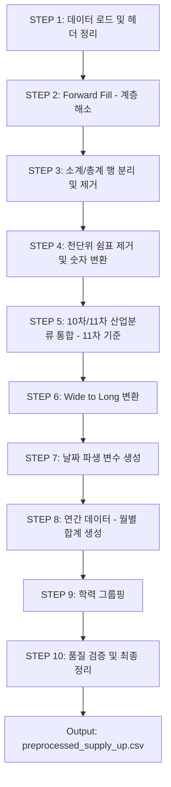

# 울산 산업별 구인인원 데이터 전처리 계획서

> **원본 파일**: `raw_supply_up.csv` (302행 × 39열)  
> **데이터 내용**: 울산 지역 산업 대분류별·학력별 월간 구인인원 (2022.01 ~ 2024.12, 36개월)  
> **작성일**: 2026-02-22

---

## 1. 원시 데이터 구조 분석

### 1.1 헤더 구조 (멀티헤더)

| 행  | 내용                                                                | 비고                       |
| --- | ------------------------------------------------------------------- | -------------------------- |
| 1행 | 연월 라벨 (`2022년 01월` ~ `2024년 12월`)                           | 36개 시점, 앞 3열은 빈 값  |
| 2행 | 컬럼명 (`(지역별)시도`, `산업_대분류`, `학력`, `구인인원(월)` × 36) | `구인인원(월)`이 36회 반복 |

- **문제점**: pandas `read_csv`로 단순 로드 시 컬럼명 충돌 (동일 이름 `구인인원(월)` 반복)
- **해결**: `header=[0,1]` 멀티인덱스 또는 `header=None`으로 읽은 뒤 수동 컬럼 생성

### 1.2 행(Row) 구조 — 계층적 구조

```
3행: 총계 (전체 합산)
4행: 울산 전체 (= 총계와 동일)
5행~: 산업별 상세 — 아래 패턴 반복
  ├─ "산업분류명 전체"      → 해당 산업 소계 (학력 열 비어있음)
  ├─ "산업분류명"           → 학력무관
  ├─ (빈 칸)               → 초졸
  ├─ (빈 칸)               → 중졸
  ├─ (빈 칸)               → 고졸
  ├─ (빈 칸)               → 전문대졸
  ├─ (빈 칸)               → 대졸
  ├─ (빈 칸)               → 대학원졸(석사)
  └─ (빈 칸)               → 대학원졸(박사) / 분류불능
```

- **1열 `(지역별)시도`**: 대부분 빈 값, 첫 등장 행에만 "울산" 표기 → `forward fill` 필요
- **2열 `산업_대분류`**: "전체" 접미사 행은 소계, 나머지는 학력 세부 → `forward fill` 필요
- **3열 `학력`**: 빈 값 없이 기재 (소계 행 제외)

### 1.3 산업분류 체계 — 10차/11차 혼재

| 분류 체계             | 데이터 존재 구간           | 예시                                          |
| --------------------- | -------------------------- | --------------------------------------------- |
| **10차 표준산업분류** | 2022.01 ~ 2024.06 (30개월) | `10차_제조업`, `10차_건설업` 등               |
| **11차 표준산업분류** | 2024.07 ~ 2024.12 (6개월)  | `11차_제조업(10~34)`, `11차_건설업(41~42)` 등 |

- 10차 분류 행은 2024.07~12 구간이 모두 `0`
- 11차 분류 행은 2022.01~2024.06 구간이 모두 `0`
- **→ 분류 체계 전환 시점(2024.07)을 기준으로 데이터가 분할됨**

### 1.4 값(Value) 특성

| 항목        | 설명                                            |
| ----------- | ----------------------------------------------- |
| 숫자 형식   | 천단위 구분 쉼표 포함 (`"6,122"`, `"2,354"` 등) |
| 결측값      | 없음 (0으로 표기)                               |
| 데이터 타입 | 쉼표 포함 시 문자열로 인식 → 숫자 변환 필요     |

---

## 2. 전처리 단계별 계획

### STEP 1: 데이터 로드 및 헤더 정리

```python
# 멀티헤더 처리
df = pd.read_csv('raw_supply_up.csv', header=None, encoding='utf-8')

# 1행(연월) + 2행(컬럼명) 결합하여 컬럼명 생성
# 예: "2022년 01월_구인인원(월)" → 간소화하여 "2022-01" 형태로 변환
# 앞 3열은 "시도", "산업_대분류", "학력"으로 명명
```

**출력 컬럼 예시**: `시도`, `산업_대분류`, `학력`, `2022-01`, `2022-02`, ..., `2024-12`

### STEP 2: 계층적 행 구조 해소 (Forward Fill)

| 대상 컬럼     | 처리 방법                                                           |
| ------------- | ------------------------------------------------------------------- |
| `시도`        | 빈 값을 윗 행 값으로 채움 (`ffill`) → 모든 행이 "울산"              |
| `산업_대분류` | 빈 값을 윗 행 값으로 채움 (`ffill`) → 각 학력 행에 산업명 자동 부여 |

### STEP 3: 소계/총계 행 분리 및 제거

| 행 유형          | 식별 조건                   | 처리                                   |
| ---------------- | --------------------------- | -------------------------------------- |
| `총계` 행        | `시도` == "총계" (3행)      | `supply_up_subtotals.csv` 저장 후 제거 |
| `울산 전체` 행   | `시도` == "울산 전체" (4행) | `supply_up_subtotals.csv` 저장 후 제거 |
| `산업별 소계` 행 | `산업_대분류`에 "전체" 포함 | `supply_up_subtotals.csv` 저장 후 제거 |

> **권장**: 소계 행은 검증용으로 별도 저장 후 본 데이터에서 제거 (이중 합산 방지)

### STEP 4: 값 클렌징 — 천단위 쉼표 제거 및 숫자 변환

```python
# 월별 컬럼에서 쉼표 제거 후 정수 변환
for col in month_columns:
    df[col] = df[col].astype(str).str.replace(',', '').astype(int)
```

### STEP 5: 산업분류 체계 통합 (10차 → 11차 기준)

#### 5.1 분류코드 매핑 테이블

| 10차 분류명                                    | 11차 분류명                                           | 통합 산업명 (11차 기준)                          |
| ---------------------------------------------- | ----------------------------------------------------- | ------------------------------------------------ |
| 10차_농업, 임업 및 어업                        | 11차_농업, 임업 및 어업(01~03)                        | 농업, 임업 및 어업(01~03)                        |
| 10차_광업                                      | 11차_광업(05~08)                                      | 광업(05~08)                                      |
| 10차_제조업                                    | 11차_제조업(10~34)                                    | 제조업(10~34)                                    |
| 10차_전기, 가스, 증기 및 공기조절 공급업       | 11차_전기, 가스, 증기 및 공기조절 공급업(35)          | 전기, 가스, 증기 및 공기조절 공급업(35)          |
| 10차_수도, 하수 및 폐기물 처리, 원료 재생업    | 11차_수도, 하수 및 폐기물 처리, 원료 재생업(36~39)    | 수도, 하수 및 폐기물 처리, 원료 재생업(36~39)    |
| 10차_건설업                                    | 11차_건설업(41~42)                                    | 건설업(41~42)                                    |
| 10차_도매 및 소매업                            | 11차_도매 및 소매업(45~47)                            | 도매 및 소매업(45~47)                            |
| 10차_운수 및 창고업                            | 11차_운수 및 창고업(49~52)                            | 운수 및 창고업(49~52)                            |
| 10차_숙박 및 음식점업                          | 11차_숙박 및 음식점업(55~56)                          | 숙박 및 음식점업(55~56)                          |
| 10차_정보통신업                                | 11차_정보통신업(58~63)                                | 정보통신업(58~63)                                |
| 10차_금융 및 보험업                            | 11차_금융 및 보험업(64~66)                            | 금융 및 보험업(64~66)                            |
| 10차_부동산업                                  | 11차_부동산업(68)                                     | 부동산업(68)                                     |
| 10차_전문, 과학 및 기술 서비스업               | 11차_전문, 과학 및 기술 서비스업(70~73)               | 전문, 과학 및 기술 서비스업(70~73)               |
| 10차_사업시설 관리, 사업 지원 및 임대 서비스업 | 11차_사업시설 관리, 사업 지원 및 임대 서비스업(74~76) | 사업시설 관리, 사업 지원 및 임대 서비스업(74~76) |
| 10차_공공행정, 국방 및 사회보장 행정           | 11차_공공행정, 국방 및 사회보장 행정(84)              | 공공행정, 국방 및 사회보장 행정(84)              |
| 10차_교육 서비스업                             | 11차_교육 서비스업(85)                                | 교육 서비스업(85)                                |
| 10차_보건업 및 사회복지 서비스업               | 11차_보건업 및 사회복지 서비스업(86~87)               | 보건업 및 사회복지 서비스업(86~87)               |
| 10차_예술, 스포츠 및 여가관련 서비스업         | 11차_예술, 스포츠 및 여가관련 서비스업(90~91)         | 예술, 스포츠 및 여가관련 서비스업(90~91)         |
| 10차_협회 및 단체, 수리 및 기타 개인 서비스업  | 11차_협회 및 단체, 수리 및 기타 개인 서비스업(94~96)  | 협회 및 단체, 수리 및 기타 개인 서비스업(94~96)  |
| 10차_가구 내 고용활동...                       | *(11차에 해당 없음)*                                  | 가구 내 고용활동 *(10차 전용, 별도관리)*         |

> [!NOTE]
> **통합 산업명은 11차 표준산업분류 명칭을 기준으로 작성합니다.**
> 10차 분류 데이터도 대응하는 11차 명칭으로 매핑하여 시계열 연속성을 확보합니다.
> 매핑 테이블은 총 **20종** (11차 대응 19종 + 10차 전용 1종)입니다.

#### 5.2 통합 전략

```
통합_산업명 컬럼 추가 → 11차 기준 명칭으로 10차/11차 동일 산업을 통합 매핑
분류체계 컬럼 추가 → "10차" / "11차" 구분 태그
```

- **주의사항**: 10차와 11차는 같은 시점에 공존하지 않으므로, 통합 후 단순 행 연결(concat) 가능
- 10차 전용 산업 (`가구 내 고용활동...`)은 별도 처리 필요

### STEP 6: Wide → Long 변환 (Unpivot/Melt)

```python
# 현재: 각 월이 별도 컬럼 (Wide 형태)
# 변환: 연월을 행으로 전환 (Long 형태)

df_long = df.melt(
    id_vars=['시도', '통합_산업명', '산업_대분류_원본', '학력', '분류체계'],
    var_name='연월',
    value_name='구인인원'
)
```

### STEP 7: 날짜 파생 변수 생성

```python
df_long['연도'] = df_long['연월'].str[:4].astype(int)
df_long['월'] = df_long['연월'].str[5:7].astype(int)
df_long['분기'] = (df_long['월'] - 1) // 3 + 1
df_long['반기'] = df_long['월'].apply(lambda x: '상반기' if x <= 6 else '하반기')
```

### STEP 8: 연간 데이터(월별 합계) 생성

원본 월별 데이터(`구인인원`)를 연도별로 합산하여 연간 데이터 파생 변수를 추가합니다.

```python
# 산업별 x 학력별 x 연도 그룹으로 월별 구인인원 합산
df_annual = df_long.groupby(
    ['통합_산업명', '학력', '연도']
)['구인인원'].sum().reset_index()
df_annual.rename(columns={'구인인원': '연간데이터_월별합계'}, inplace=True)

# 원본 Long 데이터에 merge
df_long = df_long.merge(df_annual, on=['통합_산업명', '학력', '연도'], how='left')
```

| 예시 | 통합_산업명   | 학력     | 연월    | 구인인원 | 연간데이터_월별합계 |
| ---- | ------------- | -------- | ------- | -------- | ------------------- |
| 1월  | 제조업(10~34) | 학력무관 | 2022-01 | 1,939    | 28,350              |
| 2월  | 제조업(10~34) | 학력무관 | 2022-02 | 1,902    | 28,350              |
| ...  | ...           | ...      | ...     | ...      | ...                 |
| 1월  | 제조업(10~34) | 학력무관 | 2023-01 | 2,688    | 30,130              |
| ...  | ...           | ...      | ...     | ...      | ...                 |
| 1월  | 제조업(10~34) | 학력무관 | 2024-01 | 2,674    | 21,150              |

> [!TIP]
> **활용 예시**: 각 행의 `구인인원`(월별)과 `연간데이터_월별합계`(연간)를 함께 보면 해당 월이 연간 총량에서 차지하는 비중을 바로 파악할 수 있습니다. 예: `2022년(월별 합계) = 28,350명`

### STEP 9: 학력 그룹핑

| 그룹   | 포함 학력                      |
| ------ | ------------------------------ |
| 저학력 | 초졸, 중졸                     |
| 중학력 | 고졸                           |
| 고학력 | 전문대졸, 대졸                 |
| 대학원 | 대학원졸(석사), 대학원졸(박사) |
| 무관   | 학력무관                       |
| 기타   | 분류불능                       |

### STEP 10: 불필요 행 제거 및 최종 품질 검증

| 검증 항목         | 방법                                                 |
| ----------------- | ---------------------------------------------------- |
| 소계 일치성       | 개별 학력 합산 == "전체" 소계 행 일치 여부 확인      |
| 총계 일치성       | 모든 산업 소계 합산 == "울산 전체" 행 일치 여부 확인 |
| 전값 행(all-zero) | 전체 월 값이 0인 행 식별 및 정리                     |
| 분류불능/해당없음 | 모든 값이 0 → 제거 대상                              |

---

## 3. 최종 스키마

| #   | 컬럼명                | dtype | 설명                               |
| --- | --------------------- | ----- | ---------------------------------- |
| 1   | `시도`                | str   | 울산                               |
| 2   | `통합_산업명`         | str   | 11차 기준 산업 분류명 (20종)       |
| 3   | `산업_대분류_원본`    | str   | 원본 산업 분류명                   |
| 4   | `분류체계`            | str   | 10차 / 11차                        |
| 5   | `학력`                | str   | 학력 수준 (8종)                    |
| 6   | `학력_그룹`           | str   | 학력 그룹 (6종)                    |
| 7   | `연월`                | str   | YYYY-MM 형식                       |
| 8   | `연도`                | int   | 2022 / 2023 / 2024                 |
| 9   | `월`                  | int   | 1~12                               |
| 10  | `분기`                | int   | 1~4                                |
| 11  | `반기`                | str   | 상반기 / 하반기                    |
| 12  | `구인인원`            | int   | 월간 구인 인원수                   |
| 13  | `연간데이터_월별합계` | int   | 해당 연도 산업×학력별 월 합산 총계 |

### 예상 행 수

- 산업 20종 × 학력 8종 × 36개월 ≈ **약 5,760행** (소계·총계 제외 기준)

---

## 4. 주의사항 및 특이점

> [!WARNING]
> **10차→11차 전환 시점 (2024.07)에서 데이터 단절이 존재합니다.**  
> 시계열 분석 시 분류체계 전환을 반드시 고려해야 하며, 단순 연결 시 트렌드 왜곡 가능성이 있습니다.

> [!IMPORTANT]
> **`가구 내 고용활동 및 달리 분류되지 않은 자가소비 생산활동`** 산업은 10차에만 존재하며,  
> 2024년 이후 데이터가 없으므로 시계열 분석 시 별도 처리가 필요합니다.

> [!NOTE]
> **학력 = "학력무관"** 행이 각 산업에서 구인인원의 대부분을 차지합니다.  
> 학력별 분석 시 "학력무관"을 포함/제외하는 두 가지 관점으로 분석하는 것을 권장합니다.

---

## 5. 전처리 실행 순서 요약



---

## 6. 산출물 관리 계획

### 6.1 디렉토리 구조

```
CSV/ulsan miss/
├── raw_supply_up.csv                  # 원본 데이터 (수정 금지)
├── preprecedd_ulsan industry.md       # 전처리 계획서 (본 문서)
├── preprocessing/
│   ├── preprocess_supply_up.py        # 전처리 실행 스크립트
│   └── industry_mapping.csv           # 10차↔11차 산업분류 매핑 테이블
├── output/
│   ├── preprocessed_supply_up.csv     # 전처리 완료 Long 형태 데이터
│   ├── supply_up_subtotals.csv        # 소계/총계 검증용 데이터
│   └── preprocess_log.txt             # 전처리 실행 로그
└── docs/
    └── data_dictionary.md             # 컬럼 사전 (스키마 상세)
```

### 6.2 산출물 목록

| #   | 산출물                       | 형식     | 설명                                   | 비고            |
| --- | ---------------------------- | -------- | -------------------------------------- | --------------- |
| 1   | `preprocessed_supply_up.csv` | CSV      | 전처리 완료 Long 형태 최종 데이터      | **핵심 산출물** |
| 2   | `supply_up_subtotals.csv`    | CSV      | 소계/총계 행 별도 저장                 | 품질 검증용     |
| 3   | `preprocess_supply_up.py`    | Python   | STEP 1~10 전처리 파이프라인 스크립트   | 재실행 가능     |
| 4   | `industry_mapping.csv`       | CSV      | 10차↔11차 산업분류 매핑 테이블         | 매핑 관리용     |
| 5   | `data_dictionary.md`         | Markdown | 최종 데이터 컬럼 사전                  | 13개 컬럼 상세  |
| 6   | `preprocess_log.txt`         | TXT      | 전처리 실행 로그 (행 수, 제거 건수 등) | 이력 관리       |

### 6.3 버전 관리 원칙

| 원칙            | 상세                                                             |
| --------------- | ---------------------------------------------------------------- |
| **원본 보존**   | `raw_supply_up.csv`는 절대 수정하지 않으며, 읽기 전용으로 관리   |
| **재현성 확보** | 스크립트 실행만으로 동일한 결과물을 재생산할 수 있도록 설계      |
| **변경 이력**   | 전처리 로직 변경 시 `preprocess_log.txt`에 변경 사유와 결과 기록 |
| **명명 규칙**   | 산출물 파일명은 영문 소문자 + 언더스코어(`_`) 사용               |
