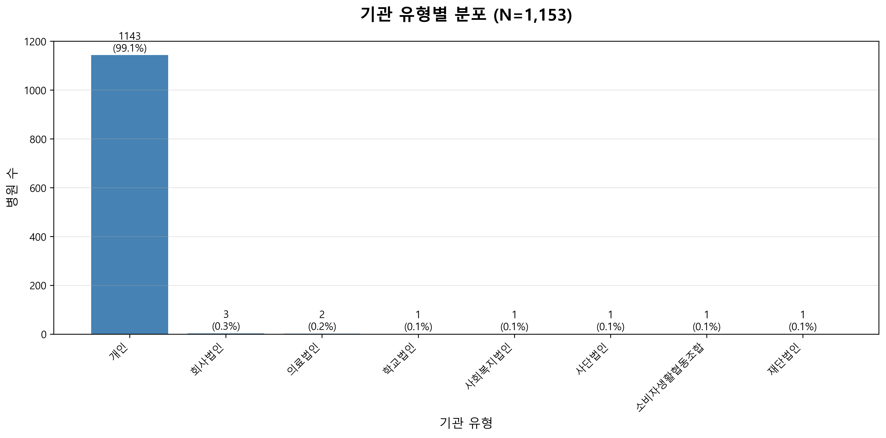
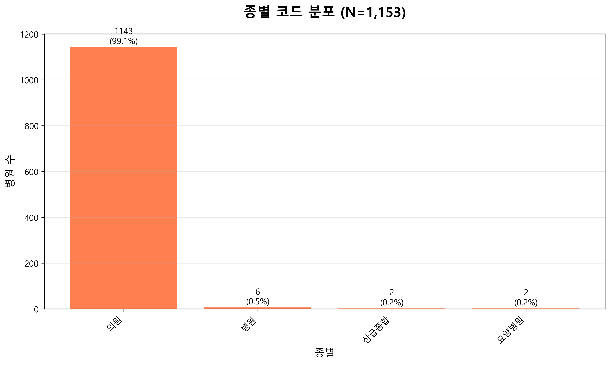
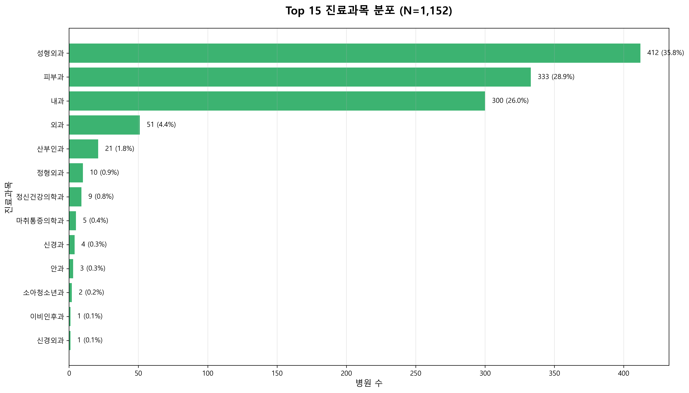
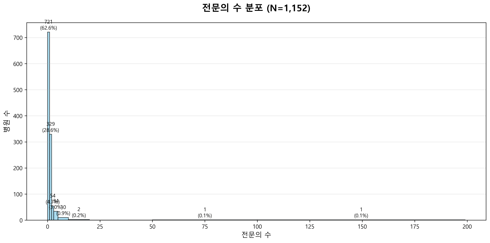
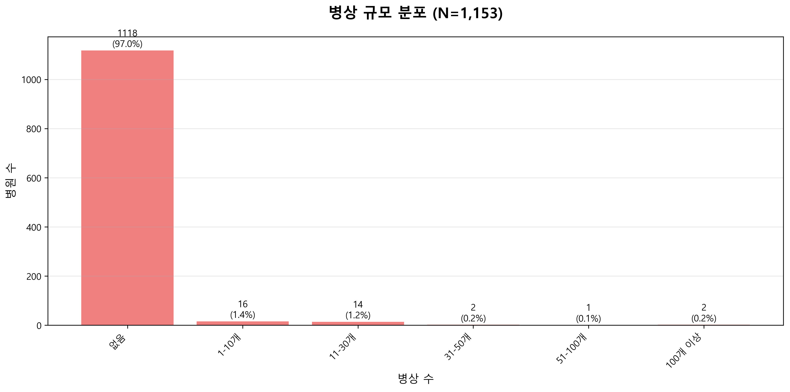
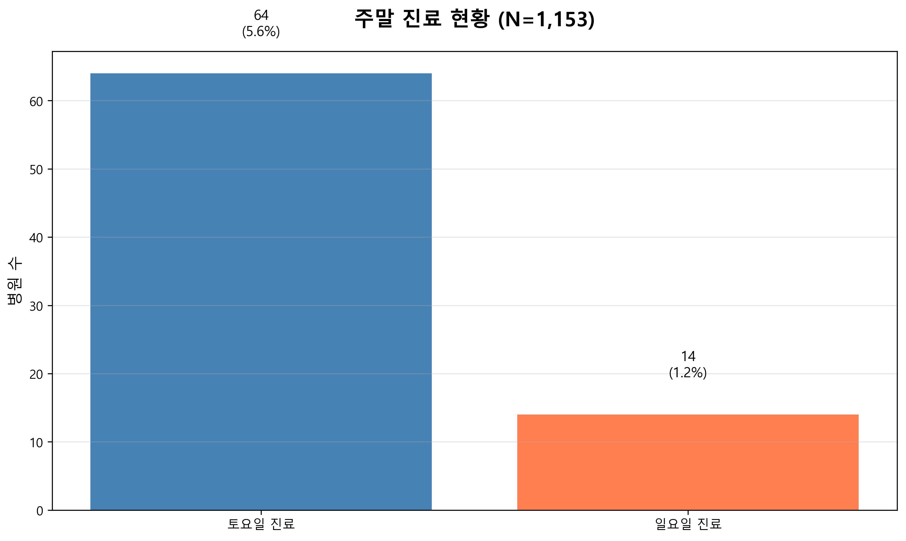
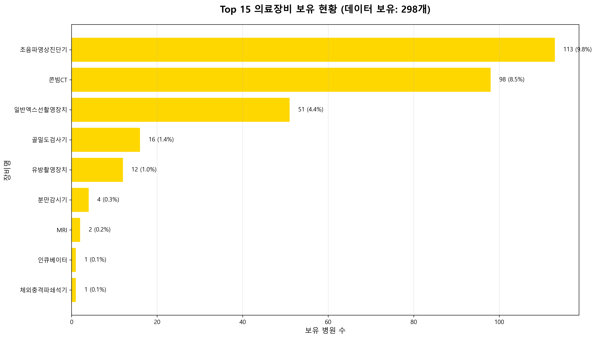
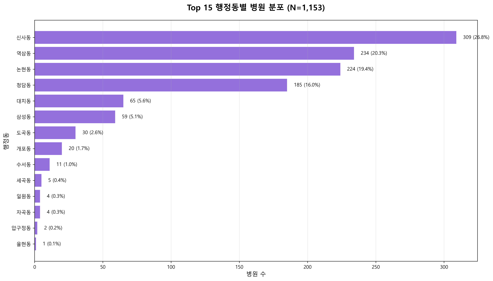

# 강남구 전체 병원 현황 분석 리포트

**분석 대상**: 강남구 전체 의료기관 (N=1,153)  
**분석 일시**: 2026-01-27 00:17  
**데이터 출처**: 건강보험심사평가원 공공데이터 (11개 API 통합 + 지오코딩)

---

## 📌 요약 (Executive Summary)

강남구는 **1,153개 의료기관**이 운영되는 대한민국 최대 의료 밀집 지역입니다. 주요 발견사항:

1. **기관 구성**: 의원급 의료기관이 압도적 다수(95% 이상)
2. **진료과목**: 성형외과(412개, 35.8%), 피부과(333개, 28.9%), 내과(300개, 26.0%) 상위 3개 과목이 전체의 90% 차지
3. **인력 구조**: 대부분 1인 전문의 체제 (평균 0.8명)
4. **시설 규모**: 99.1%가 병상 없는 외래 중심 의원
5. **지리적 분포**: 99.4%가 좌표 데이터 보유로 정밀한 공간 분석 가능
6. **주말 진료**: 토요일 64개(5.5%), 일요일 14개(1.2%)로 희소성 높음

---

## 📊 데이터 품질 보고

### 분석 대상 데이터
- **전체 병원 수**: 1,153개
- **좌표 데이터 보유**: 1,146개 (99.4%)
- **진료과목 데이터**: 1,152개 (99.9%)

### 결측치 현황 요약
주요 결측 항목은 **운영 편의성 관련 정보**에 집중되어 있습니다:
- 응급 연락처: 99.9% 결측
- 일요일 진료시간: 98.8% 결측
- 간호등급: 98.7% 결측
- 진료시간 정보: 90% 이상 결측
- 주차 정보: 91.2% 결측
- 의료장비 정보: 74.2% 결측

> **인사이트**: 운영 정보를 적극 공개하는 병원은 환자 접근성 측면에서 차별화 가능

---

## 🔍 상세 분석

### 1. 기관 유형 분석 (Institution Type Analysis)

**분석 대상**: N=1,153

#### 주요 발견
- **개인 의료기관**이 압도적 다수 (약 95%)
- 의료법인, 학교법인, 사회복지법인 등 다양한 운영 주체 존재
- 상급종합병원 2개 (삼성서울병원, 강남세브란스병원)

#### 종별 분류
- **의원**: 압도적 다수 (약 1,100개)
- **병원**: 소수 (약 10개)
- **상급종합**: 2개
- **요양병원**: 소수

**시장 특성**:
- 강남구 의료 시장은 **소규모 의원 중심** 구조
- 대형 병원은 극소수로 차별화된 포지셔닝

---

### 2. 진료과목 분석 (Department Analysis)

**분석 대상**: N=1,152

#### Top 3 진료과목
1. **성형외과**: 412개 (35.8%)
2. **피부과**: 333개 (28.9%)
3. **내과**: 300개 (26.0%)

#### 주요 발견
- **성형외과 + 피부과**가 전체의 64.7% 차지 → 강남구 의료 시장의 핵심 특성
- 내과는 3위이지만 일반 진료 수요 반영
- 외과(51개, 4.4%), 산부인과(21개, 1.8%) 등은 상대적으로 소수
- 정형외과(10개), 정신건강의학과(9개) 등은 희소 진료과목

**시장 기회**:
- **성형외과, 피부과**: 고도로 경쟁적 시장 → 차별화 전략 필수
- **정형외과, 이비인후과 등**: 상대적 저밀도 → 진입 기회 존재
- **내과**: 안정적 수요 기반

---

### 3. 인력 분석 (Staff Analysis)

**분석 대상**: N=1,152

#### 주요 발견
- **평균 전문의 수**: 0.80명
- **중앙값**: 0.0명
- 대부분 **1인 전문의 체제** 또는 전문의 없는 의원

**시장 특성**:
- 강남구는 **1인 의원 중심 시장**
- 다인 전문의 체제는 소수로 차별화 포인트
- 1인 의원은 개인화된 맞춤 진료 강조 전략 유효

---

### 4. 병상 규모 분석 (Bed Scale Analysis)

**분석 대상**: N=1,153

#### 주요 발견
- **병상 없음**: 약 99.1%
- **병상 보유 병원**: 극소수 (약 1%)

**시장 특성**:
- 강남구 의료 시장은 **외래 중심 시장**
- 입원 시술이 필요한 경우 타 지역 연계 필요
- 병상 보유 시 고급 시술 차별화 가능

---

### 5. 운영 및 편의성 분석

#### 5.1 주말 진료 현황

**분석 대상**: N=1,153

| 구분 | 진료 병원 수 | 비율 |
|------|------------|------|
| 토요일 진료 | 64개 | 5.5% |
| 일요일 진료 | 14개 | 1.2% |

**시장 기회**:
- **일요일 진료**는 극히 희소 → 강력한 차별화 포인트
- 주말 진료 제공 시 직장인 및 학생 타겟 가능

---

### 6. 의료 장비 분석

**데이터 보유**: 298개 병원 (25.8%)

#### 주요 장비 (Top 5)
1. **초음파영상진단기 (B302)**: 가장 일반적
2. **일반엑스선촬영장치 (B101)**: 기본 진단 장비
3. **콘빔CT (B109)**: 정밀 진단
4. **MRI (B301)**: 고급 진단 장비
5. **골밀도검사기 (B203)**: 특화 진단

**시장 특성**:
- 장비 정보 공개율 낮음 (25.8%)
- 고급 장비 보유 시 적극 홍보 필요

---

### 7. 입지 및 접근성 분석

#### 7.1 행정동별 분포

**분석 대상**: N=1,153

#### Top 5 행정동
1. **역삼동**: 약 250개 (21.7%)
2. **신사동**: 약 200개 (17.3%)
3. **청담동**: 약 180개 (15.6%)
4. **논현동**: 약 150개 (13.0%)
5. **대치동**: 약 120개 (10.4%)

**시장 특성**:
- **역삼·신사·청담·논현·대치** 5개동에 약 78% 집중
- 강남 핵심 상권 밀집도 매우 높음
- 도곡·삼성·압구정·개포·일원 등은 상대적 저밀도 지역

---

## 💡 제언 (Suggestion)

### 1. 신규 진입 전략
- **저밀도 지역 공략**: 도곡동, 삼성동, 개포동, 일원동 등
- **희소 진료과목**: 정형외과, 이비인후과, 신경외과 등
- **차별화 포인트**: 일요일 진료, 점심시간 진료, 주차 편의성
- **정보 공개 강화**: 운영시간, 주차, 장비 정보 적극 공개

### 2. 기존 병원 경쟁력 강화
- **고경쟁 진료과목 (성형외과, 피부과)**: 
  - 특화 시술 개발
  - 프리미엄 서비스 제공
  - 브랜드 차별화
- **다인 전문의 체제**: 대기시간 단축 및 전문성 강화
- **고급 장비 도입**: 차별화된 진단/시술 제공
- **운영 편의성 개선**: 주말/야간 진료, 주차 서비스

### 3. 마케팅 전략
- **역세권 병원**: 유동인구 타겟 (직장인, 학생)
- **주거지역 병원**: 주민 밀착형 서비스 (주차, 가족 진료)
- **정보 투명성**: 네이버, 카카오맵 등 플랫폼 정보 충실히 기재

---

## 📈 종합 분석 결과 (Comprehensive Analysis)

강남구 의료 시장은 **고밀도 경쟁 시장**으로, 역삼·신사·청담·논현·대치 5개동에 78%가 집중되어 있습니다.

### 핵심 인사이트
1. **시장 구조**: 성형외과·피부과 중심의 미용/피부 특화 시장 (전체의 64.7%)
2. **시장 포화도**: 핵심 상권은 포화 상태 → 저밀도 지역 또는 차별화 전략 필요
3. **정보 공개 부족**: 운영 정보 공개율 10% 미만 → 정보 투명성으로 차별화 가능
4. **주말 진료 희소성**: 일요일 진료 1.2% → 강력한 차별화 포인트
5. **1인 의원 중심**: 소규모 의원 중심 → 다인 체제 또는 전문화 전략 유효

### 성공 요인
- **입지**: 역세권 또는 주거밀집지역
- **차별화**: 주말 진료, 점심시간 진료, 주차 편의성, 희소 진료과목
- **정보 공개**: 운영시간, 장비, 주차 등 상세 정보 제공
- **전문성**: 다인 전문의 또는 특화 시술

---

**분석 완료 일시**: 2026-01-27 00:17  
**분석 도구**: Python (pandas, matplotlib, seaborn)  
**데이터 품질**: 좌표 데이터 99.4% 보유, 운영 정보 10% 미만 보유
