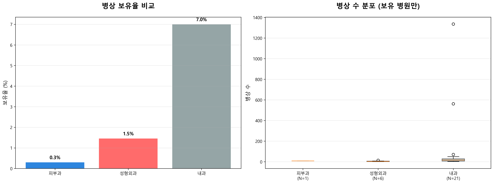
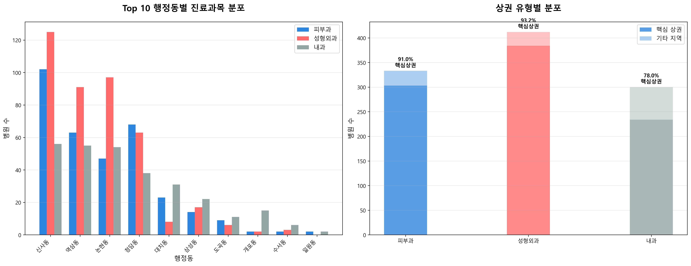
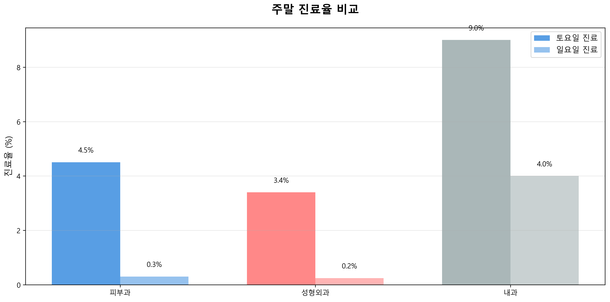

# 피부과 중심 TOP3 진료과목 비교 분석 리포트

**분석 대상**: 성형외과(412개), 피부과(333개), 내과(300개) - 총 1,045개  
**분석 일시**: 2026-01-27 00:43  
**분석 목적**: 피부과의 차별화 포인트 및 경쟁 전략 도출

---

## 📌 핵심 발견사항 (Executive Summary)

### 피부과의 독특한 특징
1. **중간 규모 전문의 체제**: 성형외과와 내과의 중간 (평균 0.58명)
2. **완전 외래 중심**: 병상 보유율 0.3%로 거의 전무
3. **핵심 상권 집중도 최고**: 91.0%가 역삼·신사·청담·논현·대치 집중
4. **주말 진료 희소**: 토요일 4.5%, 일요일 0.3%로 매우 낮음

### 성형외과 대비 차이점
- ✅ **유사점**: 외래 중심, 핵심 상권 집중, 주말 진료 희소
- ⚠️ **차이점**: 전문의 수 약간 적음 (0.58 vs 0.70), 1인 의원 비율 약간 높음 (91.0% vs 88.1%)

### 내과 대비 차이점
- ✅ **명확한 차별화**: 
  - 병상 보유율: 0.3% vs 7.0% (내과의 1/23)
  - 핵심 상권 비율: 91.0% vs 78.0% (13%p 높음)
  - 주말 진료율: 훨씬 낮음 (토 4.5% vs 9.0%, 일 0.3% vs 4.0%)

---

## 📊 상세 비교 분석

### 1. 인력 구조 비교

| 진료과목 | 평균 전문의 수 | 1인 의원 비율 |
|---------|--------------|-------------|
| **피부과** | **0.58명** | **91.0%** |
| 성형외과 | 0.70명 | 88.1% |
| 내과 | 1.21명 | 95.3% |

**피부과 인사이트**:
- 성형외과보다 전문의 수 약간 적음 → **1인 전문가 중심** 운영
- 내과보다 전문의 수 훨씬 적음 → **고도 전문화** 가능
- 1인 의원 비율 91.0% → **개인화된 맞춤 진료** 강점

**차별화 전략**:
- 1인 전문의 체제의 **전문성과 신뢰도** 강조
- "원장 직접 진료" 마케팅 포인트
- 다인 체제 전환 시 **대기시간 단축** 차별화 가능

---

### 2. 병상 보유율 비교

| 진료과목 | 병상 보유율 |
|---------|-----------|
| **피부과** | **0.3%** |
| 성형외과 | 1.5% |
| 내과 | 7.0% |

**피부과 인사이트**:
- **완전 외래 중심** 시장 (99.7%가 병상 없음)
- 성형외과도 외래 중심이지만 피부과가 더 극단적
- 내과는 입원 진료 비율이 상대적으로 높음 (7.0%)

**차별화 전략**:
- **빠른 시술 및 당일 귀가** 강조
- 입원 불필요 → **비용 절감** 및 **편의성** 어필
- "직장인 친화적" 포지셔닝

---

### 3. 지역 분포 비교

| 진료과목 | 핵심 상권 비율 |
|---------|--------------|
| **피부과** | **91.0%** |
| 성형외과 | 93.2% |
| 내과 | 78.0% |

**피부과 인사이트**:
- **핵심 상권 집중도 매우 높음** (91.0%)
- 성형외과와 유사한 패턴 (93.2%)
- 내과는 주거지역 분산 (78.0%)

**지역별 특징**:
- **역삼·신사·청담**: 피부과 최대 밀집 지역
- **논현·대치**: 성형외과와 경쟁 치열
- **도곡·개포·일원**: 상대적 저밀도 → **진입 기회**

**차별화 전략**:
- 핵심 상권: **프리미엄 브랜딩** 및 **차별화 시술** 필수
- 저밀도 지역: **접근성** 및 **주차 편의성** 강조

---

### 4. 주말 진료 비교

| 진료과목 | 토요일 진료율 | 일요일 진료율 |
|---------|-------------|-------------|
| **피부과** | **4.5%** | **0.3%** |
| 성형외과 | 3.4% | 0.2% |
| 내과 | 9.0% | 4.0% |

**피부과 인사이트**:
- 주말 진료율 **매우 낮음** (토 4.5%, 일 0.3%)
- 성형외과와 유사한 패턴 (미용 특화 진료과목 특성)
- 내과는 주말 진료율 상대적으로 높음 (일반 진료 수요)

**시장 기회**:
- **일요일 진료 제공** 시 강력한 차별화 가능 (현재 0.3%만 제공)
- 직장인 타겟 시 **토요일 진료** 확대 필요
- 주말 진료 = **경쟁 우위** 확보 가능

---

## 💡 피부과 차별화 전략

### 1. 성형외과 대비 차별화
**유사점이 많아 명확한 차별화 필요**

#### 차별화 포인트
- **비수술 중심**: 레이저, 필러 등 비침습적 시술 강조
- **피부 건강**: 미용뿐 아니라 피부 질환 치료 전문성
- **빠른 회복**: 수술 없이 일상 복귀 가능
- **가격 경쟁력**: 성형외과 대비 합리적 가격대

### 2. 내과 대비 차별화
**명확히 구별되는 시장**

#### 차별화 포인트
- **미용 특화**: 건강 관리가 아닌 외모 개선
- **핵심 상권**: 유동인구 많은 상권 입지
- **프리미엄 서비스**: 고급 인테리어 및 서비스
- **SNS 마케팅**: 시각적 결과물 중심 홍보

### 3. 피부과 고유 강점
- **1인 전문의 체제**: 개인화된 맞춤 진료
- **외래 중심**: 빠르고 편리한 시술
- **핵심 상권 집중**: 접근성 우수
- **전문성**: 피부 질환 + 미용 이중 전문성

---

## 🎯 실행 가능한 제언

### 신규 개원 전략
1. **입지 선정**:
   - 핵심 상권 (역삼·신사·청담): 차별화 시술 필수
   - 저밀도 지역 (도곡·개포): 접근성 + 주차 강조
   
2. **차별화 포인트**:
   - **일요일 진료** 제공 (현재 0.3%만 제공)
   - **점심시간 진료** 제공
   - **주차 편의성** 확보

3. **마케팅 전략**:
   - "원장 직접 진료" 강조
   - "비수술 피부 개선" 포지셔닝
   - SNS 비포/애프터 사진 활용

### 기존 병원 경쟁력 강화
1. **운영 개선**:
   - 주말 진료 확대 (특히 일요일)
   - 예약 시스템 고도화
   - 대기시간 최소화

2. **서비스 차별화**:
   - 특화 시술 개발
   - 프리미엄 서비스 라인 추가
   - 고객 관리 시스템 구축

3. **마케팅 강화**:
   - 지역 커뮤니티 활동
   - 인플루언서 협업
   - 온라인 리뷰 관리

---

## 📈 종합 분석 결과

### 피부과 시장의 특징
1. **성형외과와 유사한 구조**: 외래 중심, 핵심 상권 집중, 1인 의원 중심
2. **내과와 명확히 구별**: 미용 특화, 상권 집중, 주말 진료 희소
3. **높은 경쟁 강도**: 핵심 상권 91.0% 집중 → 차별화 필수
4. **주말 진료 기회**: 일요일 0.3%만 제공 → 강력한 차별화 포인트

### 성공 요인
1. **입지**: 핵심 상권 또는 저밀도 지역 전략적 선택
2. **차별화**: 특화 시술, 주말 진료, 서비스 품질
3. **마케팅**: 1인 전문의 신뢰도, 비수술 강조, SNS 활용
4. **운영**: 예약 시스템, 대기시간 관리, 고객 만족도

### 위험 요인
1. **과도한 경쟁**: 핵심 상권 포화 상태
2. **성형외과와 경계 모호**: 명확한 차별화 필요
3. **주말 진료 부족**: 직장인 접근성 제한
4. **1인 의원 한계**: 규모의 경제 어려움

---

**분석 완료 일시**: 2026-01-27 00:43  
**분석 도구**: Python (pandas, matplotlib, seaborn)  
**데이터 품질**: TOP3 진료과목 1,045개 (전체의 90.6%)
