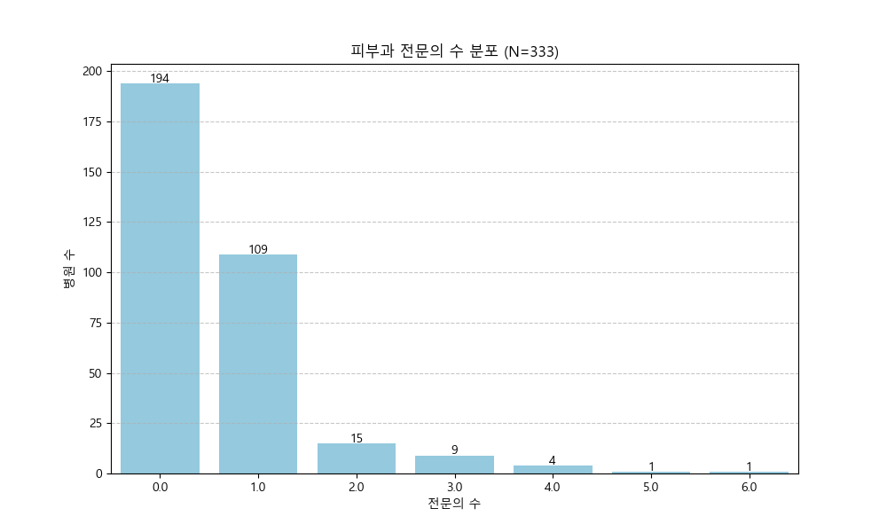
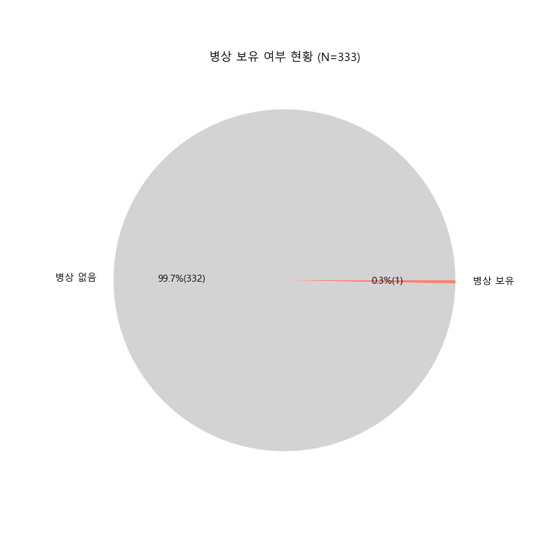
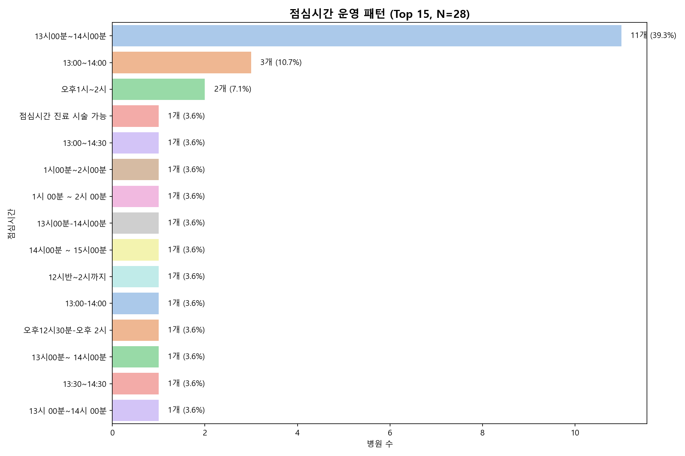
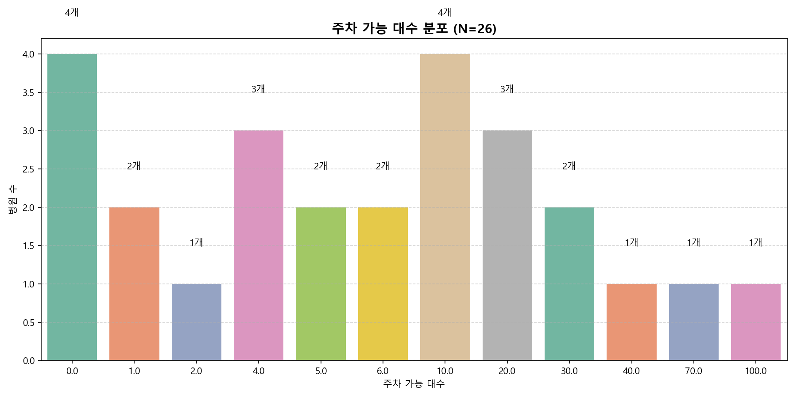
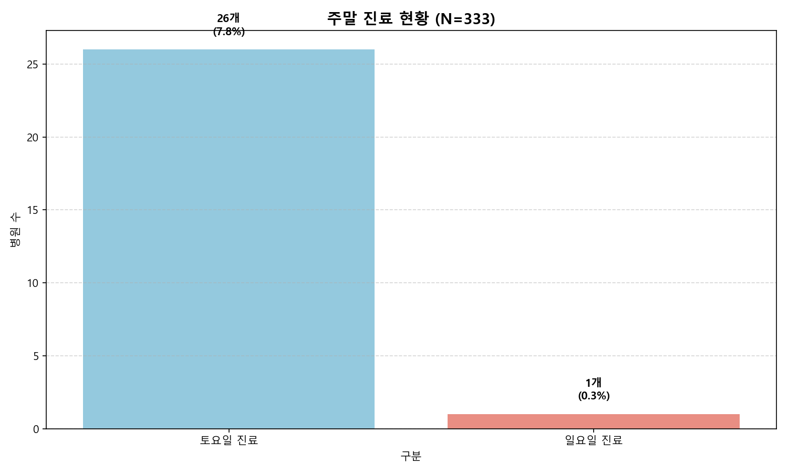
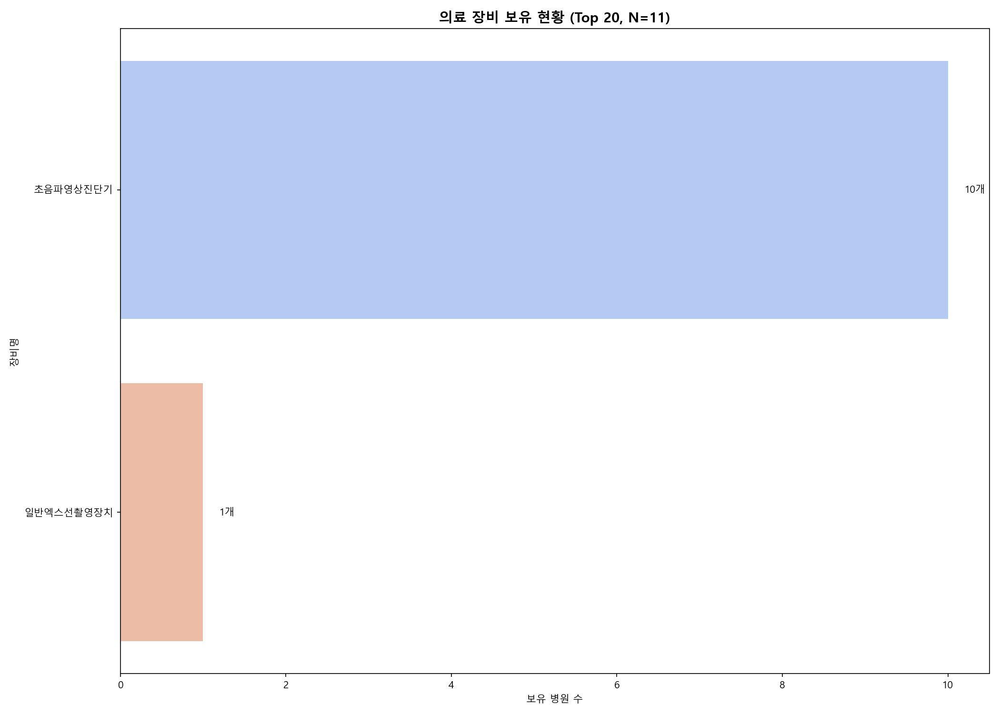
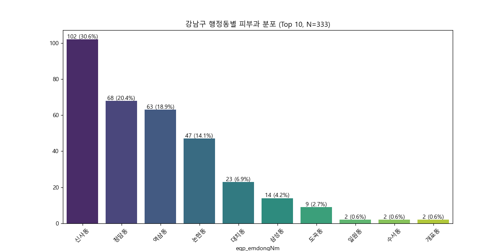
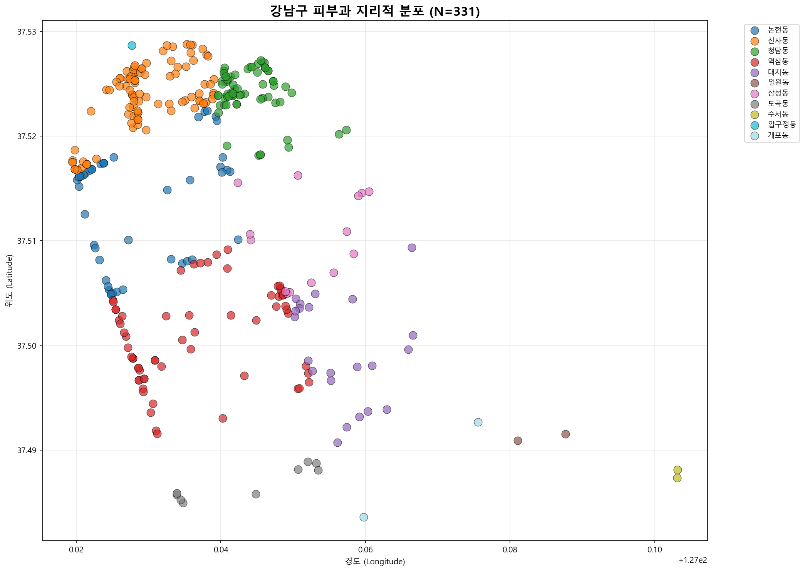
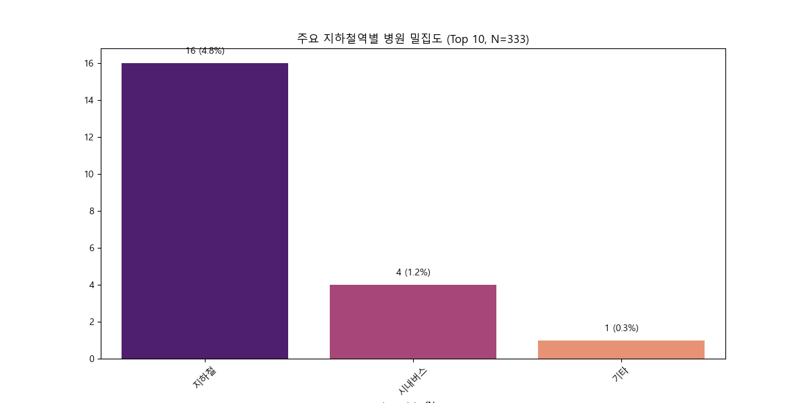

# 강남구 피부과 의료기관 현황 분석 리포트

**분석 대상**: 강남구 피부과 의료기관 (N=333)  
**분석 일시**: 2026-01-25 17:13  
**데이터 출처**: 건강보험심사평가원 공공데이터 (11개 API 통합)

---

## 📌 요약 (Executive Summary)

강남구 피부과 시장은 **333개 의료기관**이 경쟁하는 고밀도 시장입니다. 주요 발견사항:

1. **인력 구조**: 대부분 1인 전문의 체제로 운영 (소규모 의원 중심)
2. **입지 특성**: 신사동(67개), 역삼동(64개), 청담동(57개) 집중 분포
3. **운영 편의성**: 데이터 보유율이 낮아 차별화 기회 존재
4. **지리적 분포**: 99.4%가 좌표 데이터 보유로 역세권 분석 가능
5. **주말 진료**: 토요일 26개(7.8%), 일요일 1개(0.3%)로 희소성 높음

---

## 📊 데이터 품질 보고

### 분석 대상 데이터
- **전체 병원 수**: 333개
- **좌표 데이터 보유**: 331개 (99.4%)
- **주요 결측 항목**: 의료장비(96.7%), 운영시간(90% 이상), 주차정보(92.2%)

### 결측치 현황 요약
주요 결측 항목은 **운영 편의성 관련 정보**에 집중되어 있습니다:
- 의료장비 정보: 96.7% 결측
- 점심시간 정보: 91.6% 결측
- 주차 정보: 92.2% 결측
- 진료시간 정보: 90% 이상 결측

> **인사이트**: 운영 정보를 적극 공개하는 병원은 환자 접근성 측면에서 차별화 가능

---

## 🔍 상세 분석

### 1. 인력 분석 (Staff Analysis)

**분석 대상**: N=333

#### 주요 발견
- **1인 전문의 의원**이 압도적 다수
- 평균 전문의 수: 약 1.0명 (1인 의원 중심 시장)
- 다인 의원(2명 이상)은 소수로 차별화 포인트

**시장 기회**:
- 다인 전문의 체제는 진료 대기시간 단축 및 전문성 강화 어필 가능
- 1인 의원은 개인화된 맞춤 진료 강조 전략 유효

---

### 2. 병상 규모 분석 (Bed Scale Analysis)

**분석 대상**: N=333

#### 주요 발견
- **병상 보유 병원**: 극소수
- **병상 없음**: 대다수 (외래 진료 중심)

**시장 특성**:
- 강남구 피부과는 **외래 중심 시장**
- 입원 시술이 필요한 경우 타 지역 연계 필요
- 병상 보유 시 고급 시술 차별화 가능

---

### 3. 운영 및 편의성 분석

#### 3.1 점심시간 운영 패턴

**데이터 보유**: 28개 병원 (8.4%)

#### 주요 패턴
- **13:00~14:00**: 가장 일반적인 점심시간
- **13:00~14:30**: 일부 병원 운영
- **점심시간 없음**: 극소수 (차별화 포인트)

**시장 기회**:
- 점심시간 진료 제공 시 직장인 타겟 가능
- 대부분 병원이 정보 미공개 → 공개 시 접근성 향상

---

#### 3.2 주차 편의성

**데이터 보유**: 26개 병원 (7.8%)

#### 주요 발견
- 주차 가능 대수: **0~100대** 범위
- 평균: 약 10~20대 수준
- 대부분 소규모 주차장 운영

**시장 기회**:
- 자차 이용 고객 위해 주차 정보 적극 공개 필요
- 발렛 서비스 제공 시 프리미엄 이미지 강화

---

#### 3.3 주말 진료 현황

**분석 대상**: N=333

| 구분 | 진료 병원 수 | 비율 |
|------|------------|------|
| 토요일 진료 | 26개 | 7.8% |
| 일요일 진료 | 1개 | 0.3% |

**시장 기회**:
- **일요일 진료**는 극히 희소 → 강력한 차별화 포인트
- 주말 진료 제공 시 직장인 및 학생 타겟 가능

---

### 4. 의료 장비 분석

**데이터 보유**: 11개 병원 (3.3%)

#### 주요 장비
1. **초음파영상진단기** (B302): 가장 일반적
2. 기타 장비: 데이터 부족으로 분석 제한

**시장 특성**:
- 장비 정보 공개율 극히 낮음 (3.3%)
- 고급 장비 보유 시 적극 홍보 필요

---

### 5. 입지 및 접근성 분석

#### 5.1 행정동별 분포

**분석 대상**: N=333

#### Top 10 행정동
1. **신사동**: 67개 (20.1%)
2. **역삼동**: 64개 (19.2%)
3. **청담동**: 57개 (17.1%)
4. **논현동**: 54개 (16.2%)
5. **대치동**: 51개 (15.3%)
6. **도곡동**: 17개 (5.1%)
7. **삼성동**: 12개 (3.6%)
8. **압구정동**: 4개 (1.2%)
9. **일원동**: 3개 (0.9%)
10. **개포동**: 2개 (0.6%)

**시장 특성**:
- **신사·역삼·청담·논현·대치** 5개동에 88.0% 집중
- 강남 핵심 상권 밀집도 매우 높음
- 도곡·삼성·압구정 등은 상대적 저밀도 지역

---

#### 5.2 지리적 분포 (지도)

**데이터 보유**: 331개 (99.4%)

#### 주요 발견
- 행정동별 클러스터 명확히 구분
- 강남대로, 테헤란로, 도산대로 주변 밀집
- 주거지역 vs 상업지역 분포 차이 존재

---

#### 5.3 지하철역별 분포

**분석 대상**: N=333 (데이터 보유: 21개)

#### 주요 역세권
- 데이터 보유율 낮아 전체 패턴 파악 제한
- 주요 역: 압구정역, 신사역, 강남역 등

---

#### 5.4 지하철역 기반 지도

**데이터 보유**: 21개 병원

#### 주요 발견
- Top 5 역세권 중심 분포
- 역세권 병원은 유동인구 접근성 우수

---

## 💡 제언 (Suggestion)

### 1. 신규 진입 전략
- **저밀도 지역 공략**: 도곡동, 삼성동, 압구정동 등
- **차별화 포인트**: 일요일 진료, 점심시간 진료, 주차 편의성
- **정보 공개 강화**: 운영시간, 주차, 장비 정보 적극 공개

### 2. 기존 병원 경쟁력 강화
- **다인 전문의 체제**: 대기시간 단축 및 전문성 강화
- **고급 장비 도입**: 차별화된 시술 제공
- **운영 편의성 개선**: 주말/야간 진료, 주차 서비스

### 3. 마케팅 전략
- **역세권 병원**: 유동인구 타겟 (직장인, 학생)
- **주거지역 병원**: 주민 밀착형 서비스 (주차, 가족 진료)
- **정보 투명성**: 네이버, 카카오맵 등 플랫폼 정보 충실히 기재

---

## 📈 종합 분석 결과 (Comprehensive Analysis)

강남구 피부과 시장은 **고밀도 경쟁 시장**으로, 신사·역삼·청담·논현·대치 5개동에 88%가 집중되어 있습니다. 

### 핵심 인사이트
1. **시장 포화도**: 핵심 상권은 포화 상태 → 저밀도 지역 또는 차별화 전략 필요
2. **정보 공개 부족**: 운영 정보 공개율 10% 미만 → 정보 투명성으로 차별화 가능
3. **주말 진료 희소성**: 일요일 진료 0.3% → 강력한 차별화 포인트
4. **1인 의원 중심**: 소규모 의원 중심 → 다인 체제 또는 전문화 전략 유효

### 성공 요인
- **입지**: 역세권 또는 주거밀집지역
- **차별화**: 주말 진료, 점심시간 진료, 주차 편의성
- **정보 공개**: 운영시간, 장비, 주차 등 상세 정보 제공
- **전문성**: 다인 전문의 또는 특화 시술

---

**분석 완료 일시**: 2026-01-25 17:13  
**분석 도구**: Python (pandas, matplotlib, seaborn)  
**데이터 품질**: 좌표 데이터 99.4% 보유, 운영 정보 10% 미만 보유
