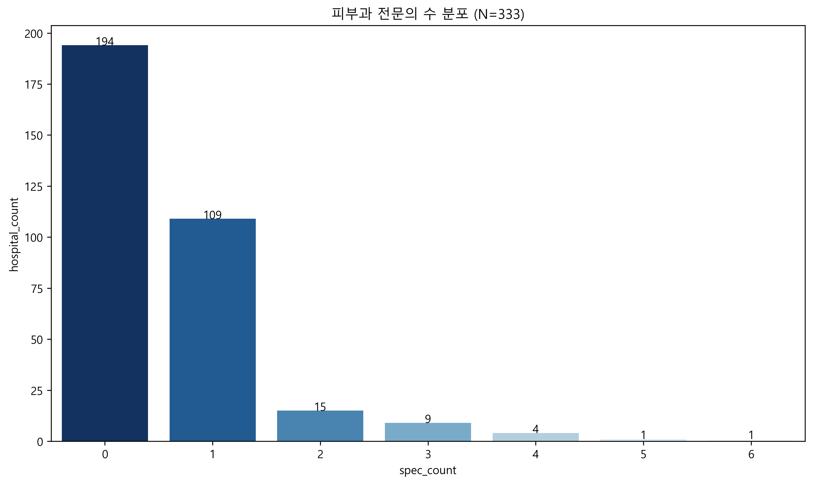
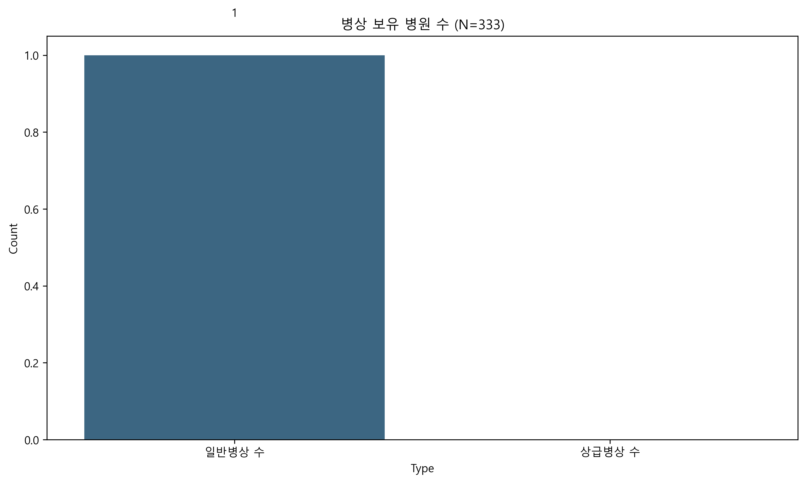
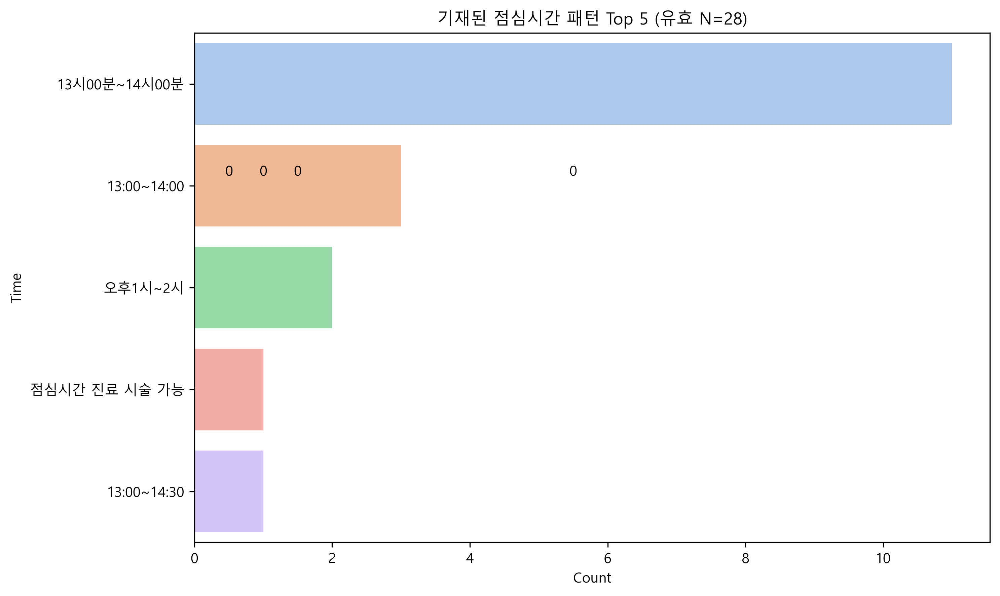
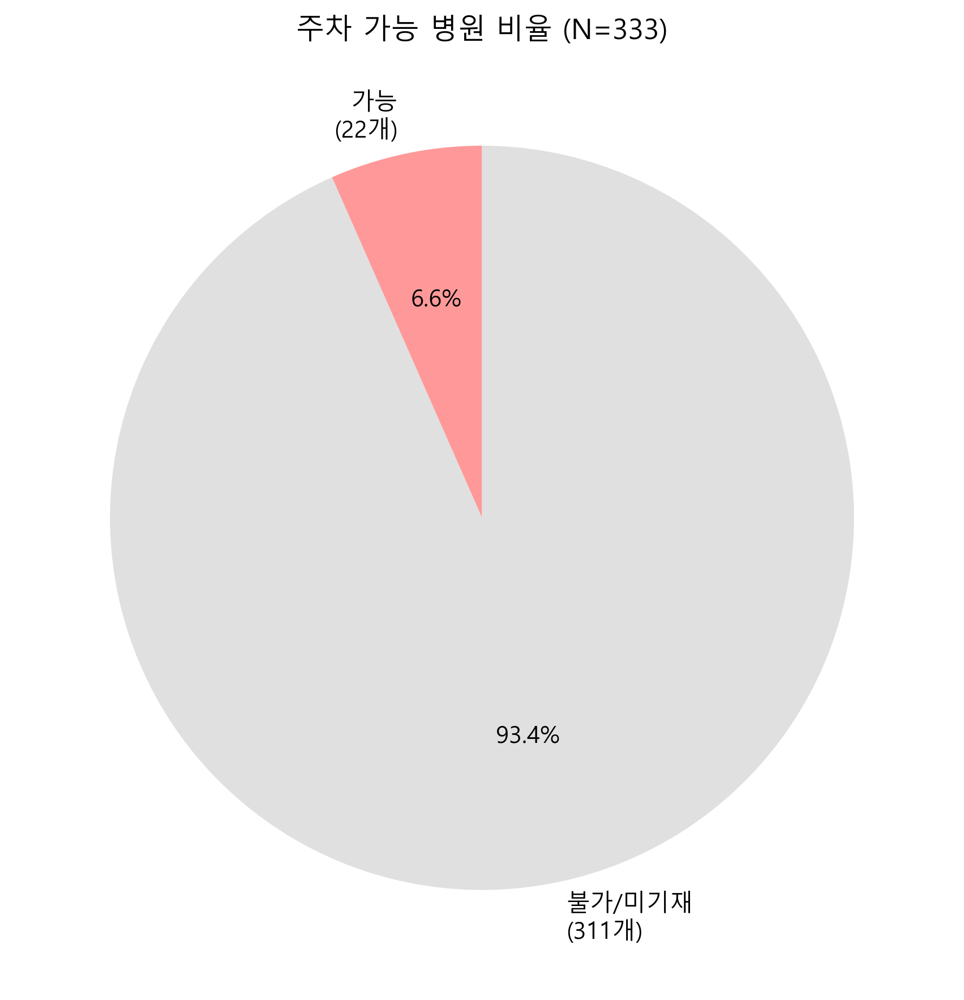
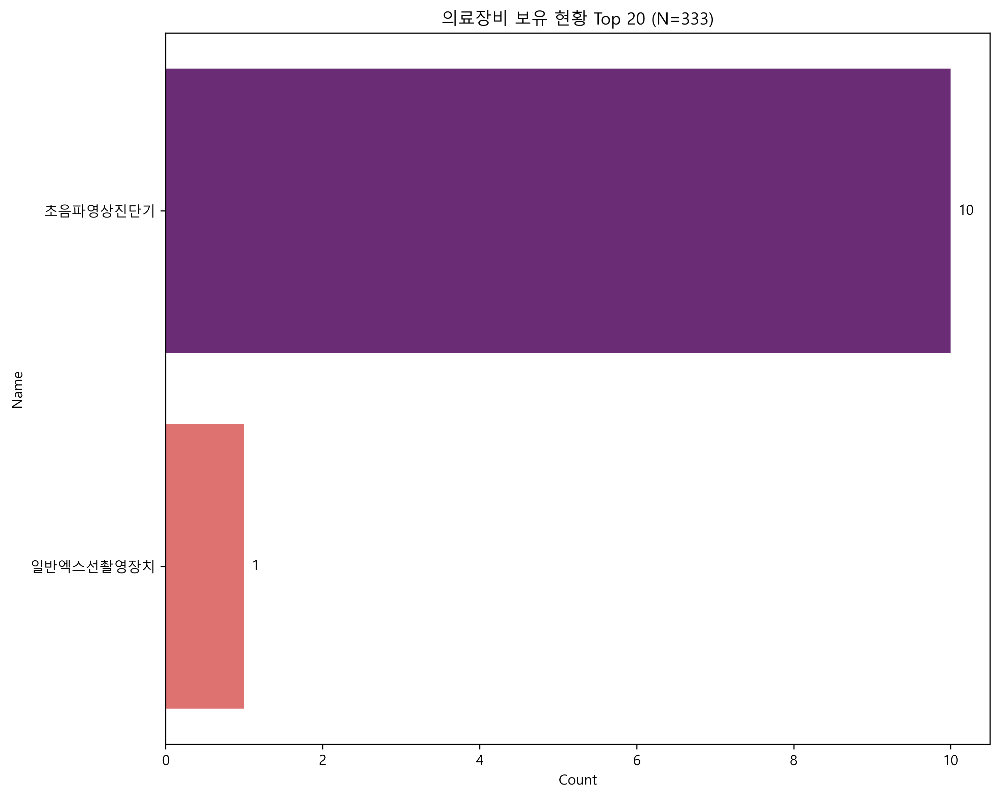
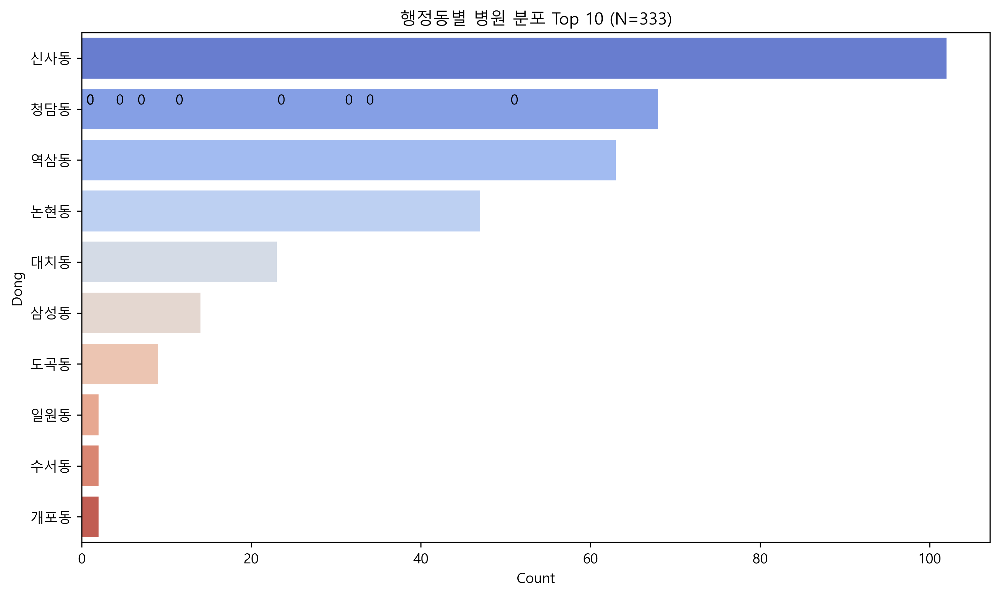
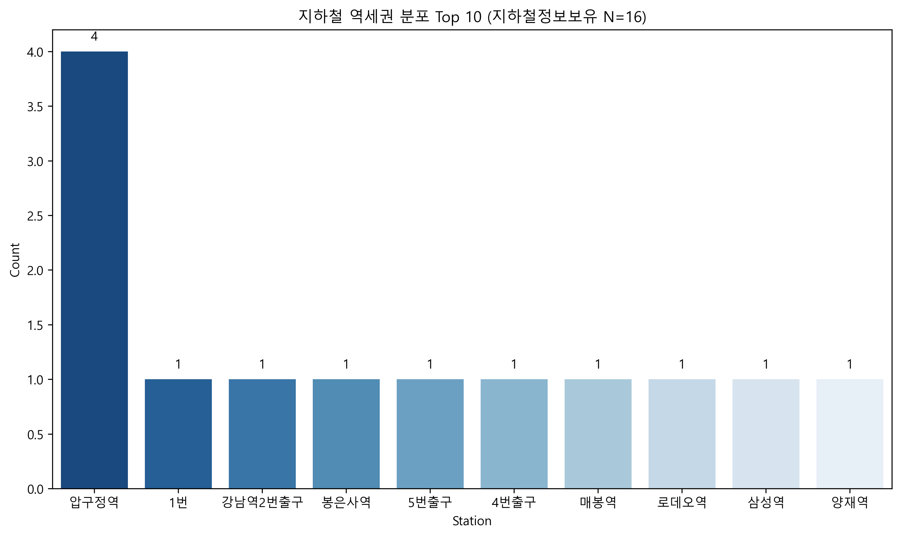

# 강남구 피부과 시장 분석 리포트
> **생성 일시**: 2026-01-24 17:20
> **분석 파일**: `피부과_병원정보_20260124_153603.csv`

## 1. 요약 (Executive Summary)
- **인력**: 1인 전문의 체제 중심 (평균 0.58명)
- **시설**: 입원 시설 보유 병원 극소수 (대부분 의원급)
- **운영**: 점심시간 13-14시 집중, 주말/야간 진료 정보 부족
- **입지**: 강남/압구정 등 주요 역세권 과밀화

## 2. 데이터 품질 보고
- **총 데이터**: 333개 병원
- **주요 결측**: 운영시간(점심/휴진), 주차정보 결측률 90% 이상으로 분석 시 주의 요망.

## 3.1 인력 분석 (Staff Analysis)

> **분석 대상 병원 수(N)**: 333개

- **평균 전문의 수**: 0.58명
- **전문의 없는 병원**: 194개 (58.3%)

> **[Chart Description]**: 전문의 수에 따른 병원 분포를 나타냅니다. 0명인(일반의 중심) 병원이 가장 큰 비중을 차지하고 있습니다.

#### [Data Quality] 결측치 현황
| 컬럼명 | 한글 설명 | 결측치 수 | 결측률 | 비고 |
|---|---|---|---|---|
| `dgsbjt_dgsbjtPrSdrCnt` | 전문의 수 | 0 | 0.0% | |

## 3.2 병상 규모 분석 (Bed Scale Analysis)

> **분석 대상 병원 수(N)**: 333개

> **[Chart Description]**: 입원 가능한 병상(일반/상급)을 보유한 병원의 수를 나타냅니다. 대부분의 병원이 입원 시설이 없는 의원급임을 알 수 있습니다.

#### [Data Quality] 결측치 현황
| 컬럼명 | 한글 설명 | 결측치 수 | 결측률 | 비고 |
|---|---|---|---|---|
| `eqp_stdSickbdCnt` | 일반병상 수 | 0 | 0.0% | |
| `eqp_hghrSickbdCnt` | 상급병상 수 | 0 | 0.0% | |

## 3.3 운영 및 편의성 (Operation & Convenience)

> **분석 대상 병원 수(N)**: 333개

> **[Chart Description]**: 점심시간 정보를 기재한 28개 병원의 주요 시간대 분포입니다.

> **[Chart Description]**: 주차 가능 여부(주차대수 > 0) 비율입니다. 대다수 병원이 주차 정보를 제공하지 않거나 불가능합니다.

#### [Data Quality] 결측치 현황
| 컬럼명 | 한글 설명 | 결측치 수 | 결측률 | 비고 |
|---|---|---|---|---|
| `dtl_lunchWeek` | 점심시간 | 305 | 91.6% | **[해석 주의]** |
| `dtl_parkQty` | 주차대수 | 307 | 92.2% | **[해석 주의]** |

> ⚠️ **[해석 주의]**: 위 항목들은 결측률이 50% 이상으로, 실제 현황보다 과소 집계되었을 가능성이 매우 높습니다.

## 3.4 의료 장비 (Medical Equipment)

> **분석 대상 데이터(Row) 수(N)**: 333건 (유효 장비 정보 11건)

> **[Chart Description]**: 전체 보유 장비 중 상위 20개 품목의 보유 건수입니다. 총 2종의 장비가 식별되었습니다.

#### 보유 장비 전체 목록 (상위 20개 발췌)
| 순위 | 장비명 | 보유 건수 | 비율(전체행 대비) |
|---|---|---|---|
| 1 | 초음파영상진단기 | 10건 | 3.0% |
| 2 | 일반엑스선촬영장치 | 1건 | 0.3% |

*...외 -18종 존재*

## 3.5 입지 및 접근성 (Location & Accessibility)

> **분석 대상 병원 수(N)**: 333개

### 1) 행정동별 분포

> **[Chart Description]**: 행정동(법정동) 기준 병원 밀집 지역 Top 10입니다.

### 2) 지하철역 분석

> **[Chart Description]**: 교통편에 '지하철'을 명시한 병원들의 주요 역세권 분포입니다.

## 4. 제언 (Suggestion)
1. **틈새 시간 공략**: 13-14시 점심 진료 도입으로 직장인 수요 흡수
2. **주차 편의 강화**: 발렛 지원 등 주차 정보 적극 홍보 (경쟁 우위)
3. **특화 장비 마케팅**: 희귀 장비 보유 시 이를 적극 활용한 포지셔닝 필요

## 5. 종합 분석 결과 (Comprehensive Analysis)
강남구 피부과 시장은 **1인 원장 중심의 소규모 의원**이 밀집된 **초경쟁(Red Ocean)** 시장입니다. 
주요 역세권에 병원이 집중되어 있어 단순 위치만으로는 경쟁력을 갖기 어려우며, 
데이터상 확인되는 **'운영 시간 차별화(점심/야간)'** 및 **'주차 편의성'**이 실질적인 환자 유입의 핵심 차별화 요소(Key Differentiator)가 될 것으로 분석됩니다. 
또한, 대부분이 외래 중심이므로 입원/수술 시설을 갖춘 병원급 진료는 **틈새 시장(Niche Market)**으로서의 가능성이 있습니다.