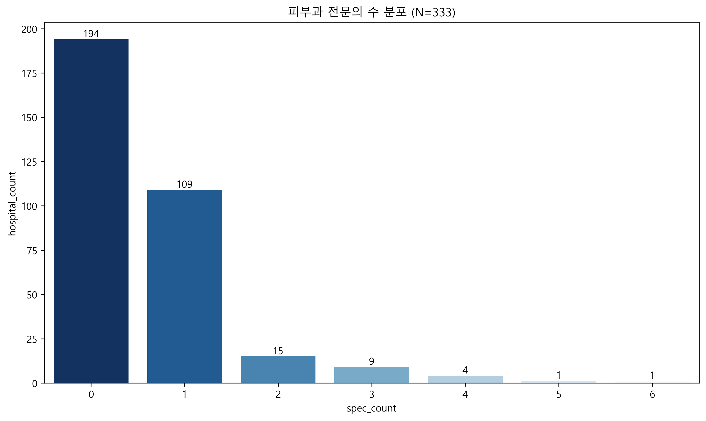
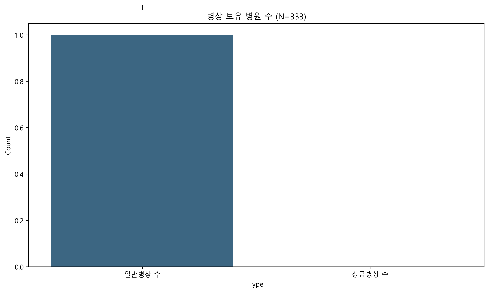
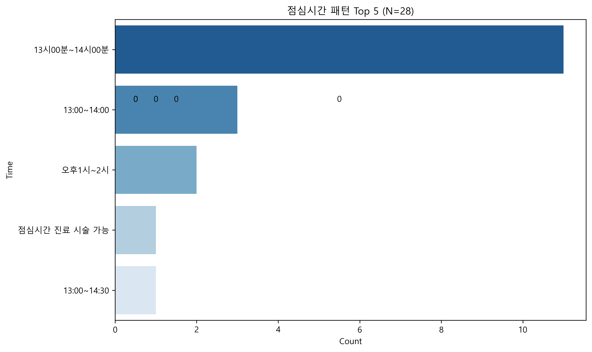
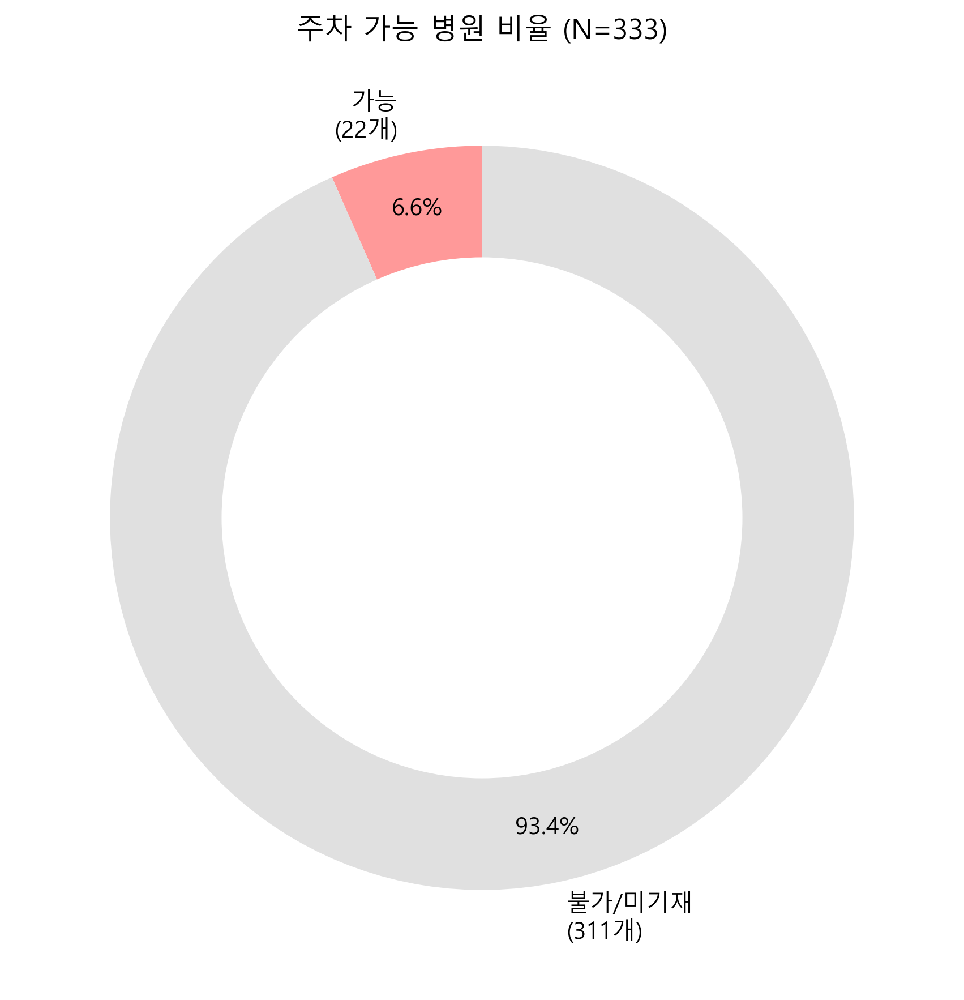
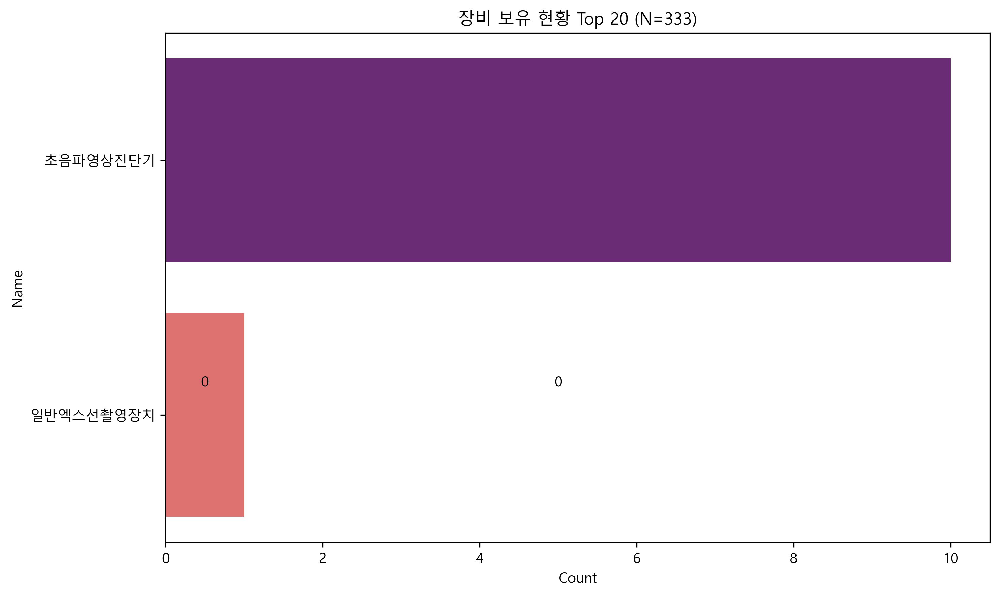
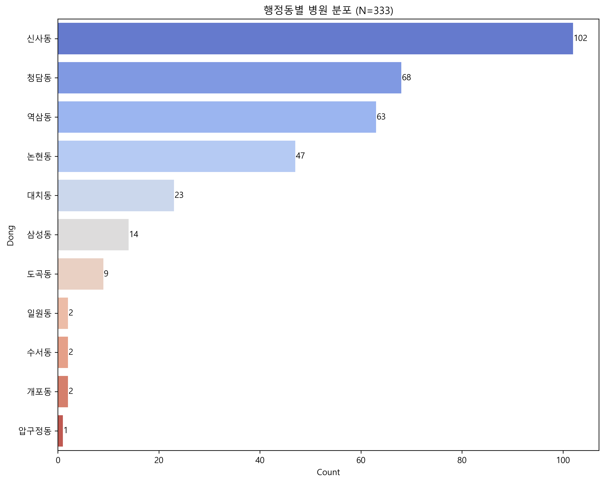
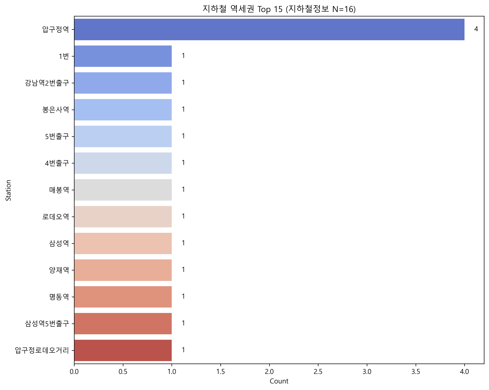

# 강남구 피부과 시장 분석 리포트
> **생성 일시**: 2026-01-24 17:39
> **분석 파일**: `피부과_병원정보_20260124_153603.csv`

## 1. 요약 (Executive Summary)
- **인력**: 1인 전문의 체제 중심
- **입지**: 강남/압구정 집중

## 2. 데이터 품질 보고
- **총 병원 수**: 333
- **참고**: 상세 결측 내역은 각 섹션 참조.

## 3.1 인력 분석 (Staff Analysis)

> **분석 대상 병원 수(N)**: 333개

- **평균 전문의 수**: 0.58명
- **전문의 없는 병원**: 194개 (58.3%)

> **[Chart Description]**: 전문의 수별 병원 빈도입니다. 숫자는 해당 전문의 수를 보유한 병원의 개수입니다.

#### [Data Quality] 결측치 현황
- **결측치 없음(0건)**: 해당 항목 데이터는 모두 유효합니다.

## 3.2 병상 규모 분석 (Bed Scale Analysis)

> **분석 대상 병원 수(N)**: 333개

> **[Chart Description]**: 입원 가능한 일반/상급 병상을 1개 이상 보유한 병원의 수입니다.

#### [Data Quality] 결측치 현황
- **결측치 없음(0건)**: 해당 항목 데이터는 모두 유효합니다.

## 3.3 운영 및 편의성 (Operation & Convenience)

> **분석 대상 병원 수(N)**: 333개

> **[Chart Description]**: 점심시간 정보가 있는 28개 병원의 시간대 분포입니다.

> **[Chart Description]**: 주차 가능(대수>0) 비율입니다.

#### [Data Quality] 결측치 현황
| 컬럼명 | 한글 설명 | 결측치 수 | 결측률 | 비고 |
|---|---|---|---|---|
| `dtl_lunchWeek` | 점심시간 | 305 | 91.6% | **[해석 주의]** |
| `dtl_parkQty` | 주차대수 | 307 | 92.2% | **[해석 주의]** |

## 3.4 의료 장비 (Medical Equipment)

> **총 데이터 행(Row) 수(N)**: 333개 (장비정보 보유 11개)

> **[Chart Description]**: 행 데이터 기준 의료 장비 보유 빈도 상위 20개입니다.

#### [Data Quality] 결측치 현황
| 컬럼명 | 한글 설명 | 결측치 수 | 결측률 | 비고 |
|---|---|---|---|---|
| `medoft_oftCdNm` | 의료장비명 | 322 | 96.7% | **[해석 주의]** |

## 3.5 입지 및 접근성 (Location & Accessibility)

> **분석 대상 병원 수(N)**: 333개

### 1) 행정동별 분포 (Administrative Dong)

> **[Chart Description]**: 행정동별 병원 비중입니다. 상위 지역일수록 막대 길이가 깁니다.

#### [Data Quality] 결측치 현황
- **결측치 없음(0건)**: 해당 항목 데이터는 모두 유효합니다.

### 2) 지하철 역세권 분포 (Station Accessibility)

> **[Chart Description]**: 교통편에 '지하철'을 명시한 병원들의 주요 역세권 분포입니다.

#### [Data Quality] 결측치 현황
| 컬럼명 | 한글 설명 | 결측치 수 | 결측률 | 비고 |
|---|---|---|---|---|
| `trnsprt_trafNm` | 교통편 | 312 | 93.7% | **[해석 주의]** |

## 4. 제언 (Suggestion)
1. **운영 차별화**: 정보 부재 영역(주차/점심) 선점
2. **입지 전략**: 과밀 지역 회피 및 이면 상권 고려

## 5. 종합 분석 결과 (Comprehensive Analysis)
강남구 피부과 시장은 **1인 원장 중심**의 **외래 진료** 위주 시장입니다.
특히 **운영 시간**과 **주차 정보**의 데이터 부재가 심각하여, 이를 역으로 이용해 **상세한 정보 제공(Information Transparency)**만으로도 초기 신뢰도를 확보할 수 있습니다.
입지적으로는 행정동 데이터 분석 결과 특정 동에 편중되어 있어, **지역 내 불균형**을 활용한 입지 전략이 유효할 것으로 보입니다.