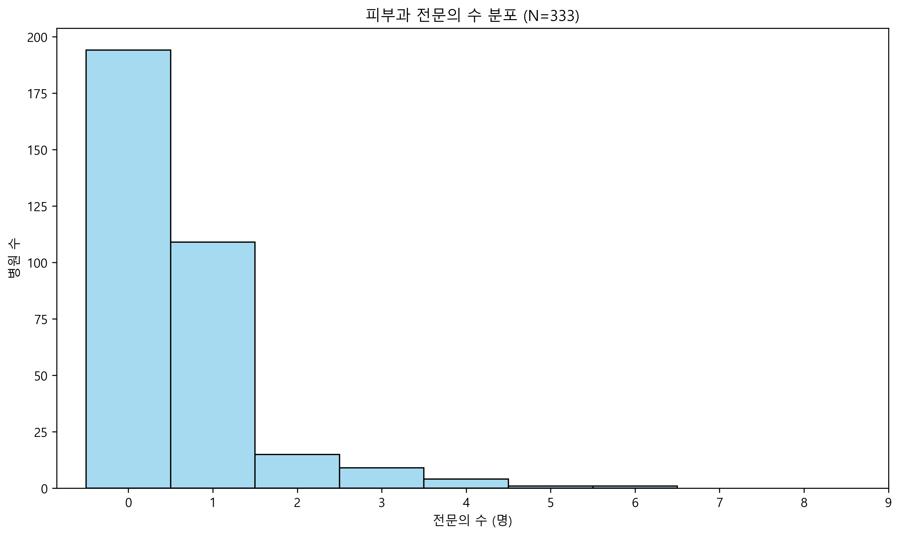
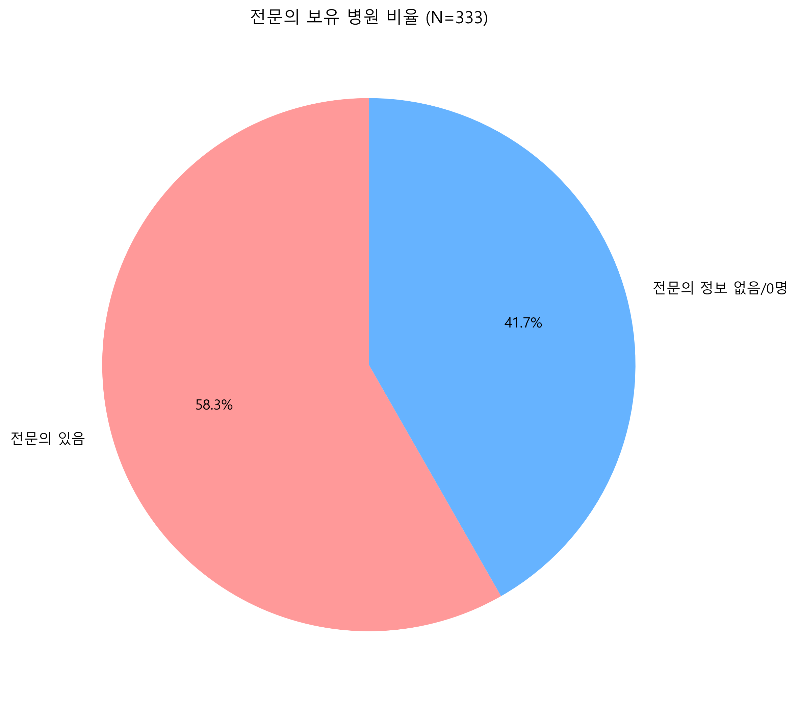
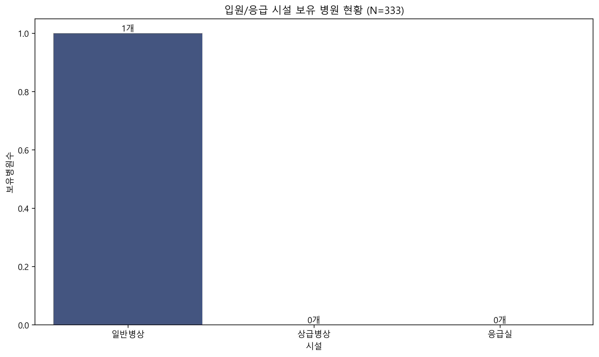
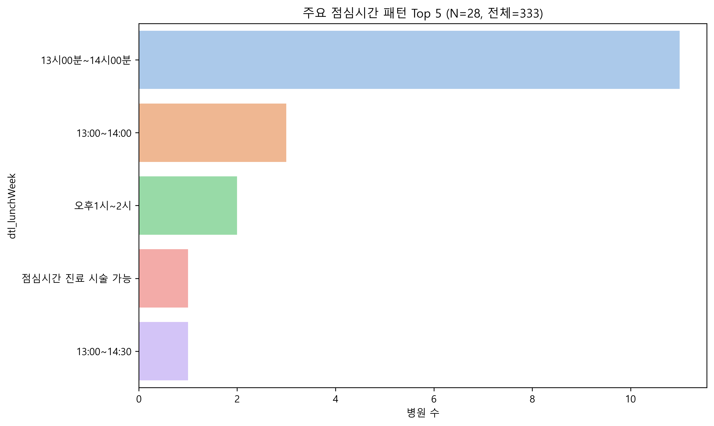
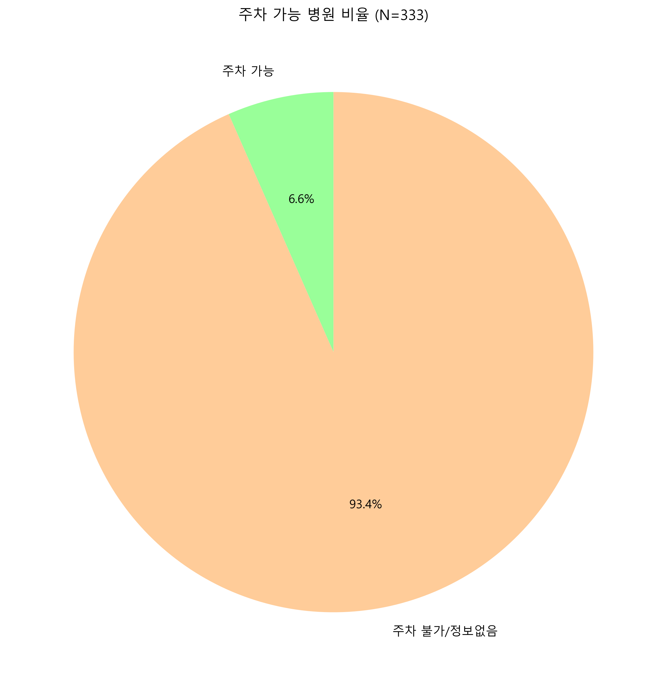
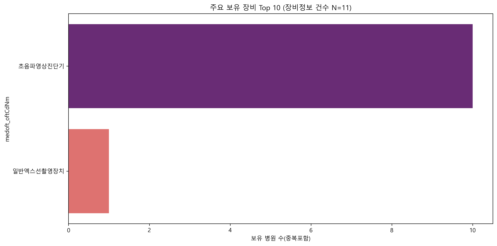
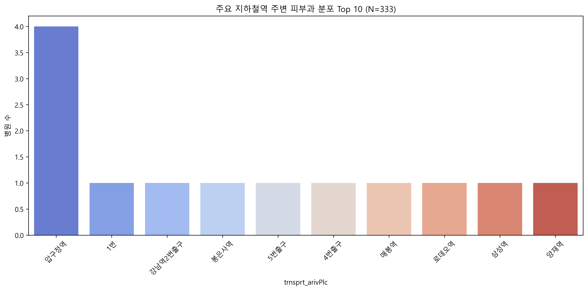

# 강남구 피부과 심층 분석 보고서 (Insight Report)

## 1. 개요
- **분석 대상**: 333개 데이터
- **목표**: 강남구 피부과 시장 미충족 수요(Unmet Needs) 발굴 및 경쟁 우위 전략 도출

## 2. 인력 및 병상 규모 분석
### 2.1 전문의 및 의사 현황

#### [Data Quality] 결측치 현황 (인력)
| 컬럼명 | 결측치 수 | 결측률 | 비고 |
|---|---|---|---|
| `dgsbjt_dgsbjtPrSdrCnt` | 0 | 0.0% | 전문의 수 |

### 2.2 입원 및 응급 시설 (Hospital Scale)

#### [Data Quality] 결측치 현황 (시설)
| 컬럼명 | 결측치 수 | 결측률 | 비고 |
|---|---|---|---|
| `eqp_stdSickbdCnt` | 0 | 0.0% | 병상/응급실 |
| `eqp_hghrSickbdCnt` | 0 | 0.0% | 병상/응급실 |
| `eqp_emymCnt` | 0 | 0.0% | 병상/응급실 |

## 3. 운영 및 편의성 분석
### 3.1 점심시간 및 주차

#### [Data Quality] 결측치 현황 (운영)
| 컬럼명 | 결측치 수 | 결측률 | 비고 |
|---|---|---|---|
| `dtl_lunchWeek` | 305 | 91.6% | |
| `dtl_parkQty` | 307 | 92.2% | |
| `dtl_noTrmtSun` | 309 | 92.8% | |

## 4. 인프라 및 입지 분석
### 4.1 주요 의료 장비

### 4.2 주요 역세권 분포

## 5. 종합 요약 (Dataset Summary)
| 분석영역 | 주요 지표 | 값/비율 | 시사점 |
|---|---|---|---|
| **인력** | 평균 전문의 수 | 0.6명 | 1인 의원 중심 |
| **시설** | 주차 가능 비율 | 6.6% | 자차 접근성 낮음 |
| **운영** | 점심시간 | 13~14시 집중 | 점심 진료 차별화 가능 |
