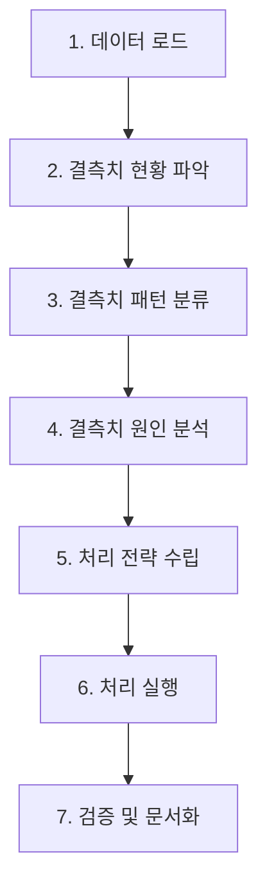

# 결측치 처리 가이드라인 (Missing Value Handling Guidelines)

> **목적**: 데이터 분석 및 처리 시 결측치를 체계적으로 다루기 위한 일반적인 방법론 제시  
> **적용 범위**: 모든 데이터 분석 프로젝트  
> **작성일**: 2026-01-19

---

## 📌 1. 결측치 처리 기본 원칙

### 1.1 핵심 원칙

| 원칙 | 설명 | 적용 예시 |
|------|------|-----------|
| **데이터 보존 우선** | 가능한 한 원본 데이터를 유지하고, 삭제는 최소화 | 결측치가 있어도 다른 유용한 정보가 있다면 보존 |
| **의미 기반 처리** | 결측치의 의미(없음 vs 미제공)를 구분하여 처리 | "장비 없음"과 "장비 정보 미제공"은 다르게 처리 |
| **분석 목적 고려** | 향후 분석 목적에 맞는 처리 방법 선택 | 통계 분석용과 머신러닝용은 다른 전략 필요 |
| **투명성 확보** | 모든 처리 내역을 문서화하고 추적 가능하게 관리 | 처리 로그, 버전 관리, 메타데이터 기록 |
| **일관성 유지** | 동일한 유형의 데이터는 동일한 방식으로 처리 | 프로젝트 전체에서 통일된 규칙 적용 |

---

## 📊 2. 결측치 분석 프로세스

### 2.1 단계별 분석 절차



### 2.2 결측치 현황 파악

#### 기본 통계 수집
```python
import pandas as pd
import numpy as np

def analyze_missing_values(df):
    """
    결측치 기본 통계 분석
    
    Returns:
        DataFrame: 컬럼별 결측치 통계
    """
    missing_stats = pd.DataFrame({
        '전체_건수': len(df),
        '결측치수': df.isnull().sum(),
        '결측_비율(%)': (df.isnull().sum() / len(df) * 100).round(2),
        '데이터타입': df.dtypes
    })
    
    # 결측치가 있는 컬럼만 필터링
    missing_stats = missing_stats[missing_stats['결측치수'] > 0]
    
    # 결측 비율 기준 정렬
    missing_stats = missing_stats.sort_values('결측_비율(%)', ascending=False)
    
    return missing_stats
```

#### 결측치 시각화
```python
import matplotlib.pyplot as plt
import seaborn as sns

def visualize_missing_patterns(df, figsize=(12, 6)):
    """결측치 패턴 시각화"""
    
    # 1. 결측치 히트맵
    plt.figure(figsize=figsize)
    sns.heatmap(df.isnull(), cbar=True, yticklabels=False)
    plt.title('결측치 패턴 히트맵')
    plt.tight_layout()
    plt.savefig('missing_heatmap.png', dpi=300, bbox_inches='tight')
    
    # 2. 결측 비율 막대 그래프
    missing_pct = (df.isnull().sum() / len(df) * 100).sort_values(ascending=False)
    missing_pct = missing_pct[missing_pct > 0]
    
    plt.figure(figsize=figsize)
    missing_pct.plot(kind='barh')
    plt.xlabel('결측 비율 (%)')
    plt.title('컬럼별 결측치 비율')
    plt.tight_layout()
    plt.savefig('missing_percentage.png', dpi=300, bbox_inches='tight')
```

---

## 🔍 3. 결측치 패턴 분류

### 3.1 결측 비율에 따른 분류

| 분류 | 결측 비율 | 처리 전략 | 예시 |
|------|-----------|-----------|------|
| **낮은 결측률** | 0-10% | 대체 또는 제거 가능 | 필수 정보 일부 누락 |
| **중간 결측률** | 10-50% | 신중한 대체 또는 플래그 추가 | 선택적 정보 |
| **높은 결측률** | 50-80% | 결측 유지 또는 별도 분석 | 특수 정보 |
| **매우 높은 결측률** | 80% 이상 | 컬럼 제거 고려 또는 결측 유지 | 거의 제공되지 않는 정보 |

### 3.2 결측치 의미에 따른 분류

#### A. MCAR (Missing Completely At Random)
- **특징**: 결측치가 완전히 무작위로 발생
- **판단 기준**: 결측 여부가 다른 변수와 무관
- **처리 방법**: 단순 삭제 또는 평균/중앙값 대체 가능

#### B. MAR (Missing At Random)
- **특징**: 결측치가 관측된 다른 변수와 관련
- **판단 기준**: 특정 조건에서 결측이 더 많이 발생
- **처리 방법**: 조건부 대체, 회귀 대체

#### C. MNAR (Missing Not At Random)
- **특징**: 결측치가 결측값 자체와 관련
- **판단 기준**: 값이 너무 크거나 작아서 누락
- **처리 방법**: 도메인 지식 기반 처리, 별도 플래그

### 3.3 데이터 유형에 따른 분류

#### 필수 정보 (Critical Data)
- **정의**: 데이터의 고유 식별자 또는 핵심 정보
- **예시**: ID, 이름, 주소, 날짜
- **처리**: 결측 시 해당 레코드 제외

#### 중요 정보 (Important Data)
- **정의**: 분석에 중요하지만 일부 누락 허용 가능
- **예시**: 연락처, 주요 속성
- **처리**: 대체값 사용 또는 '정보없음' 표시

#### 선택 정보 (Optional Data)
- **정의**: 있으면 좋지만 필수는 아닌 정보
- **예시**: 홈페이지, 부가 서비스
- **처리**: 결측 유지 (NULL)

#### 통계 정보 (Statistical Data)
- **정의**: 수치형 통계 데이터
- **예시**: 개수, 금액, 비율
- **처리**: 0 또는 평균값으로 대체

---

## 🛠️ 4. 결측치 처리 방법

### 4.1 삭제 (Deletion)

#### 행 삭제 (Listwise Deletion)
```python
def remove_rows_with_missing(df, columns=None, threshold=None):
    """
    결측치가 있는 행 삭제
    
    Parameters:
    -----------
    df : DataFrame
        원본 데이터
    columns : list, optional
        특정 컬럼만 검사 (None이면 전체)
    threshold : int, optional
        최소 유효 값 개수 (None이면 하나라도 결측이면 삭제)
    """
    if columns:
        df_clean = df.dropna(subset=columns)
    elif threshold:
        df_clean = df.dropna(thresh=threshold)
    else:
        df_clean = df.dropna()
    
    print(f"원본: {len(df)}건 → 처리 후: {len(df_clean)}건 (제거: {len(df) - len(df_clean)}건)")
    return df_clean
```

#### 열 삭제 (Column Deletion)
```python
def remove_columns_with_high_missing(df, threshold=0.8):
    """
    결측 비율이 높은 컬럼 삭제
    
    Parameters:
    -----------
    threshold : float
        삭제 기준 결측 비율 (0.8 = 80%)
    """
    missing_ratio = df.isnull().sum() / len(df)
    cols_to_drop = missing_ratio[missing_ratio > threshold].index.tolist()
    
    print(f"제거할 컬럼 ({len(cols_to_drop)}개): {cols_to_drop}")
    return df.drop(columns=cols_to_drop)
```

### 4.2 대체 (Imputation)

#### 단순 대체
```python
def simple_imputation(df, strategy='mean'):
    """
    단순 대체 방법
    
    Parameters:
    -----------
    strategy : str
        'mean', 'median', 'mode', 'zero', 'constant'
    """
    df_imputed = df.copy()
    
    for col in df.columns:
        if df[col].isnull().sum() > 0:
            if strategy == 'mean' and df[col].dtype in ['int64', 'float64']:
                df_imputed[col].fillna(df[col].mean(), inplace=True)
            elif strategy == 'median' and df[col].dtype in ['int64', 'float64']:
                df_imputed[col].fillna(df[col].median(), inplace=True)
            elif strategy == 'mode':
                df_imputed[col].fillna(df[col].mode()[0], inplace=True)
            elif strategy == 'zero':
                df_imputed[col].fillna(0, inplace=True)
    
    return df_imputed
```

#### 조건부 대체
```python
def conditional_imputation(df, target_col, condition_col, mapping):
    """
    조건에 따른 대체
    
    Parameters:
    -----------
    target_col : str
        대체할 컬럼
    condition_col : str
        조건 컬럼
    mapping : dict
        조건값 → 대체값 매핑
    """
    df_imputed = df.copy()
    
    for condition_value, fill_value in mapping.items():
        mask = (df_imputed[condition_col] == condition_value) & (df_imputed[target_col].isnull())
        df_imputed.loc[mask, target_col] = fill_value
    
    return df_imputed
```

#### 도메인 지식 기반 대체
```python
def domain_based_imputation(df, rules):
    """
    도메인 지식 기반 대체
    
    Parameters:
    -----------
    rules : dict
        컬럼명 → 대체 규칙 딕셔너리
        예: {
            'column_name': {
                'type': 'zero',  # 또는 'constant', 'flag'
                'value': 0,
                'reason': '해당 항목 없음을 의미'
            }
        }
    """
    df_imputed = df.copy()
    
    for col, rule in rules.items():
        if col in df.columns:
            if rule['type'] == 'zero':
                df_imputed[col].fillna(0, inplace=True)
            elif rule['type'] == 'constant':
                df_imputed[col].fillna(rule['value'], inplace=True)
            elif rule['type'] == 'flag':
                # 결측 여부를 별도 컬럼으로 저장
                df_imputed[f'{col}_missing_flag'] = df_imputed[col].isnull().astype(int)
    
    return df_imputed
```

### 4.3 결측 유지 (Keep as NULL)

```python
def keep_missing_with_documentation(df, columns, reason):
    """
    결측치를 유지하되 문서화
    
    Parameters:
    -----------
    columns : list
        결측 유지할 컬럼 리스트
    reason : str
        유지 사유
    """
    metadata = {
        'columns': columns,
        'reason': reason,
        'missing_count': {col: df[col].isnull().sum() for col in columns},
        'missing_ratio': {col: f"{(df[col].isnull().sum() / len(df) * 100):.2f}%" for col in columns}
    }
    
    return df, metadata
```

---

## 📋 5. 컬럼별 처리 방법 결정 프로세스

### 5.1 의사결정 플로우차트

```
1. 컬럼이 필수 정보인가?
   ├─ YES → 결측 시 행 삭제
   └─ NO → 2번으로

2. 결측 비율이 80% 이상인가?
   ├─ YES → 컬럼 삭제 고려 또는 결측 유지
   └─ NO → 3번으로

3. 결측의 의미가 "없음"인가?
   ├─ YES (예: 장비 없음, 직원 0명)
   │   └─ 수치형: 0으로 대체
   │   └─ 범주형: 'N' 또는 '해당없음'으로 대체
   └─ NO (정보 미제공) → 4번으로

4. 결측 비율이 10% 미만인가?
   ├─ YES → 평균/중앙값/최빈값으로 대체
   └─ NO → 결측 유지 (NULL) + 플래그 추가 고려
```

### 5.2 처리 방법 매트릭스

| 데이터 유형 | 결측 비율 | 결측 의미 | 권장 처리 방법 |
|------------|----------|-----------|---------------|
| 필수 정보 | 모든 비율 | - | **행 삭제** |
| 수치형 | 0-10% | 미제공 | 평균/중앙값 대체 |
| 수치형 | 0-10% | 없음 | **0으로 대체** |
| 수치형 | 10-50% | 미제공 | 조건부 대체 또는 결측 유지 |
| 수치형 | 10-50% | 없음 | **0으로 대체** |
| 수치형 | 50% 이상 | - | **결측 유지 (NULL)** |
| 범주형 | 0-10% | 미제공 | 최빈값 대체 |
| 범주형 | 0-10% | 없음 | **'해당없음' 대체** |
| 범주형 | 10-50% | - | **결측 유지 (NULL)** |
| 범주형 | 50% 이상 | - | **결측 유지 (NULL)** 또는 컬럼 삭제 |
| Y/N 플래그 | 모든 비율 | 없음 | **'N'으로 대체** |
| 코드-명칭 쌍 | 모든 비율 | - | **동일하게 처리** (연동 관계 유지) |

---

## 📝 6. 결측치 처리 문서화 템플릿

### 6.1 분석 문서 구조

```markdown
# [프로젝트명] 결측치 분석 및 처리 방법

> **분석 대상**: [파일명]
> **분석 일시**: YYYY-MM-DD HH:MM:SS
> **총 데이터 건수**: N건
> **총 컬럼 수**: M개

## 1. 결측치 현황 개요

### 1.1 데이터 구조
- **카테고리 1**: N개 컬럼
- **카테고리 2**: M개 컬럼
...

### 1.2 결측치 통계 요약
- 결측치 없는 컬럼: X개
- 결측치 있는 컬럼: Y개
- 평균 결측 비율: Z%

## 2. 결측치 패턴 분류

### 2.1 결측 비율별 분류
- 낮은 결측률 (0-10%): N개 컬럼
- 중간 결측률 (10-50%): M개 컬럼
- 높은 결측률 (50% 이상): K개 컬럼

## 3. 컬럼별 처리 방법

### 3.1 카테고리 1: [카테고리명]

| 컬럼명 | 전체 건수 | 결측치수 | 결측 비율 | 처리방법 | 대체값 | 사유 |
|--------|----------|----------|----------|----------|--------|------|
| `column1` (설명) | N | M | X% | 방법 | 값 | 이유 |

## 4. 처리 구현 코드

```python
# 실제 처리 코드
```

## 5. 처리 결과 검증

- 처리 전 데이터: N건
- 처리 후 데이터: M건
- 제외된 데이터: K건

## 6. 주의사항 및 권장사항

[프로젝트별 특이사항]
```

### 6.2 처리 로그 기록

```python
import json
from datetime import datetime

def log_missing_value_processing(df_before, df_after, processing_rules, output_file='processing_log.json'):
    """
    결측치 처리 로그 기록
    
    Parameters:
    -----------
    df_before : DataFrame
        처리 전 데이터
    df_after : DataFrame
        처리 후 데이터
    processing_rules : dict
        적용된 처리 규칙
    """
    log = {
        'timestamp': datetime.now().isoformat(),
        'before': {
            'rows': len(df_before),
            'columns': len(df_before.columns),
            'total_missing': int(df_before.isnull().sum().sum())
        },
        'after': {
            'rows': len(df_after),
            'columns': len(df_after.columns),
            'total_missing': int(df_after.isnull().sum().sum())
        },
        'processing_rules': processing_rules,
        'changes': {
            'rows_removed': len(df_before) - len(df_after),
            'missing_reduced': int(df_before.isnull().sum().sum() - df_after.isnull().sum().sum())
        }
    }
    
    with open(output_file, 'w', encoding='utf-8') as f:
        json.dump(log, f, ensure_ascii=False, indent=2)
    
    return log
```

---

## ⚠️ 7. 주의사항

### 7.1 일반적 주의사항

1. **과도한 삭제 지양**
   - 행 삭제는 정보 손실을 초래하므로 신중하게 결정
   - 가능하면 대체 방법 우선 고려

2. **대체값의 의미 명확화**
   - 0 대체: "없음"을 의미하는지 명확히 구분
   - NULL 유지: "정보 미제공"의 의미

3. **데이터 타입 일관성**
   - 대체 후에도 원래 데이터 타입 유지
   - 수치형 컬럼에 문자열 대체 금지

4. **통계적 왜곡 방지**
   - 평균값 대체 시 분산 감소 주의
   - 중요한 분석에는 민감도 분석 수행

### 7.2 프로젝트별 고려사항

1. **도메인 지식 활용**
   - 해당 분야 전문가의 의견 반영
   - 비즈니스 로직에 맞는 처리

2. **법적/규제 요구사항**
   - 개인정보 처리 시 주의
   - 필수 항목 규정 준수

3. **후속 분석 영향**
   - 머신러닝 모델 학습 시 영향 고려
   - 통계 분석 시 가정 검토

---

## 📚 8. 참고 자료

### 8.1 추천 라이브러리

- **pandas**: 기본 결측치 처리
- **scikit-learn**: SimpleImputer, KNNImputer
- **missingno**: 결측치 시각화
- **fancyimpute**: 고급 대체 알고리즘

### 8.2 추가 학습 자료

- Little, R. J., & Rubin, D. B. (2019). Statistical analysis with missing data (Vol. 793). John Wiley & Sons.
- Van Buuren, S. (2018). Flexible imputation of missing data. CRC press.

---

## 📌 9. 체크리스트

결측치 처리 완료 전 확인사항:

- [ ] 결측치 현황 파악 완료
- [ ] 결측치 패턴 분류 완료
- [ ] 컬럼별 처리 방법 결정
- [ ] 처리 코드 작성 및 테스트
- [ ] 처리 전후 비교 검증
- [ ] 처리 로그 기록
- [ ] 문서화 완료
- [ ] 원본 데이터 백업
- [ ] 처리된 데이터 저장
- [ ] 팀 리뷰 완료

---

**문서 버전**: 1.0  
**최종 수정**: 2026-01-19  
**작성자**: Data Analysis Team
