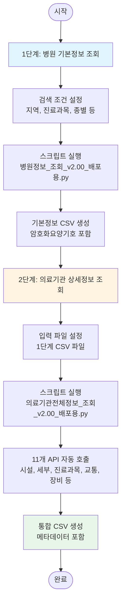
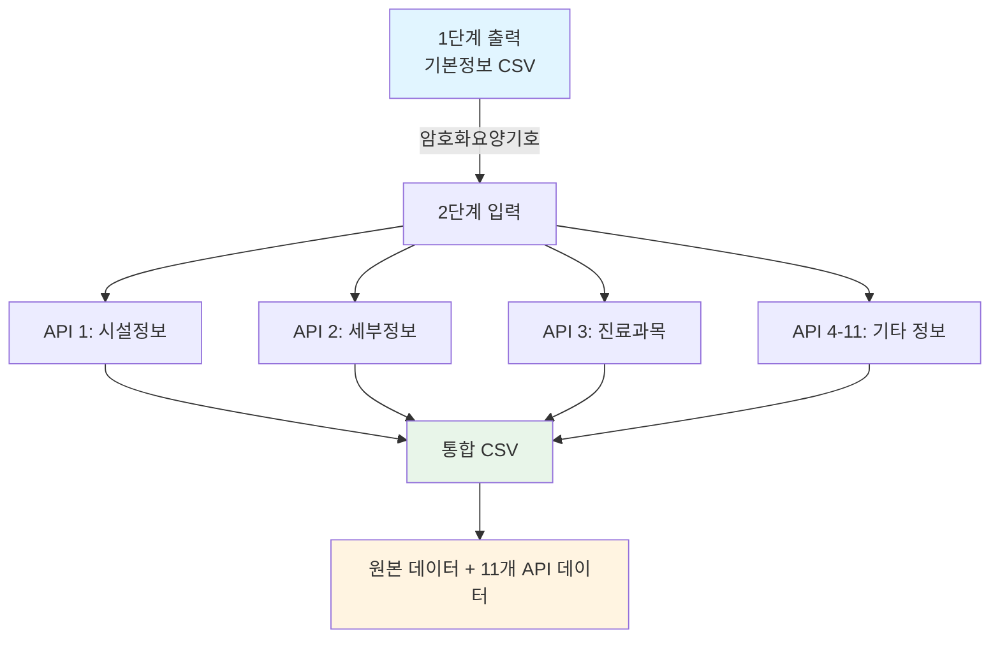

# HIRA 병원정보 수집 통합 사용 가이드

**버전**: 1.0  
**작성일**: 2026-01-17  
**목적**: 병원 기본정보 조회부터 상세정보 수집까지 전체 워크플로우 안내

---

## 📋 목차

1. [개요](#개요)
2. [전체 워크플로우](#전체-워크플로우)
3. [1단계: 병원 기본정보 조회](#1단계-병원-기본정보-조회)
4. [2단계: 의료기관 상세정보 조회](#2단계-의료기관-상세정보-조회)
5. [데이터 흐름 및 연계](#데이터-흐름-및-연계)
6. [통합 문제 해결](#통합-문제-해결)
7. [활용 사례](#활용-사례)

---

## 개요

### 목적

건강보험심사평가원(HIRA) Open API를 활용하여 **병원 기본정보**와 **상세정보**를 체계적으로 수집하는 2단계 워크플로우를 제공합니다.

### 2단계 워크플로우


### 수집 데이터 범위

| 단계 | API | 수집 정보 | 출력 |
|------|-----|----------|------|
| **1단계** | 병원정보서비스 | 병원명, 주소, 전화번호, 진료과목, 의사수, 좌표 등 | 기본정보 CSV |
| **2단계** | 의료기관별상세정보서비스 (11개 API) | 시설정보, 세부정보, 진료과목, 교통정보, 의료장비, 간호등급, 특수진료, 전문병원, 전문의수, 기타인력 등 | 통합 CSV |

---

## 전체 워크플로우

### 단계별 흐름도



### 소요 시간 예상

| 단계 | 데이터 규모 | 예상 소요 시간 |
|------|------------|---------------|
| 1단계 | 100건 | 약 1-2분 |
| 1단계 | 1,000건 | 약 10-15분 |
| 2단계 | 100건 | 약 10-15분 |
| 2단계 | 1,000건 | 약 1.5-2시간 |

> 💡 **팁**: 2단계는 11개 API를 순차 호출하므로 시간이 오래 걸립니다. 체크포인트 기능을 활용하여 중단 후 재개할 수 있습니다.

---

## 1단계: 병원 기본정보 조회

### 목적
지역, 진료과목, 종별 등의 조건으로 병원 목록을 검색하고 기본정보를 수집합니다.

### 사용 스크립트
- **파일명**: `병원정보_조회_v2.00_배포용.py`
- **위치**: `d:\git_gb4pro\crawling\openapi\getHospBasisList\`

### 준비사항

#### 1. API 인증키 발급
1. [공공데이터포털](https://www.data.go.kr) 접속
2. **"병원정보서비스"** 검색 및 활용신청
3. 승인 후 **디코딩 인증키** 복사

#### 2. 필수 라이브러리 설치
```bash
pip install requests pandas
```

### 설정 방법

스크립트를 열고 다음 항목을 수정하세요:

```python
# 1. 인증키 설정 (필수)
SERVICE_KEY = "여기에_발급받은_디코딩_인증키를_입력하세요"

# 3. 검색 조건 설정
SEARCH_SIDO = '서울'           # 시도명
SEARCH_SGGU = '강남구'         # 시군구명
SEARCH_DGSBJ = '피부과'        # 진료과목
SEARCH_CL = None              # 종별 (None이면 전체)
```

### 실행 방법

```bash
cd "D:\git_gb4pro\crawling\openapi\getHospBasisList"
python 병원정보_조회_v2.00_배포용.py
```

### 출력 파일

```
getHospBasisList\
└── data\
    └── 서울_강남구_피부과_20260117_084530.csv
```

**주요 컬럼**:
- `암호화요양기호` ⭐ (2단계에서 사용)
- `병원명`, `종별`, `주소`, `전화번호`
- `시도`, `시군구`, `읍면동`
- `의사총수`, `전문의수`
- `경도`, `위도`

### 다음 단계로

✅ CSV 파일이 생성되었으면 **2단계**로 진행하세요.  
✅ `암호화요양기호` 컬럼이 포함되어 있는지 확인하세요.

---

## 2단계: 의료기관 상세정보 조회

### 목적
1단계에서 수집한 병원 목록의 각 병원에 대해 11개 API를 호출하여 상세정보를 수집합니다.

### 사용 스크립트
- **파일명**: `의료기관전체정보_조회_v2.00_배포용.py`
- **위치**: `d:\git_gb4pro\crawling\openapi\getHospDetailList\`

### 준비사항

#### 1. API 인증키 발급
1. [공공데이터포털](https://www.data.go.kr) 접속
2. **"의료기관별상세정보서비스"** 검색 및 활용신청
3. 승인 후 **디코딩 인증키** 복사

> ⚠️ **주의**: 1단계와 다른 API이므로 별도로 신청해야 합니다!

#### 2. 입력 파일 준비
1단계에서 생성한 CSV 파일을 준비합니다.

### 설정 방법

스크립트를 열고 다음 항목을 수정하세요:

```python
# 1. 인증키 설정 (필수)
SERVICE_KEY = "여기에_발급받은_디코딩_인증키를_입력하세요"

# 3. 입력 파일 설정 (필수)
INPUT_CSV_FILE = r"여기에_입력_CSV_파일_경로를_입력하세요"
```

**입력 파일 경로 예시**:
```python
# 절대 경로
INPUT_CSV_FILE = r"D:\git_gb4pro\crawling\openapi\getHospBasisList\data\서울_강남구_피부과_20260117_084530.csv"

# 상대 경로
INPUT_CSV_FILE = r"..\getHospBasisList\data\서울_강남구_피부과_20260117_084530.csv"
```

### 테스트 모드 (권장)

처음 실행 시 소량 데이터로 테스트하세요:

```python
# 8. 테스트 모드 설정
TEST_MODE = True         # True로 변경
MAX_TEST_RECORDS = 3     # 테스트할 레코드 수
```

성공 확인 후 전체 실행:

```python
TEST_MODE = False
```

### 실행 방법

```bash
cd "D:\git_gb4pro\crawling\openapi\getHospDetailList"
python 의료기관전체정보_조회_v2.00_배포용.py
```

### 11개 API 호출 내역

스크립트는 각 병원에 대해 다음 11개 API를 자동으로 호출합니다:

| API 코드 | API 이름 | 수집 정보 |
|---------|---------|----------|
| `eqp` | 시설정보 | 병상수, 입원실, 수술실 등 |
| `dtl` | 세부정보 | 병원명, 주소, 전화번호, 운영시간 등 |
| `dgsbjt` | 진료과목정보 | 진료과목별 전문의 수 |
| `trnsprt` | 교통정보 | 대중교통 이용 방법 |
| `medoft` | 의료장비정보 | CT, MRI 등 장비 보유 현황 |
| `foepaddc` | 식대가산정보 | 식대 가산 여부 |
| `nursiggrd` | 간호등급정보 | 간호등급 |
| `spcldiag` | 특수진료정보 | 특수 진료 항목 |
| `spclhosp` | 전문병원지정분야 | 전문병원 지정 분야 |
| `spcsbtj` | 전문과목별전문의수 | 전문과목별 전문의 수 |
| `etchst` | 기타인력수정보 | 간호사, 약사 등 인력 수 |

### 출력 파일

```
getHospDetailList\
└── data\
    ├── 병원전체정보_20260117_091500.csv      ← 통합 데이터
    └── 병원전체정보_20260117_091500.md       ← 메타데이터
```

**CSV 파일 구조**:
- **원본 데이터**: `원본_기관코드`, `원본_병원명`, `원본_주소`
- **11개 API 데이터**: 각 API별로 접두사가 붙은 컬럼
  - `eqp_*`: 시설정보
  - `dtl_*`: 세부정보
  - `dgsbjt_*`: 진료과목정보
  - ... (11개 API)

**메타데이터 파일**:
- 데이터 개요 (총 레코드 수, 컬럼 수)
- API별 수집 정보 통계
- 주요 컬럼 결측치 분석

---

## 데이터 흐름 및 연계

### 데이터 연계 구조



### 핵심 연결 고리: 암호화요양기호

**1단계 출력**:
```csv
암호화요양기호,병원명,주소,...
JDQ4MTIzNDU2Nzg5,강남피부과의원,서울특별시 강남구...
```

**2단계 입력**:
- 스크립트가 `암호화요양기호` 컬럼을 자동으로 탐지
- 각 요양기호에 대해 11개 API 호출
- 원본 데이터와 API 응답을 병합

**2단계 출력**:
```csv
원본_기관코드,원본_병원명,eqp_병상수,dtl_전화번호,dgsbjt_진료과목,...
JDQ4MTIzNDU2Nzg5,강남피부과의원,0,02-1234-5678,피부과,...
```

### 데이터 품질 관리

#### 1단계 품질 확인
- [ ] CSV 파일이 정상적으로 생성되었는가?
- [ ] `암호화요양기호` 컬럼이 포함되어 있는가?
- [ ] 예상한 병원 수가 수집되었는가?

#### 2단계 품질 확인
- [ ] 메타데이터 파일에서 API별 응답률 확인
- [ ] 주요 컬럼의 결측치 비율 확인
- [ ] 원본 데이터가 올바르게 매핑되었는가?

---

## 통합 문제 해결

### 1. 1단계와 2단계 API 인증키 혼동

**문제**:
```
API 오류 [30]: SERVICE_KEY_IS_NOT_REGISTERED_ERROR
```

**원인**: 1단계와 2단계는 서로 다른 API이므로 별도의 인증키가 필요합니다.

**해결**:
1. 공공데이터포털에서 두 API를 각각 신청
   - **1단계**: "병원정보서비스"
   - **2단계**: "의료기관별상세정보서비스"
2. 각 스크립트에 해당하는 인증키를 입력

---

### 2. 암호화요양기호 컬럼 없음

**문제**:
```
요양기호 컬럼을 찾을 수 없습니다.
```

**원인**: 1단계 스크립트에서 `OUTPUT_INCLUDE_YKIHO = False`로 설정

**해결**:
1. 1단계 스크립트 설정 확인:
   ```python
   OUTPUT_INCLUDE_YKIHO = True  # True로 설정
   ```
2. 1단계를 다시 실행하여 CSV 파일 재생성

---

### 3. 2단계 입력 파일 경로 오류

**문제**:
```
[오류] CSV 파일 읽기 실패: No such file or directory
```

**해결**:
1. 파일 경로가 올바른지 확인
2. 절대 경로 사용 권장:
   ```python
   INPUT_CSV_FILE = r"D:\git_gb4pro\crawling\openapi\getHospBasisList\data\서울_강남구_피부과_20260117_084530.csv"
   ```
3. 경로 앞에 `r`을 붙여 백슬래시 문제 방지

---

### 4. 대량 데이터 처리 시 중단

**문제**: 1,000건 이상의 데이터 처리 중 중단됨

**해결**:
1. **체크포인트 기능 활용** (기본 활성화)
   - 중단된 지점부터 자동으로 재개
   - 같은 명령어로 다시 실행

2. **테스트 모드로 먼저 확인**
   ```python
   TEST_MODE = True
   MAX_TEST_RECORDS = 10
   ```

3. **트래픽 제한 확인**
   - 개발 계정: 일 1,000건 제한
   - 운영 계정 신청 고려

---

### 5. API 응답률 낮음

**문제**: 메타데이터에서 특정 API 응답률이 낮게 나타남

**원인**: 
- 일부 병원은 특정 정보를 제공하지 않음
- 예: 의원급은 간호등급 정보가 없을 수 있음

**해결**:
- 정상적인 현상입니다
- 메타데이터 파일에서 API별 응답률을 확인하여 데이터 품질 파악
- 필요시 결측치 처리 전략 수립

---

## 활용 사례

### 사례 1: 특정 지역 피부과 분석

**목표**: 서울 강남구 피부과의 시설 및 장비 현황 분석

**1단계**:
```python
SEARCH_SIDO = '서울'
SEARCH_SGGU = '강남구'
SEARCH_DGSBJ = '피부과'
```
→ 156건 수집

**2단계**:
- 입력: 156건 CSV 파일
- 출력: 156건 × 11개 API = 통합 데이터

**분석**:
- `eqp_병상수`: 입원 가능 여부
- `medoft_*`: 레이저 장비 보유 현황
- `dtl_운영시간`: 진료 시간대

---

### 사례 2: 전국 상급종합병원 현황

**목표**: 전국 상급종합병원의 전문의 수 및 특수진료 현황

**1단계**:
```python
SEARCH_SIDO = None
SEARCH_SGGU = None
SEARCH_DGSBJ = None
SEARCH_CL = '상급종합병원'
```
→ 약 45건 수집

**2단계**:
- 입력: 45건 CSV 파일
- 출력: 45건 × 11개 API = 통합 데이터

**분석**:
- `spcsbtj_*`: 전문과목별 전문의 수
- `spcldiag_*`: 특수진료 항목
- `medoft_*`: 고가 의료장비 보유 현황

---

### 사례 3: 지역별 소아청소년과 비교

**목표**: 서울 25개 구의 소아청소년과 분포 및 의사 수 비교

**1단계**: 각 구별로 실행
```python
# 강남구
SEARCH_SIDO = '서울'
SEARCH_SGGU = '강남구'
SEARCH_DGSBJ = '소아청소년과'

# 서초구
SEARCH_SGGU = '서초구'
# ... (25개 구 반복)
```

**2단계**: 각 구별 CSV 파일에 대해 실행

**분석**:
- 구별 병원 수 비교
- 구별 의사 수 비교
- 진료 시간대 분석

---

## 📊 데이터 활용 가이드

### Excel 분석

1. **피벗 테이블 활용**
   - 지역별, 종별 집계
   - 의사 수, 병상 수 통계

2. **필터링**
   - 특정 조건에 맞는 병원 추출
   - 예: 간호등급 1등급, MRI 보유

### Python 분석

```python
import pandas as pd

# CSV 읽기
df = pd.read_csv('병원전체정보_20260117_091500.csv', encoding='utf-8-sig')

# 기본 통계
print(df.describe())

# 종별 집계
print(df['dtl_종별코드명'].value_counts())

# 결측치 확인
print(df.isnull().sum())

# 특정 조건 필터링
high_grade = df[df['nursiggrd_간호등급'] == '1등급']
```

---

## 📞 추가 도움말

### 관련 문서

#### 1단계 관련
- [병원정보 조회 README](getHospBasisList/README.md)
- [병원정보 조회 배포용 가이드](getHospBasisList/배포용_사용가이드.md)
- [병원정보 조회 API 가이드라인](getHospBasisList/getHospBasisList_api_guideline.md)

#### 2단계 관련
- [의료기관상세정보 조회 README](getHospDetailList/README.md)
- [의료기관상세정보 조회 배포용 가이드](getHospDetailList/배포용_사용가이드.md)
- [의료기관상세정보 조회 API 가이드라인](getHospDetailList/getHospDetailList_api_guideline.md)

### 공식 자료
- [공공데이터포털](https://www.data.go.kr)
- [건강보험심사평가원](https://www.hira.or.kr)

---

## 🎯 빠른 시작 체크리스트

### 1단계 준비
- [ ] Python 3.8 이상 설치
- [ ] `pip install requests pandas` 실행
- [ ] 병원정보서비스 API 인증키 발급
- [ ] 스크립트에 인증키 입력
- [ ] 검색 조건 설정

### 1단계 실행
- [ ] 스크립트 실행
- [ ] CSV 파일 생성 확인
- [ ] `암호화요양기호` 컬럼 확인

### 2단계 준비
- [ ] 의료기관별상세정보서비스 API 인증키 발급
- [ ] 스크립트에 인증키 입력
- [ ] 1단계 CSV 파일 경로 설정
- [ ] 테스트 모드 활성화 (권장)

### 2단계 실행
- [ ] 테스트 모드로 실행 (3건)
- [ ] 결과 확인 후 전체 실행
- [ ] 통합 CSV 파일 생성 확인
- [ ] 메타데이터 파일 확인

---

**문서 버전**: 1.0  
**최종 수정**: 2026-01-17  
**작성자**: OpenAPI 스크립트 개발팀

---

## 📝 버전 히스토리

| 버전 | 날짜 | 변경 내용 |
|------|------|----------|
| 1.0 | 2026-01-17 | 초안 작성 |
