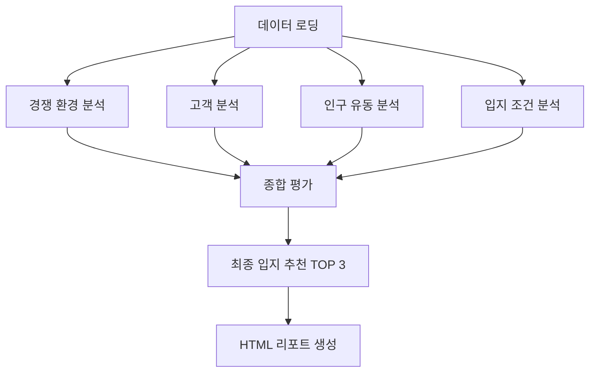

# 의원급 피부과 입지 분석을 위한 EDA 실행 가이드라인

**작성일**: 2026-02-03  
**버전**: 5.00 (분석 내용 및 시각화 대폭 확장 - 실전 분석 가이드)  
**데이터 기준**: 강남 지역 9개 주요 상권 데이터 (2022년 1분기 ~ 2024년 4분기)  
**분석 목적**: 의원급 피부과 최적 입지 선정을 위한 종합 탐색적 데이터 분석

---

## 📋 변경 이력

### v5.00 (2026-02-03) - 분석 내용 및 시각화 대폭 확장 ⭐ NEW
- 📊 **분석 프레임워크 개요 추가**
  - 4개 핵심 차원(경쟁/고객/인구/입지) 및 가중치 명시
  - 9개 분석 대상 상권 명확화
  - 분석 흐름도 추가
  
- 🎨 **시각화 디자인 가이드 신규 추가**
  - 색상 팔레트 정의 (Primary, Gradient)
  - 그래프 유형별 코드 예시 (막대, 라인, 산점도, 히트맵, 레이더)
  - 저장 설정 표준화
  
- 📈 **7개 단계별 분석 가이드 상세화**
  - 각 단계별 분석 목적, 핵심 지표, 계산식, 예상 인사이트 제공
  - 생성 시각화 목록 및 코드 예시
  
- 📄 **산출물 HTML 리포트로 통일**
  - PDF 대신 HTML 형식으로 최종 리포트 생성
  - 브라우저에서 바로 확인 가능
  - 이미지 임베딩 및 인터랙티브 요소 지원

- 🔧 **실행 안정성 강화 (V4.01 통합)**
  - 타임아웃 메커니즘 (폰트 60초, 데이터 로딩 180초)
  - 자동 재시도 로직 (최대 3회, 지수 백오프)
  - 하트비트 모니터링 (`heartbeat.txt`) 및 환경 진단 (`00_환경진단.py`)

### v4.01 (2026-02-03) - 한글 폰트 설정 개선
- 🎨 CP949 인코딩 에러 해결
- 📝 직접 폰트 설정 방법 추가
- 🔍 폰트 진단 도구 추가

### v4.00 (2026-02-03) - 무한 로딩 근본 해결
- 🔧 타임아웃 메커니즘 도입
- 🔄 재시도 로직 구현
- 💓 하트비트 모니터링 추가

---

## 📊 분석 프레임워크 개요

### 분석 목표

**강남 지역 9개 주요 상권**을 대상으로 의원급 피부과 최적 입지를 선정하기 위해 **4개 핵심 차원**을 종합 평가합니다.

### 분석 대상 상권

| 순번 | 상권명               | 카테고리     | 특징                     |
| ---- | -------------------- | ------------ | ------------------------ |
| 1    | 강남 마이스 관광특구 | 관광특구     | 국제 비즈니스 중심지     |
| 2    | 강남역               | 인구밀집지역 | 최대 유동인구, 상업 중심 |
| 3    | 선릉역               | 인구밀집지역 | 업무/상업 복합           |
| 4    | 신논현역             | 인구밀집지역 | 주거/상업 복합           |
| 5    | 양재역               | 인구밀집지역 | 교통 요충지              |
| 6    | 역삼역               | 인구밀집지역 | IT/금융 중심지           |
| 7    | 가로수길             | 발달상권     | 패션/뷰티 특화           |
| 8    | 압구정로데오         | 발달상권     | 럭셔리 쇼핑              |
| 9    | 청담사거리           | 발달상권     | 프리미엄 소비            |

### 분석 차원 및 가중치

| 차원      | 가중치 | 핵심 질문                    | 주요 지표                    |
| --------- | ------ | ---------------------------- | ---------------------------- |
| 경쟁 환경 | 20%    | 시장이 포화되지 않았는가?    | 경쟁 밀도, HHI, 시장 점유율  |
| 고객 수요 | 40%    | 타겟 고객의 수요가 충분한가? | 매출액, 고객 연령/성별 분포  |
| 인구 유동 | 20%    | 유동인구가 충분한가?         | 상주인구, 직장인구, 유동인구 |
| 입지 조건 | 20%    | 접근성과 인프라가 우수한가?  | 집객시설, 소득 수준          |

### 분석 흐름도



---

## 📈 단계별 분석 방법론

### 1. 경쟁 환경 분석

#### 분석 목적
상권별 피부과 경쟁 강도를 측정하여 진입 가능성을 평가합니다.

#### 핵심 지표

**1) 경쟁 밀도 (Competitive Density)**
```python
경쟁밀도 = 상권 내 피부과 수 / 상권 면적(km²)
```
- **해석**: 높을수록 경쟁 심화
- **기준**: 
  - 낮음: < 5개/km²
  - 중간: 5-10개/km²
  - 높음: > 10개/km²

**2) HHI (Herfindahl-Hirschman Index)**
```python
HHI = Σ(각 병원의 시장점유율²) × 10,000
```
- **해석**: 시장 집중도 측정
- **기준**:
  - 경쟁적 시장: HHI < 1,500
  - 중간 집중: 1,500 ≤ HHI < 2,500
  - 고도 집중: HHI ≥ 2,500

**3) 시장 포화도**
```python
포화도 = (현재 피부과 수 / 예상 수요) × 100
```

#### 생성 시각화

1. **상권별 경쟁 밀도 히트맵**
2. **HHI 산점도**
3. **경쟁 강도 레이더 차트**

#### 산출물
- `상권별_경쟁분포_현황.csv`
- `경쟁밀도_히트맵.png`
- `HHI_분석.png`
- `경쟁강도_레이더.png`
- `경쟁환경_분석_리포트.html` ⭐ HTML

#### 예상 인사이트
- 강남역: 높은 경쟁 밀도, 높은 HHI → 진입 어려움
- 양재역: 낮은 경쟁 밀도, 낮은 HHI → 진입 기회

---

### 2. 고객 분석

#### 분석 목적
타겟 고객(20-40대 여성)의 수요와 소비 패턴을 분석합니다.

#### 핵심 지표

**1) 타겟 고객 매출액**
```python
타겟매출 = Σ(20대여성매출 + 30대여성매출 + 40대여성매출)
```

**2) 고객 집중도**
```python
집중도 = 타겟고객매출 / 전체매출 × 100
```
- **해석**: 타겟 고객 의존도
- **기준**: > 60% 이상 권장

**3) 분기별 성장률**
```python
성장률 = (현재분기매출 - 이전분기매출) / 이전분기매출 × 100
```

#### 생성 시각화

1. **연령별/성별 매출 분포 (스택 막대 그래프)**
2. **타겟 고객 집중도 (도넛 차트)**
3. **분기별 매출 추이 (라인 차트)**
4. **고객 수요 히트맵 (시간대별)**

#### 산출물
- `상권별_매출현황.csv`
- `연령성별_매출분포.png`
- `타겟고객_집중도.png`
- `분기별_매출추이.png`
- `시간대별_수요_히트맵.png`
- `고객분석_리포트.html` ⭐ HTML

#### 예상 인사이트
- 가로수길: 20-30대 여성 매출 80% → 타겟 적합
- 양재역: 40-50대 여성 중심 → 타겟 부적합

---

### 3. 인구 유동 분석

#### 분석 목적
상권별 인구 구조와 유동 패턴을 분석하여 잠재 고객 규모를 추정합니다.

#### 핵심 지표

**1) 총 유효 인구**
```python
유효인구 = 상주인구 + (직장인구 × 0.7) + (유동인구 × 0.3)
```
- 가중치: 상주 > 직장 > 유동

**2) 타겟 인구 밀도**
```python
타겟밀도 = 20-40대여성인구 / 상권면적
```

**3) 인구 다양성 지수**
```python
다양성 = 1 - Σ(각연령대비율²)
```
- 높을수록 다양한 연령층 분포

#### 생성 시각화

1. **인구 구조 피라미드**
2. **유동인구 시계열 분석**
3. **인구 밀도 버블 차트**
4. **요일별 유동 패턴 (박스플롯)**

#### 산출물
- `상권별_인구현황.csv`
- `인구구조_피라미드.png`
- `유동인구_시계열.png`
- `인구밀도_버블차트.png`
- `요일별_유동패턴.png`
- `인구분석_리포트.html` ⭐ HTML

---

### 4. 입지 조건 분석

#### 분석 목적
상권의 접근성, 인프라, 소비력을 종합 평가합니다.

#### 핵심 지표

**1) 집객시설 점수**
```python
집객점수 = (편의시설수 + 문화시설수 + 의료시설수) / 3
```

**2) 소비력 지수**
```python
소비력 = (평균소득 / 전국평균소득) × 100
```

**3) 종합 입지 점수**
```python
입지점수 = (집객시설×0.5 + 소비력×0.5) × 100
```

#### 생성 시각화

1. **집객시설 분포 막대 그래프**
2. **소득 수준 박스플롯**
3. **종합 입지 레이더 차트**

#### 산출물
- `상권별_입지조건.csv`
- `집객시설_분포.png`
- `소득수준_분포.png`
- `종합입지_레이더.png`
- `입지분석_리포트.html` ⭐ HTML

---

### 5. 종합 평가

#### 평가 방법론

**1) 점수 정규화**
각 지표를 0-1 범위로 정규화:
```python
정규화점수 = (실제값 - 최소값) / (최대값 - 최소값)
```

**2) 가중 합산**
```python
종합점수 = (경쟁환경×0.2 + 고객수요×0.4 + 인구유동×0.2 + 입지조건×0.2) × 100
```

**3) 순위 산정**
종합점수 기준 내림차순 정렬

#### 생성 시각화

1. **종합 점수 순위 (막대 그래프)** - 전체 9개 상권
2. **4차원 레이더 차트** - 상위 5개 상권 비교
3. **점수 분포 막대 그래프** - 전체 9개 상권 점수 비교
4. **상관관계 매트릭스** - 4개 차원 간 상관계수
5. **최종 추천 대시보드** - 4×2 서브플롯, TOP 5 상권 종합 정보

#### 산출물
- `전체_상권_종합점수.csv`
- `종합점수_순위.png`
- `4차원_레이더.png`
- `점수분포_막대그래프.png`
- `상관관계_매트릭스.png`
- `최종추천_대시보드.png`
- `종합평가_최종리포트.html` ⭐ HTML

---

### 6. 최종 리포트 생성

#### 분석 목적
모든 분석 결과를 통합하여 전문적인 **HTML 리포트**를 생성합니다.

#### 리포트 구조

**1. 표지**
- 제목: "의원급 피부과 최적 입지 분석 리포트"
- 분석 기간: 2022년 1분기 ~ 2024년 4분기
- 생성 일자

**2. 요약 (Executive Summary)**
- 분석 목적
- 주요 발견사항 (Key Findings)
- 9개 상권 종합 평가 결과
- 최종 추천 상권 (TOP 3)
- 핵심 인사이트

**3. 분석 방법론**
- 데이터 출처
- 분석 프레임워크
- 평가 지표 및 가중치

**4. 상세 분석 결과**
- 4.1 경쟁 환경 분석
- 4.2 고객 분석
- 4.3 인구 유동 분석
- 4.4 입지 조건 분석

**5. 종합 평가**
- 종합 점수 순위 (9개 상권)
- 상위 5개 상권 상세 프로필
- 비교 분석

**6. 결론 및 제언**
- 최종 추천 입지
- 진입 전략 제안
- 리스크 요인

**7. 부록**
- 전체 데이터 테이블
- 추가 시각화
- 용어 정의

#### HTML 리포트 생성 방법

```python
html_template = '''
<!DOCTYPE html>
<html lang="ko">
<head>
    <meta charset="UTF-8">
    <meta name="viewport" content="width=device-width, initial-scale=1.0">
    <title>피부과 입지 분석 리포트</title>
    <style>
        body {{
            font-family: 'Malgun Gothic', 'Noto Sans KR', sans-serif;
            line-height: 1.6;
            max-width: 1200px;
            margin: 0 auto;
            padding: 20px;
            background-color: #f5f5f5;
        }}
        .container {{
            background-color: white;
            padding: 40px;
            border-radius: 8px;
            box-shadow: 0 2px 4px rgba(0,0,0,0.1);
        }}
        h1 {{
            color: #FF6B6B;
            border-bottom: 3px solid #FF6B6B;
            padding-bottom: 10px;
        }}
        h2 {{
            color: #4ECDC4;
            margin-top: 30px;
        }}
        .chart {{
            margin: 20px 0;
            text-align: center;
        }}
        .chart img {{
            max-width: 100%;
            height: auto;
            border: 1px solid #ddd;
            border-radius: 4px;
        }}
        table {{
            border-collapse: collapse;
            width: 100%;
            margin: 20px 0;
        }}
        th, td {{
            border: 1px solid #ddd;
            padding: 12px;
            text-align: left;
        }}
        th {{
            background-color: #4ECDC4;
            color: white;
        }}
        tr:nth-child(even) {{
            background-color: #f9f9f9;
        }}
        .summary {{
            background-color: #FFF9E6;
            padding: 20px;
            border-left: 4px solid #FFEAA7;
            margin: 20px 0;
        }}
        .insight {{
            background-color: #E8F8F5;
            padding: 15px;
            border-left: 4px solid #4ECDC4;
            margin: 15px 0;
        }}
    </style>
</head>
<body>
    <div class="container">
        <h1>의원급 피부과 최적 입지 분석 리포트</h1>
        
        <div class="summary">
            <h2>요약 (Executive Summary)</h2>
            <p><strong>분석 기간:</strong> 2022년 1분기 ~ 2024년 4분기</p>
            <p><strong>분석 대상:</strong> 강남 지역 9개 주요 상권</p>
            <p><strong>최종 추천:</strong> {top_recommendations}</p>
        </div>
        
        <h2>1. 경쟁 환경 분석</h2>
        <div class="chart">
            
        </div>
        
        <h2>2. 고객 분석</h2>
        <div class="chart">
            
        </div>
        
        <h2>3. 인구 유동 분석</h2>
        <div class="chart">
            
        </div>
        
        <h2>4. 입지 조건 분석</h2>
        <div class="chart">
            
        </div>
        
        <h2>5. 종합 평가</h2>
        <div class="chart">
            
        </div>
        
        <h2>6. 상세 데이터</h2>
        <table>
            {table_html}
        </table>
        
        <div class="insight">
            <h3>핵심 인사이트</h3>
            <ul>
                {insights}
            </ul>
        </div>
    </div>
</body>
</html>
'''

# HTML 파일 생성
with open('최종리포트.html', 'w', encoding='utf-8') as f:
    f.write(html_template.format(
        top_recommendations="강남역, 가로수길, 청담사거리",
        chart_competition="01_경쟁환경분석/경쟁밀도_히트맵.png",
        chart_customer="02_고객분석/연령성별_매출분포.png",
        chart_population="03_인구유동분석/인구구조_피라미드.png",
        chart_location="04_입지조건분석/집객시설_분포.png",
        chart_final="05_종합평가/종합점수_순위.png",
        table_html=df_final.to_html(index=False),
        insights="<li>강남역은 최대 유동인구를 보유하나 경쟁이 치열함</li><li>가로수길은 타겟 고객 집중도가 80%로 매우 높음</li>"
    ))
```

#### 산출물
- `최종리포트.html` ⭐ HTML 형식 리포트

---

## 🎨 시각화 디자인 가이드

### 색상 팔레트

**주요 색상 (Primary)**
- 강조색: `#FF6B6B` (빨강) - 경쟁 강도, 위험 요소
- 긍정색: `#4ECDC4` (청록) - 기회, 긍정 지표
- 중립색: `#45B7D1` (파랑) - 일반 데이터
- 보조색: `#96CEB4` (연두) - 보조 지표
- 경고색: `#FFEAA7` (노랑) - 주의 필요

**그라데이션 (Gradient)**
- 히트맵: `viridis`, `RdYlGn_r`
- 밀도: `YlOrRd`
- 순위: `Blues`

### 그래프 유형별 가이드

#### 1. 막대 그래프 (Bar Chart)

**사용 시기**: 카테고리별 비교

```python
import matplotlib.pyplot as plt

# 한글 폰트 설정
plt.rcParams['font.family'] = 'Malgun Gothic'
plt.rcParams['axes.unicode_minus'] = False

# 데이터
categories = ['강남역', '선릉역', '신논현역', '양재역', '역삼역']
values = [88.5, 76.3, 74.5, 62.5, 55.0]

# 그래프 생성
plt.figure(figsize=(12, 6))
colors = ['#FF6B6B', '#4ECDC4', '#45B7D1', '#96CEB4', '#FFEAA7']
plt.barh(categories, values, color=colors)
plt.xlabel('종합점수', fontsize=12)
plt.ylabel('상권명', fontsize=12)
plt.title('상권별 종합평가 점수', fontsize=14, fontweight='bold')
plt.grid(axis='x', alpha=0.3)
plt.tight_layout()
plt.savefig('종합점수_순위.png', dpi=150, bbox_inches='tight')
plt.close()
```

#### 2. 라인 차트 (Line Chart)

**사용 시기**: 시계열 추이

```python
import matplotlib.pyplot as plt

# 데이터
quarters = ['2022Q1', '2022Q2', '2022Q3', '2022Q4', 
            '2023Q1', '2023Q2', '2023Q3', '2023Q4',
            '2024Q1', '2024Q2', '2024Q3', '2024Q4']
sales_data = {
    '강남역': [120, 125, 130, 135, 140, 145, 150, 155, 160, 165, 170, 175],
    '가로수길': [80, 85, 90, 95, 100, 105, 110, 115, 120, 125, 130, 135]
}

# 그래프 생성
plt.figure(figsize=(14, 6))
for area, sales in sales_data.items():
    plt.plot(quarters, sales, marker='o', linewidth=2, label=area)

plt.xlabel('분기', fontsize=12)
plt.ylabel('매출액 (백만원)', fontsize=12)
plt.title('분기별 매출 추이', fontsize=14, fontweight='bold')
plt.legend(loc='best', fontsize=10)
plt.grid(alpha=0.3)
plt.xticks(rotation=45)
plt.tight_layout()
plt.savefig('분기별_매출추이.png', dpi=150, bbox_inches='tight')
plt.close()
```

#### 3. 산점도 (Scatter Plot)

**사용 시기**: 두 변수 간 관계

```python
import matplotlib.pyplot as plt

# 데이터
competition = [0.85, 0.72, 0.68, 0.55, 0.45, 0.78, 0.65, 0.70, 0.62]
demand = [0.92, 0.78, 0.85, 0.65, 0.58, 0.88, 0.75, 0.82, 0.79]
sizes = [88.5, 76.3, 74.5, 62.5, 55.0, 82.0, 70.5, 78.0, 72.5]
areas = ['강남역', '선릉역', '신논현역', '양재역', '역삼역', 
         '가로수길', '압구정로데오', '청담사거리', '마이스']

# 그래프 생성
plt.figure(figsize=(10, 8))
scatter = plt.scatter(competition, demand, s=[s*10 for s in sizes], 
                     c=sizes, cmap='viridis', alpha=0.6, 
                     edgecolors='black', linewidth=1.5)

# 상권명 표시
for i, area in enumerate(areas):
    plt.annotate(area, (competition[i], demand[i]),
                xytext=(5, 5), textcoords='offset points', fontsize=9)

plt.xlabel('경쟁 강도', fontsize=12)
plt.ylabel('고객 수요', fontsize=12)
plt.title('경쟁 강도 vs 고객 수요', fontsize=14, fontweight='bold')
plt.colorbar(scatter, label='종합점수')
plt.grid(alpha=0.3)
plt.tight_layout()
plt.savefig('경쟁_수요_산점도.png', dpi=150, bbox_inches='tight')
plt.close()
```

#### 4. 히트맵 (Heatmap)

**사용 시기**: 2차원 밀도/강도 표현

```python
import matplotlib.pyplot as plt
import seaborn as sns
import numpy as np

# 데이터 (요일별, 시간대별 매출)
days = ['월', '화', '수', '목', '금', '토', '일']
hours = ['10-12', '12-14', '14-16', '16-18', '18-20', '20-22']
data = np.random.rand(7, 6) * 100

# 그래프 생성
plt.figure(figsize=(12, 8))
sns.heatmap(data, annot=True, fmt='.1f', cmap='YlOrRd', 
           xticklabels=hours, yticklabels=days,
           cbar_kws={'label': '매출액 (백만원)'})
plt.xlabel('시간대', fontsize=12)
plt.ylabel('요일', fontsize=12)
plt.title('요일별/시간대별 매출 히트맵', fontsize=14, fontweight='bold')
plt.tight_layout()
plt.savefig('시간대별_수요_히트맵.png', dpi=150, bbox_inches='tight')
plt.close()
```

#### 5. 레이더 차트 (Radar Chart)

**사용 시기**: 다차원 비교

```python
import matplotlib.pyplot as plt
import numpy as np

# 데이터
categories = ['경쟁환경', '고객수요', '인구유동', '입지조건']
areas_data = {
    '강남역': [0.85, 0.92, 0.88, 0.90],
    '가로수길': [0.68, 0.85, 0.70, 0.75],
    '양재역': [0.55, 0.65, 0.60, 0.70]
}

# 각도 계산
angles = np.linspace(0, 2*np.pi, len(categories), endpoint=False).tolist()
angles += angles[:1]

# 그래프 생성
fig, ax = plt.subplots(figsize=(8, 8), subplot_kw=dict(projection='polar'))

colors = ['#FF6B6B', '#4ECDC4', '#45B7D1']
for idx, (area, values) in enumerate(areas_data.items()):
    values += values[:1]
    ax.plot(angles, values, 'o-', linewidth=2, label=area, color=colors[idx])
    ax.fill(angles, values, alpha=0.15, color=colors[idx])

ax.set_xticks(angles[:-1])
ax.set_xticklabels(categories, fontsize=11)
ax.set_ylim(0, 1)
ax.set_title('상위 3개 상권 비교 (레이더 차트)', 
            fontsize=14, fontweight='bold', pad=20)
ax.legend(loc='upper right', bbox_to_anchor=(1.3, 1.1))
ax.grid(True)
plt.tight_layout()
plt.savefig('4차원_레이더.png', dpi=150, bbox_inches='tight')
plt.close()
```

### 저장 설정

**표준 설정**
```python
plt.tight_layout()
plt.savefig(output_path, dpi=150, bbox_inches='tight', 
           facecolor='white', edgecolor='none')
plt.close()
```

**고해상도 (발표용)**
```python
plt.savefig(output_path, dpi=300, bbox_inches='tight')
plt.close()
```

---

## 📂 산출물 디렉토리 구조

```
REPORT/
├── 00_스크립트/
│   ├── 01_데이터로딩.py
│   ├── 02_경쟁환경분석.py
│   ├── 03_고객분석.py
│   ├── 04_인구유동분석.py
│   ├── 05_입지조건분석.py
│   ├── 06_종합평가.py
│   └── 07_리포트생성.py
├── 01_경쟁환경분석/
│   ├── 상권별_경쟁분포_현황.csv
│   ├── 경쟁밀도_히트맵.png
│   ├── HHI_분석.png
│   ├── 경쟁강도_레이더.png
│   └── 경쟁환경_분석_리포트.html ⭐
├── 02_고객분석/
│   ├── 상권별_매출현황.csv
│   ├── 연령성별_매출분포.png
│   ├── 타겟고객_집중도.png
│   ├── 분기별_매출추이.png
│   ├── 시간대별_수요_히트맵.png
│   └── 고객분석_리포트.html ⭐
├── 03_인구유동분석/
│   ├── 상권별_인구현황.csv
│   ├── 인구구조_피라미드.png
│   ├── 유동인구_시계열.png
│   ├── 인구밀도_버블차트.png
│   ├── 요일별_유동패턴.png
│   └── 인구분석_리포트.html ⭐
├── 04_입지조건분석/
│   ├── 상권별_입지조건.csv
│   ├── 집객시설_분포.png
│   ├── 소득수준_분포.png
│   ├── 종합입지_레이더.png
│   └── 입지분석_리포트.html ⭐
├── 05_종합평가/
│   ├── 전체_상권_종합점수.csv
│   ├── 종합점수_순위.png
│   ├── 4차원_레이더.png
│   ├── 점수분포_막대그래프.png
│   ├── 상관관계_매트릭스.png
│   ├── 최종추천_대시보드.png
│   └── 종합평가_최종리포트.html ⭐
└── 06_최종리포트/
    └── 최종리포트.html ⭐ 통합 HTML 리포트
```

---

## 🚀 실행 전 체크리스트

### 시스템 요구 사항
- **Python**: 3.8 이상
- **메모리**: 최소 4GB RAM
- **저장 공간**: 최소 500MB 여유 공간

### 필수 라이브러리
```bash
pip install pandas numpy matplotlib seaborn
```

### 데이터 파일 준비

다음 9개 CSV 파일이 `Gangnam_9_Areas/` 디렉토리에 있어야 합니다:

1. `gangnam_서울시 상권분석서비스(길단위인구-상권).csv`
2. `gangnam_서울시 상권분석서비스(상권변화지표-상권).csv`
3. `gangnam_서울시 상권분석서비스(상주인구-상권).csv`
4. `gangnam_서울시 상권분석서비스(소득소비-상권).csv`
5. `gangnam_서울시 상권분석서비스(영역-상권).csv`
6. `gangnam_서울시 상권분석서비스(점포-상권)_2022년 1분기~2024년 4분기.csv`
7. `gangnam_서울시 상권분석서비스(직장인구-상권).csv`
8. `gangnam_서울시 상권분석서비스(집객시설-상권).csv`
9. `gangnam_서울시 상권분석서비스(추정매출-상권)__2022년 1분기~2024년 4분기.csv`

---

## 🎯 실행 방법

### [권장] 전체 통합 실행

```bash
cd REPORT/00_스크립트
python 99_전체실행.py
```

### 개별 스크립트 실행

```bash
python 01_데이터로딩.py
python 02_경쟁환경분석.py
python 03_고객분석.py
python 04_인구유동분석.py
python 05_입지조건분석.py
python 06_종합평가.py
python 07_리포트생성.py
```

---

## 💻 스크립트 상세 가이드

### 1. 데이터 로딩 및 준비 (01_데이터로딩.py)

#### 주요 프로세스

**1) 한글 폰트 설정**
```python
import matplotlib.pyplot as plt
import matplotlib.font_manager as fm

# 사용 가능한 한글 폰트 자동 감지
available_fonts = [f.name for f in fm.fontManager.ttflist]
korean_fonts = ['Malgun Gothic', 'NanumGothic', 'Gulim', 'Batang']

selected_font = None
for font in korean_fonts:
    if font in available_fonts:
        selected_font = font
        break

if selected_font:
    plt.rcParams['font.family'] = selected_font
    plt.rcParams['axes.unicode_minus'] = False
    print(f"[OK] 한글 폰트 설정: {selected_font}")
else:
    print("[WARNING] 한글 폰트를 찾을 수 없습니다.")
    plt.rcParams['axes.unicode_minus'] = False
```

**2) 데이터 로딩**
```python
import pandas as pd
from pathlib import Path

base_path = Path('d:/git_gb4pro/data/서울시 주요 82장소 영역')
data_dir = base_path / 'Gangnam_9_Areas'

# 9개 CSV 파일 로딩
df_area = pd.read_csv(data_dir / 'gangnam_서울시 상권분석서비스(영역-상권).csv', encoding='utf-8-sig')
df_population = pd.read_csv(data_dir / 'gangnam_서울시 상권분석서비스(상주인구-상권).csv', encoding='utf-8-sig')
df_work = pd.read_csv(data_dir / 'gangnam_서울시 상권분석서비스(직장인구-상권).csv', encoding='utf-8-sig')
df_flow = pd.read_csv(data_dir / 'gangnam_서울시 상권분석서비스(길단위인구-상권).csv', encoding='utf-8-sig')
df_sales = pd.read_csv(data_dir / 'gangnam_서울시 상권분석서비스(추정매출-상권)__2022년 1분기~2024년 4분기.csv', encoding='utf-8-sig')
df_store = pd.read_csv(data_dir / 'gangnam_서울시 상권분석서비스(점포-상권)_2022년 1분기~2024년 4분기.csv', encoding='utf-8-sig')
df_facility = pd.read_csv(data_dir / 'gangnam_서울시 상권분석서비스(집객시설-상권).csv', encoding='utf-8-sig')
df_income = pd.read_csv(data_dir / 'gangnam_서울시 상권분석서비스(소득소비-상권).csv', encoding='utf-8-sig')
df_change = pd.read_csv(data_dir / 'gangnam_서울시 상권분석서비스(상권변화지표-상권).csv', encoding='utf-8-sig')

print(f"[OK] 9개 CSV 파일 로딩 완료")
```

**3) 데이터 전처리**
```python
# 날짜 형식 변환
df_sales['기준_년_코드'] = pd.to_datetime(df_sales['기준_년_코드'], format='%Y')
df_sales['기준_분기_코드'] = df_sales['기준_분기_코드'].astype(int)

# 결측치 확인
print("\n[결측치 확인]")
for name, df in [('영역', df_area), ('인구', df_population), ('매출', df_sales)]:
    missing = df.isnull().sum().sum()
    print(f"  {name}: {missing}개")
```

---

## ⚠️ 무한 로딩 방지 - 핵심 개선 사항

> [!IMPORTANT]
> V5.00에서는 V4.01의 무한 로딩 방지 메커니즘을 통합하여 분석의 안정성을 극대화했습니다.

### 1. **타임아웃 기반 실행** ✅
모든 주요 단계에 최대 허용 시간을 설정하여 무한 대기 방지

| 단계             | 타임아웃 | 초과 시 동작                   |
| ---------------- | -------- | ------------------------------ |
| 폰트 초기화      | 60초     | 대체 폰트로 자동 전환          |
| 데이터 로딩 전체 | 180초    | 오류 메시지 + 진단 가이드 제공 |
| 환경 진단        | 30초     | 경고 후 건너뛰기               |

### 2. **재시도 메커니즘** ✅
일시적 오류(네트워크, 파일 잠금 등) 시 자동 재시도 (최대 3회)

### 3. **하트비트 모니터링** ✅
실행 상태를 외부 파일(`heartbeat.txt`)에 실시간 기록하여 병목 지점 즉시 파악 가능

## 🔧 트러블슈팅

### 증상 0: 그래프 한글 깨짐 (네모 박스 표시) ⭐

**해결방법**:
1. `font_diagnosis.py`를 실행하여 시스템 폰트 확인
2. `korean_font_setup.py`가 정상 작동하는지 확인 (UTF-8 인코딩 필수)
3. 직접 설정 코드 사용:
```python
import matplotlib.pyplot as plt
plt.rcParams['font.family'] = 'Malgun Gothic'
plt.rcParams['axes.unicode_minus'] = False
```

### 증상 1: 데이터 로딩 타임아웃 (180초 초과)

**해결방법**:
1. `heartbeat.txt`를 확인하여 어느 파일에서 멈췄는지 파악
2. 메모리 사용량 확인 (최소 4GB 필요)
3. CSV 파일이 다른 프로그램(Excel 등)에서 열려있는지 확인

### 증상 2: HTML 리포트 생성 오류

**해결방법**:
1. `REPORT/06_최종리포트/` 디렉토리 권한 확인
2. 시각화 이미지(.png) 파일들이 정상적으로 생성되었는지 확인
3. 브라우저에서 `최종리포트.html`이 열리지 않는다면 파일 경로에 특수문자나 한글이 포함되어 있는지 확인 (영문 경로 권장)

---

**문서 끝**
