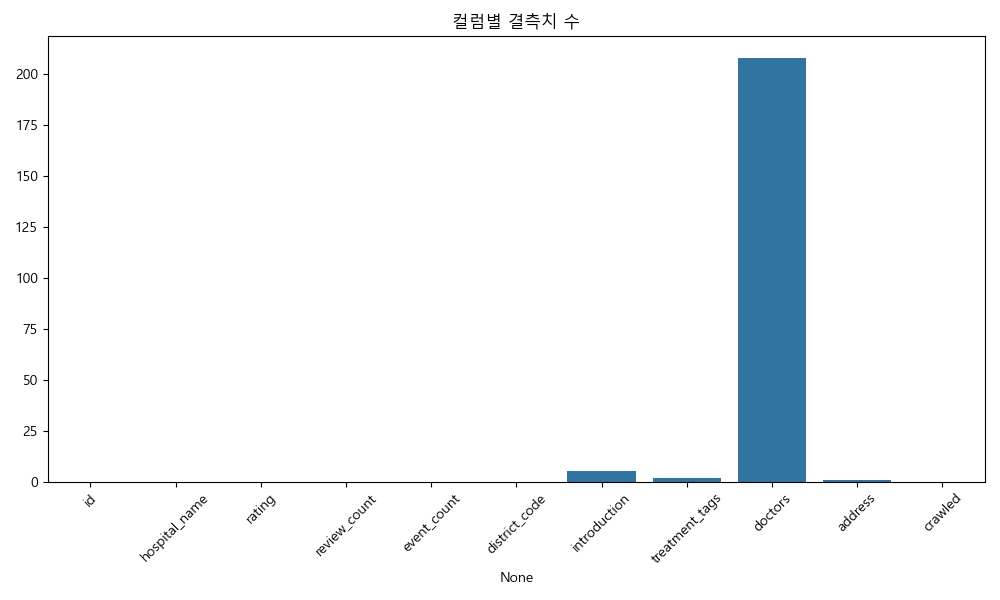
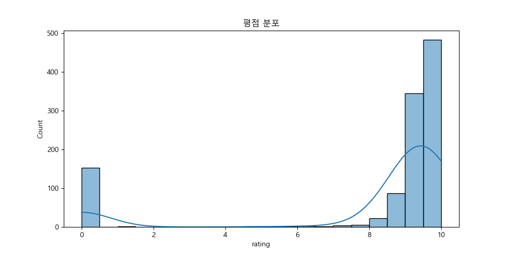
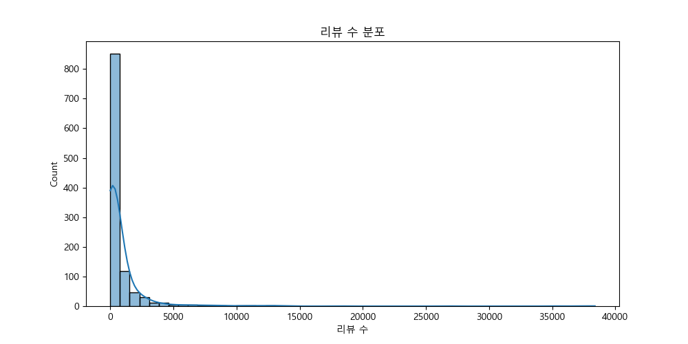
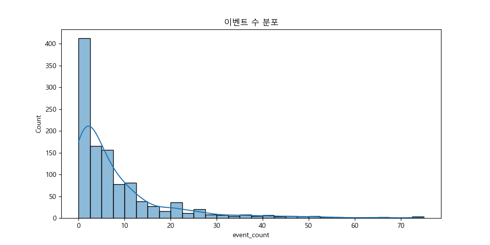
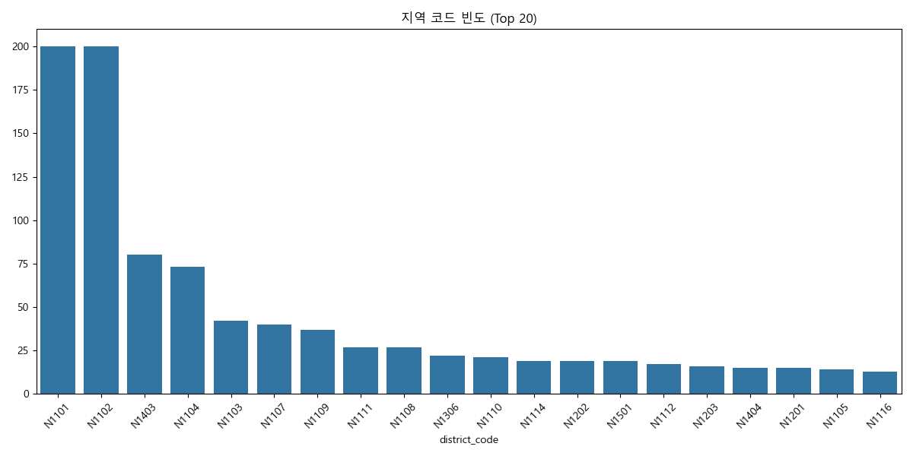
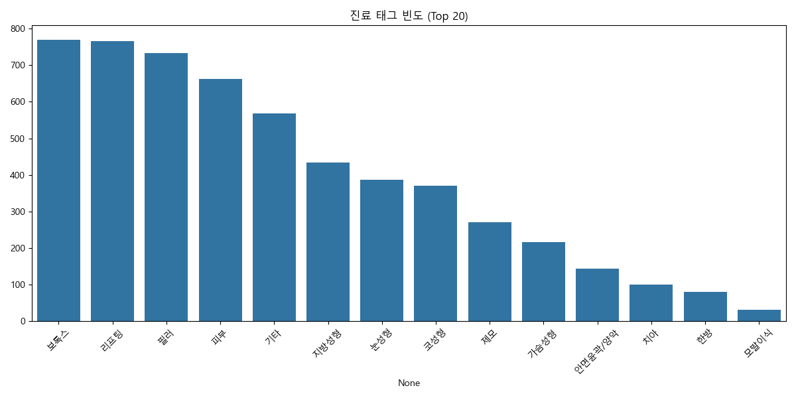
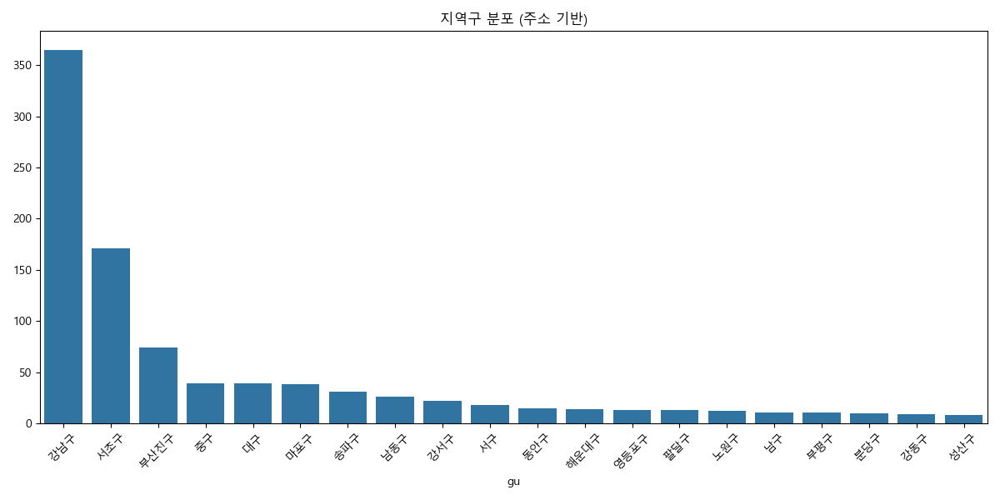

# 1차 EDA 분석 리포트
## 1. 데이터 개요
- 데이터 크기: (1103, 11)
- 컬럼 목록: ['id', 'hospital_name', 'rating', 'review_count', 'event_count', 'district_code', 'introduction', 'treatment_tags', 'doctors', 'address', 'crawled']

### 데이터 샘플
|    |   id | hospital_name          |   rating |   review_count |   event_count | district_code   | introduction                                                                                                                  | treatment_tags                                                                                | doctors                                                                                                                                                                                                                                                                                                                                                                                                                                                                                                                                                                                                                                                                                                                                                  | address                                                                                    | crawled   |
|---:|-----:|:-----------------------|---------:|---------------:|--------------:|:----------------|:------------------------------------------------------------------------------------------------------------------------------|:----------------------------------------------------------------------------------------------|:---------------------------------------------------------------------------------------------------------------------------------------------------------------------------------------------------------------------------------------------------------------------------------------------------------------------------------------------------------------------------------------------------------------------------------------------------------------------------------------------------------------------------------------------------------------------------------------------------------------------------------------------------------------------------------------------------------------------------------------------------------|:-------------------------------------------------------------------------------------------|:----------|
|  0 |  250 | 디에이성형외과의원     |      9.6 |          37157 |            67 | N1101           | 디에이성형외과는 기본에 충실한 마음으로 더 완성도 높은                                                                        | 눈성형, 코성형, 지방성형, 필러, 보톡스, 리프팅, 가슴성형, 안면윤곽/양악, 모발이식, 기타, 피부 | 이상우(성형외과), 박태준(), 양희재(성형외과), 류우상(성형외과), 구현국(성형외과), 이동찬(성형외과), 박민석(성형외과), 이윤환(성형외과), 임승택(), 배재영(성형외과), 김윤정(이비인후과), 강현구(성형외과), 김도연(성형외과), 이성주(성형외과), 장주윤(성형외과), 박준우(이비인후과), 김석환(성형외과), 윤현식(성형외과), 안경찬(성형외과), 이동욱(), 유영선(성형외과), 이재현(성형외과), 남동우(성형외과), 김태기(성형외과), 이현건(성형외과), 서상훈(성형외과), 김동현(가정의학과), 김시호(), 박진우(성형외과), 김진빈(성형외과), 김성환(마취통증의학과), 양혜모(마취통증의학과), 최현정(마취통증의학과), 서민구(마취통증의학과), 조동원(마취통증의학과), 이미숙(마취통증의학과), 안상범(마취통증의학과), 조지훈(마취통증의학과), 주지연(마취통증의학과) | 서울 강남구 테헤란로 125 D.A디에이성형외과                                                 | True      |
|    |      |                        |          |                |               |                 | 결과를 위해 끊임없이 연구합니다.                                                                                              |                                                                                               |                                                                                                                                                                                                                                                                                                                                                                                                                                                                                                                                                                                                                                                                                                                                                          |                                                                                            |           |
|    |      |                        |          |                |               |                 |                                                                                                                               |                                                                                               |                                                                                                                                                                                                                                                                                                                                                                                                                                                                                                                                                                                                                                                                                                                                                          |                                                                                            |           |
|    |      |                        |          |                |               |                 | -전담의료인의 정밀한 진단과 수술                                                                                              |                                                                                               |                                                                                                                                                                                                                                                                                                                                                                                                                                                                                                                                                                                                                                                                                                                                                          |                                                                                            |           |
|    |      |                        |          |                |               |                 | -정직한 상담과 고객맞춤형 수술플랜                                                                                            |                                                                                               |                                                                                                                                                                                                                                                                                                                                                                                                                                                                                                                                                                                                                                                                                                                                                          |                                                                                            |           |
|    |      |                        |          |                |               |                 | -수술방 실명제                                                                                                                |                                                                                               |                                                                                                                                                                                                                                                                                                                                                                                                                                                                                                                                                                                                                                                                                                                                                          |                                                                                            |           |
|    |      |                        |          |                |               |                 | -마취통증의학과 전문의 9인                                                                                                    |                                                                                               |                                                                                                                                                                                                                                                                                                                                                                                                                                                                                                                                                                                                                                                                                                                                                          |                                                                                            |           |
|    |      |                        |          |                |               |                 | -대학병원급 의료장비와 안심시스템 구비                                                                                        |                                                                                               |                                                                                                                                                                                                                                                                                                                                                                                                                                                                                                                                                                                                                                                                                                                                                          |                                                                                            |           |
|    |      |                        |          |                |               |                 | -체계적인 사후관리시스템 운영                                                                                                 |                                                                                               |                                                                                                                                                                                                                                                                                                                                                                                                                                                                                                                                                                                                                                                                                                                                                          |                                                                                            |           |
|  1 |  938 | 나나성형외과의원       |      9.6 |          26522 |            55 | N1101           | NA는 오늘, NA에게 반해버렸다                                                                                                  | 눈성형, 코성형, 지방성형, 리프팅, 필러, 보톡스, 가슴성형, 안면윤곽/양악, 피부                 | 황동연(성형외과), 김형준(성형외과), 김윤호(성형외과), 권병윤(성형외과), 조성수(가정의학과), 최정식(성형외과), 정미선(성형외과), 양은진(성형외과), 이연지(성형외과), 조진태(성형외과), 김재원(성형외과), 강교준(성형외과), 박송이(성형외과), 최혁준(성형외과), 권효정(성형외과), 이승제(성형외과), 조민호(이비인후과), 김성애(성형외과), 김다희(성형외과), 박민석(성형외과), 안마립(성형외과), 김민성(가정의학과), 김지은(가정의학과), 박연수(마취통증의학과), 경문기(마취통증의학과), 김일환(성형외과)                                                                                                                                                                                                                                                   | 서울 강남구 압구정로 406 나나성형외과의원                                                  | True      |
|    |      |                        |          |                |               |                 | 나나성형외과                                                                                                                  |                                                                                               |                                                                                                                                                                                                                                                                                                                                                                                                                                                                                                                                                                                                                                                                                                                                                          |                                                                                            |           |
|    |      |                        |          |                |               |                 |                                                                                                                               |                                                                                               |                                                                                                                                                                                                                                                                                                                                                                                                                                                                                                                                                                                                                                                                                                                                                          |                                                                                            |           |
|    |      |                        |          |                |               |                 | 1. 개개인의 특징을 고려한 1:1 맞춤 진료                                                                                       |                                                                                               |                                                                                                                                                                                                                                                                                                                                                                                                                                                                                                                                                                                                                                                                                                                                                          |                                                                                            |           |
|    |      |                        |          |                |               |                 | 2. 수술실 CCTV 설치, 수술실명제 시행                                                                                          |                                                                                               |                                                                                                                                                                                                                                                                                                                                                                                                                                                                                                                                                                                                                                                                                                                                                          |                                                                                            |           |
|    |      |                        |          |                |               |                 | 3. 마취통증의학과전문의 상주 및 안심시스템 구축                                                                               |                                                                                               |                                                                                                                                                                                                                                                                                                                                                                                                                                                                                                                                                                                                                                                                                                                                                          |                                                                                            |           |
|    |      |                        |          |                |               |                 | 4. 상담부터 수술, 사후관리까지! 체계적인 의료 시스템                                                                          |                                                                                               |                                                                                                                                                                                                                                                                                                                                                                                                                                                                                                                                                                                                                                                                                                                                                          |                                                                                            |           |
|    |      |                        |          |                |               |                 |                                                                                                                               |                                                                                               |                                                                                                                                                                                                                                                                                                                                                                                                                                                                                                                                                                                                                                                                                                                                                          |                                                                                            |           |
|    |      |                        |          |                |               |                 | 눈성형 · 코성형 · 가슴성형 · 윤곽성형 ·                                                                                       |                                                                                               |                                                                                                                                                                                                                                                                                                                                                                                                                                                                                                                                                                                                                                                                                                                                                          |                                                                                            |           |
|    |      |                        |          |                |               |                 | 남자성형 · 리프팅 · 체형성형 · 쁘띠 시술 · 유방검진 등등                                                                      |                                                                                               |                                                                                                                                                                                                                                                                                                                                                                                                                                                                                                                                                                                                                                                                                                                                                          |                                                                                            |           |
|    |      |                        |          |                |               |                 |                                                                                                                               |                                                                                               |                                                                                                                                                                                                                                                                                                                                                                                                                                                                                                                                                                                                                                                                                                                                                          |                                                                                            |           |
|    |      |                        |          |                |               |                 | 각 분야별 전문 의료진이 세심하게 진료하여                                                                                     |                                                                                               |                                                                                                                                                                                                                                                                                                                                                                                                                                                                                                                                                                                                                                                                                                                                                          |                                                                                            |           |
|    |      |                        |          |                |               |                 | 만족스러운 결과를 위해 항상 노력하고 있습니다!                                                                                |                                                                                               |                                                                                                                                                                                                                                                                                                                                                                                                                                                                                                                                                                                                                                                                                                                                                          |                                                                                            |           |
|    |      |                        |          |                |               |                 |                                                                                                                               |                                                                                               |                                                                                                                                                                                                                                                                                                                                                                                                                                                                                                                                                                                                                                                                                                                                                          |                                                                                            |           |
|    |      |                        |          |                |               |                 | 새로운 나를 위한 선택!                                                                                                        |                                                                                               |                                                                                                                                                                                                                                                                                                                                                                                                                                                                                                                                                                                                                                                                                                                                                          |                                                                                            |           |
|    |      |                        |          |                |               |                 | 지금 바로! 나나성형외과를 찾아주세요!                                                                                         |                                                                                               |                                                                                                                                                                                                                                                                                                                                                                                                                                                                                                                                                                                                                                                                                                                                                          |                                                                                            |           |
|  2 | 3234 | 사적인아름다움지유의원 |      9   |          38391 |            13 | N1101           | 사적인 아름다움 지유는 고객의 시각에 충실한 뷰티 클리닉입니다.                                                                | 피부, 보톡스, 필러, 리프팅, 기타, 제모                                                        | 권도윤(), 정연성(성형외과), 김하은(), 김혁수(), 나윤채(), 박기범(), 박혜민(), 양재우(), 이금영(), 이종은()                                                                                                                                                                                                                                                                                                                                                                                                                                                                                                                                                                                                                                               | 서울 서초구 서초대로77길 54 (서초동, 서초더블유타워) 3층, 4층, 11층 사적인아름다움지유의원 | True      |
|    |      |                        |          |                |               |                 |                                                                                                                               |                                                                                               |                                                                                                                                                                                                                                                                                                                                                                                                                                                                                                                                                                                                                                                                                                                                                          |                                                                                            |           |
|    |      |                        |          |                |               |                 | 고객에게 잠재된 아름다움을 이끌어내는 데 집중하며,                                                                            |                                                                                               |                                                                                                                                                                                                                                                                                                                                                                                                                                                                                                                                                                                                                                                                                                                                                          |                                                                                            |           |
|    |      |                        |          |                |               |                 | 고객 평가를 투명하게 공개하는 운영 방식을 선도적으로 도입합니다.                                                              |                                                                                               |                                                                                                                                                                                                                                                                                                                                                                                                                                                                                                                                                                                                                                                                                                                                                          |                                                                                            |           |
|    |      |                        |          |                |               |                 |                                                                                                                               |                                                                                               |                                                                                                                                                                                                                                                                                                                                                                                                                                                                                                                                                                                                                                                                                                                                                          |                                                                                            |           |
|    |      |                        |          |                |               |                 | 고객의 개인적인 고민에서 출발하여, 고객의 솔직한 평가로 귀결되는 클리닉,                                                      |                                                                                               |                                                                                                                                                                                                                                                                                                                                                                                                                                                                                                                                                                                                                                                                                                                                                          |                                                                                            |           |
|    |      |                        |          |                |               |                 |  사적인 아름다움 지유의원입니다.                                                                                              |                                                                                               |                                                                                                                                                                                                                                                                                                                                                                                                                                                                                                                                                                                                                                                                                                                                                          |                                                                                            |           |
|    |      |                        |          |                |               |                 |                                                                                                                               |                                                                                               |                                                                                                                                                                                                                                                                                                                                                                                                                                                                                                                                                                                                                                                                                                                                                          |                                                                                            |           |
|    |      |                        |          |                |               |                 | 울쎄라, 써마지, 튠페이스, 슈링크 유니버스, 젠틀맥스프로 등 다양한 장비 보유중이며                                             |                                                                                               |                                                                                                                                                                                                                                                                                                                                                                                                                                                                                                                                                                                                                                                                                                                                                          |                                                                                            |           |
|    |      |                        |          |                |               |                 | 레이저 리프팅 뿐만아니라 보톡스, 필러, 지방분해주사 등 여러 시술로 고객 여러분의 고유한 드라마를 찾아드리는 피부과의원입니다. |                                                                                               |                                                                                                                                                                                                                                                                                                                                                                                                                                                                                                                                                                                                                                                                                                                                                          |                                                                                            |           |
|  3 | 1982 | 미케이의원             |      9   |          13850 |            28 | N1101           | 안녕하세요, 오늘보다 더 아름다운 내일을 위해 노력하는 미케이의원입니다:)                                                      | 필러, 보톡스, 피부, 리프팅, 기타                                                              | 노영근()                                                                                                                                                                                                                                                                                                                                                                                                                                                                                                                                                                                                                                                                                                                                                 | 서울 서초구 서초대로77길 24 강남 지웰타워2 4층 미케이의원                                  | True      |
|  4 | 3004 | 에이비성형외과의원     |      9.5 |          12812 |            39 | N1101           | 자연스럽게, 더 나답게                                                                                                         | 눈성형, 코성형, 안면윤곽/양악, 가슴성형, 지방성형, 필러, 보톡스, 리프팅, 피부, 기타           | 김주연(성형외과), 안승현(성형외과), 배인호(성형외과), 박성호(성형외과), 조동필(성형외과), 안문영(성형외과), 도경현(성형외과), 최재익(성형외과), 서찬얼(성형외과), 마성환(성형외과), 김수정(성형외과), 송천호(성형외과), 서제원(성형외과), 박성훈(성형외과), 정연우(성형외과), 조규상(성형외과), 손지환(성형외과), 김승현(가정의학과), 백인철(), 신희지(외과), 구원영(성형외과), 김지원(), 최수민()                                                                                                                                                                                                                                                                                                                                                       | 서울 서초구 서초대로77길 17 (서초동, BLOCK77) 2-4층                                        | True      |
|    |      |                        |          |                |               |                 | 예쁨의 시작은 에이비성형외과에서.                                                                                             |                                                                                               |                                                                                                                                                                                                                                                                                                                                                                                                                                                                                                                                                                                                                                                                                                                                                          |                                                                                            |           |
|    |      |                        |          |                |               |                 |                                                                                                                               |                                                                                               |                                                                                                                                                                                                                                                                                                                                                                                                                                                                                                                                                                                                                                                                                                                                                          |                                                                                            |           |
|    |      |                        |          |                |               |                 | 눈성형·코성형·안면윤곽·가슴성형·남자성형·재수술·피부 클리닉까지                                                               |                                                                                               |                                                                                                                                                                                                                                                                                                                                                                                                                                                                                                                                                                                                                                                                                                                                                          |                                                                                            |           |
|    |      |                        |          |                |               |                 | 각 분야별 숙련된 전문 의료진이 섬세한 디자인과 안전한 수술로 ‘나다운 아름다움’을 만드는 성형외과, 바로 에이비입니다.          |                                                                                               |                                                                                                                                                                                                                                                                                                                                                                                                                                                                                                                                                                                                                                                                                                                                                          |                                                                                            |           |

## 2. 결측치 분석
|                |   Missing Count |   Ratio (%) |
|:---------------|----------------:|------------:|
| id             |               0 |   0         |
| hospital_name  |               0 |   0         |
| rating         |               0 |   0         |
| review_count   |               0 |   0         |
| event_count    |               0 |   0         |
| district_code  |               0 |   0         |
| introduction   |               5 |   0.453309  |
| treatment_tags |               2 |   0.181324  |
| doctors        |             208 |  18.8577    |
| address        |               1 |   0.0906618 |
| crawled        |               0 |   0         |

## 3. 기초 통계량 (수치형)
|       |      id |     rating |   review_count |   event_count |
|:------|--------:|-----------:|---------------:|--------------:|
| count | 1103    | 1103       |       1103     |    1103       |
| mean  | 4454.18 |    8.06346 |        839.897 |       7.97461 |
| std   | 2599.2  |    3.27108 |       2612.64  |      10.8511  |
| min   |    2    |    0       |          0     |       0       |
| 25%   | 2317    |    8.9     |          7     |       1       |
| 50%   | 4653    |    9.4     |        158     |       4       |
| 75%   | 6798.5  |    9.65    |        666     |      10       |
| max   | 8064    |   10       |      38391     |      75       |

## 4. 컬럼별 상세 분석

### Rating (평점)
|       |     rating |
|:------|-----------:|
| count | 1103       |
| mean  |    8.06346 |
| std   |    3.27108 |
| min   |    0       |
| 25%   |    8.9     |
| 50%   |    9.4     |
| 75%   |    9.65    |
| max   |   10       |

### Review Count (리뷰 수)
|       |   review_count |
|:------|---------------:|
| count |       1103     |
| mean  |        839.897 |
| std   |       2612.64  |
| min   |          0     |
| 25%   |          7     |
| 50%   |        158     |
| 75%   |        666     |
| max   |      38391     |

### Event Count (이벤트 수)
|       |   event_count |
|:------|--------------:|
| count |    1103       |
| mean  |       7.97461 |
| std   |      10.8511  |
| min   |       0       |
| 25%   |       1       |
| 50%   |       4       |
| 75%   |      10       |
| max   |      75       |

### District Code (지역 코드)
| district_code   |   count |
|:----------------|--------:|
| N1101           |     200 |
| N1102           |     200 |
| N1403           |      80 |
| N1104           |      73 |
| N1103           |      42 |
| N1107           |      40 |
| N1109           |      37 |
| N1111           |      27 |
| N1108           |      27 |
| N1306           |      22 |

### Treatment Tags (진료 태그)
Top 20 Tags:
|               |   count |
|:--------------|--------:|
| 보톡스        |     770 |
| 리프팅        |     765 |
| 필러          |     733 |
| 피부          |     662 |
| 기타          |     568 |
| 지방성형      |     433 |
| 눈성형        |     387 |
| 코성형        |     370 |
| 제모          |     271 |
| 가슴성형      |     216 |
| 안면윤곽/양악 |     144 |
| 치아          |     101 |
| 한방          |      80 |
| 모발이식      |      31 |

### Doctors (의사)
Doctors 컬럼 결측치 수: 208
Doctors 데이터 샘플 (Top 5):
|    | doctors                                                                                                                                                                                                                                                                                                                                                                                                                                                                                                                                                                                                                                                                                                                                                  |
|---:|:---------------------------------------------------------------------------------------------------------------------------------------------------------------------------------------------------------------------------------------------------------------------------------------------------------------------------------------------------------------------------------------------------------------------------------------------------------------------------------------------------------------------------------------------------------------------------------------------------------------------------------------------------------------------------------------------------------------------------------------------------------|
|  0 | 이상우(성형외과), 박태준(), 양희재(성형외과), 류우상(성형외과), 구현국(성형외과), 이동찬(성형외과), 박민석(성형외과), 이윤환(성형외과), 임승택(), 배재영(성형외과), 김윤정(이비인후과), 강현구(성형외과), 김도연(성형외과), 이성주(성형외과), 장주윤(성형외과), 박준우(이비인후과), 김석환(성형외과), 윤현식(성형외과), 안경찬(성형외과), 이동욱(), 유영선(성형외과), 이재현(성형외과), 남동우(성형외과), 김태기(성형외과), 이현건(성형외과), 서상훈(성형외과), 김동현(가정의학과), 김시호(), 박진우(성형외과), 김진빈(성형외과), 김성환(마취통증의학과), 양혜모(마취통증의학과), 최현정(마취통증의학과), 서민구(마취통증의학과), 조동원(마취통증의학과), 이미숙(마취통증의학과), 안상범(마취통증의학과), 조지훈(마취통증의학과), 주지연(마취통증의학과) |
|  1 | 황동연(성형외과), 김형준(성형외과), 김윤호(성형외과), 권병윤(성형외과), 조성수(가정의학과), 최정식(성형외과), 정미선(성형외과), 양은진(성형외과), 이연지(성형외과), 조진태(성형외과), 김재원(성형외과), 강교준(성형외과), 박송이(성형외과), 최혁준(성형외과), 권효정(성형외과), 이승제(성형외과), 조민호(이비인후과), 김성애(성형외과), 김다희(성형외과), 박민석(성형외과), 안마립(성형외과), 김민성(가정의학과), 김지은(가정의학과), 박연수(마취통증의학과), 경문기(마취통증의학과), 김일환(성형외과)                                                                                                                                                                                                                                                   |
|  2 | 권도윤(), 정연성(성형외과), 김하은(), 김혁수(), 나윤채(), 박기범(), 박혜민(), 양재우(), 이금영(), 이종은()                                                                                                                                                                                                                                                                                                                                                                                                                                                                                                                                                                                                                                               |
|  3 | 노영근()                                                                                                                                                                                                                                                                                                                                                                                                                                                                                                                                                                                                                                                                                                                                                 |
|  4 | 김주연(성형외과), 안승현(성형외과), 배인호(성형외과), 박성호(성형외과), 조동필(성형외과), 안문영(성형외과), 도경현(성형외과), 최재익(성형외과), 서찬얼(성형외과), 마성환(성형외과), 김수정(성형외과), 송천호(성형외과), 서제원(성형외과), 박성훈(성형외과), 정연우(성형외과), 조규상(성형외과), 손지환(성형외과), 김승현(가정의학과), 백인철(), 신희지(외과), 구원영(성형외과), 김지원(), 최수민()                                                                                                                                                                                                                                                                                                                                                       |

### Address (주소)
| gu       |   count |
|:---------|--------:|
| 강남구   |     365 |
| 서초구   |     171 |
| 부산진구 |      74 |
| 중구     |      39 |
| 대구     |      39 |
| 마포구   |      38 |
| 송파구   |      31 |
| 남동구   |      26 |
| 강서구   |      22 |
| 서구     |      18 |
| 동안구   |      15 |
| 해운대구 |      14 |
| 영등포구 |      13 |
| 팔달구   |      13 |
| 노원구   |      12 |
| 남구     |      11 |
| 부평구   |      11 |
| 분당구   |      10 |
| 강동구   |       9 |
| 성산구   |       8 |

