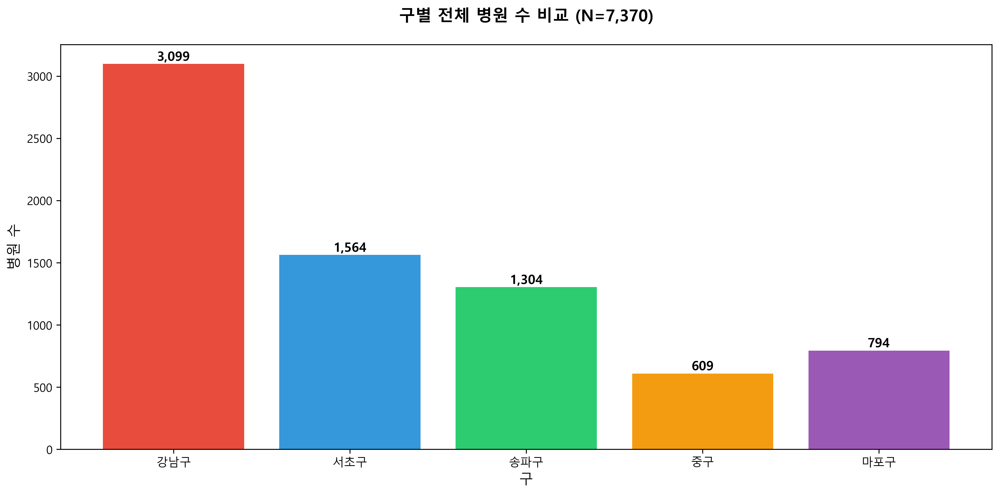
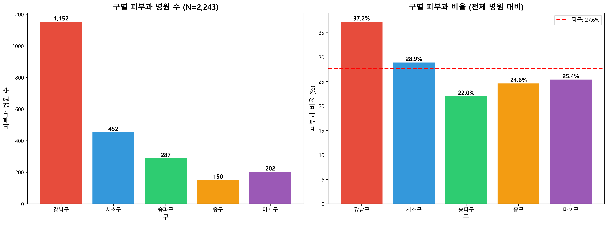
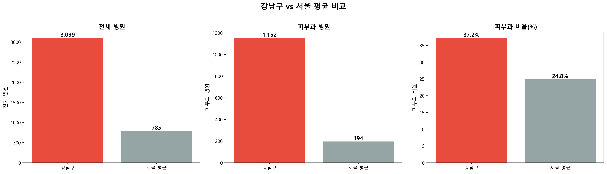

# 강남구 피부과 비교 분석 리포트

> **분석 일자**: 2026-01-31  
> **데이터 기준**: 2025년 12월  
> **분석 대상**: 서울시 5개 구 (강남구, 서초구, 송파구, 중구, 마포구)

---

## 📊 요약 (Executive Summary)

강남구는 서울시에서 **피부과 의료기관이 가장 집중된 지역**으로 확인되었습니다. 전체 병원 중 피부과 비율이 **37.2%**로 서울 평균(24.8%)보다 **1.5배 높으며**, 비교 대상 5개 구 중 피부과 병원 수 **1위**(1,152개)를 차지하고 있습니다. 이는 강남구가 피부과 의료 서비스의 핵심 거점임을 시사합니다.

**핵심 발견사항**:
- 강남구 피부과 집중도: 서울 평균 대비 **1.50배**
- 피부과 병원 수: **1,152개** (비교 대상 5개 구 중 1위)
- 피부과 비율: **37.2%** (전체 병원 3,099개 중)

---

## 📈 1. 구별 전체 병원 수 비교

### 1.1 기본 통계

| 구 | 전체 병원 수 | 피부과 병원 수 | 피부과 비율 (%) |
|---|------------|--------------|---------------|
| **강남구** | **3,099개** | **1,152개** | **37.2%** |
| 서초구 | 1,564개 | 452개 | 28.9% |
| 송파구 | 1,304개 | 287개 | 22.0% |
| 중구 | 609개 | 150개 | 24.6% |
| 마포구 | 794개 | 202개 | 25.4% |

### 1.2 시각화

**분석 코멘트**:
- 강남구는 비교 대상 5개 구 중 전체 병원 수에서도 압도적 1위를 차지하고 있습니다.
- 강남구의 전체 병원 수(3,099개)는 2위인 서초구(1,564개)의 약 2배 수준입니다.
- 이는 강남구가 서울에서 의료 인프라가 가장 밀집된 지역임을 보여줍니다.

---

## 🏥 2. 구별 피부과 현황 비교

### 2.1 피부과 병원 수 및 비율

**분석 코멘트**:

**피부과 병원 수 (절대값)**:
- 강남구: **1,152개** (압도적 1위)
- 서초구: 452개 (2위, 강남구의 39% 수준)
- 송파구: 287개 (3위)
- 마포구: 202개 (4위)
- 중구: 150개 (5위)

**피부과 비율 (상대값)**:
- 강남구: **37.2%** (가장 높음)
- 서초구: 28.9% (2위)
- 마포구: 25.4% (3위)
- 중구: 24.6% (4위)
- 송파구: 22.0% (5위)
- **5개 구 평균**: 27.6%

**핵심 인사이트**:
1. 강남구는 절대적 병원 수뿐만 아니라 **상대적 비율**에서도 1위를 차지하고 있습니다.
2. 강남구의 피부과 비율(37.2%)은 5개 구 평균(27.6%)보다 **9.6%p 높습니다**.
3. 이는 강남구가 단순히 병원이 많은 지역이 아니라, **피부과에 특화된 의료 생태계**를 가지고 있음을 의미합니다.

---

## 🔍 3. 강남구 vs 서울 평균 비교

### 3.1 상세 비교

| 구분 | 전체 병원 | 피부과 병원 | 피부과 비율 (%) |
|-----|----------|-----------|---------------|
| **강남구** | **3,099개** | **1,152개** | **37.2%** |
| 서울 평균 (25개 구) | 786개 | 195개 | 24.8% |
| **차이** | **+2,313개** | **+957개** | **+12.4%p** |
| **배율** | **3.95배** | **5.91배** | **1.50배** |

**분석 코멘트**:
- 강남구의 피부과 병원 수는 서울 평균의 **5.91배**에 달합니다.
- 피부과 비율도 서울 평균(24.8%)보다 **12.4%p 높아**, 강남구가 피부과 의료 서비스의 **핵심 허브**임을 확인할 수 있습니다.
- 이러한 집중도는 강남구의 높은 소득 수준, 미용 및 피부 관리에 대한 높은 수요와 밀접한 관련이 있을 것으로 추정됩니다.

---

## 💡 4. 핵심 인사이트 및 시사점

### 4.1 핵심 발견사항

1. **강남구 피부과 집중도는 서울 평균 대비 1.50배 높음**
   - 강남구: 37.2% vs 서울 평균: 24.8%
   - 이는 강남구가 피부과 의료 서비스의 **최대 집적지**임을 의미합니다.

2. **강남구는 비교 대상 5개 구 중 피부과 병원 수 1위**
   - 강남구: 1,152개
   - 2위인 서초구(452개)와 비교해도 **2.5배 이상** 많습니다.

3. **강남구는 피부과 비율이 가장 높은 구**
   - 37.2%로 5개 구 중 1위
   - 전체 병원의 **3분의 1 이상**이 피부과를 운영하고 있습니다.

### 4.2 시장 시사점

**경쟁 환경**:
- 강남구는 피부과 의료기관이 매우 밀집된 **초경쟁 시장**입니다.
- 1,152개의 피부과 병원이 경쟁하고 있어, **차별화 전략**이 필수적입니다.

**기회 요인**:
- 높은 집중도는 **수요의 크기**를 반영합니다.
- 강남구 환자들은 피부과 의료 서비스에 대한 **높은 지불 의향**을 가지고 있을 가능성이 높습니다.
- 프리미엄 서비스, 특화 진료 등을 통한 **고부가가치 전략**이 유효할 것으로 판단됩니다.

**전략적 제언**:
1. **차별화된 전문 서비스** 제공 (예: 레이저 시술, 미용 피부과 등)
2. **프리미엄 포지셔닝** 전략 (고급 시설, 유명 의료진 등)
3. **온라인 마케팅 강화** (강남언니, 네이버 플레이스 등 플랫폼 활용)
4. **환자 경험 최적화** (예약 시스템, 대기 시간 단축, 고객 서비스 등)

---

## 📁 5. 산출물 목록

본 분석을 통해 다음 산출물이 생성되었습니다:

### 데이터 파일
- [구별_피부과_통계.csv](data/구별_피부과_통계.csv) - 5개 구의 피부과 통계 요약
- [강남구_피부과_병원_리스트.csv](data/강남구_피부과_병원_리스트.csv) - 강남구 피부과 병원 1,152개 상세 리스트
- [핵심_인사이트.txt](data/핵심_인사이트.txt) - 핵심 인사이트 요약

### 시각화 차트
- [01_구별_병원수_비교.png](charts/01_구별_병원수_비교.png) - 5개 구 전체 병원 수 비교
- [02_구별_피부과_비교.png](charts/02_구별_피부과_비교.png) - 5개 구 피부과 병원 수 및 비율 비교
- [03_강남구_vs_서울평균.png](charts/03_강남구_vs_서울평균.png) - 강남구와 서울 평균 비교

### 스크립트
- [01_comparative_analysis_v2.py](scripts/01_comparative_analysis_v2.py) - 분석 실행 스크립트

---

## 📝 6. 분석 방법론

### 6.1 데이터 출처
- **병원 기본 정보**: 건강보험심사평가원 - 병원정보서비스 (2025.12)
- **진료과목 정보**: 건강보험심사평가원 - 의료기관별상세정보서비스_03_진료과목정보 (2025.12)

### 6.2 분석 프로세스
1. 전국 병원 정보(79,432개)에서 서울 병원(19,641개) 추출
2. 진료과목 정보(432,526개 레코드)에서 피부과 레코드(17,769개) 추출
3. 병원 정보와 진료과목 정보를 `암호화요양기호` 기준으로 병합
4. 서울 피부과 병원(4,874개) 중 5개 구 데이터 추출 및 비교 분석

### 6.3 데이터 품질
- **결측치**: 없음 (모든 병원이 시군구코드명 보유)
- **중복**: 없음 (암호화요양기호 기준 고유 병원)
- **신뢰도**: 공공데이터 기반, 2025년 12월 기준 최신 데이터

---

## 🎯 7. 종합 분석 결과

강남구는 서울에서 **피부과 의료 서비스의 최대 집적지**로, 다음과 같은 특징을 보입니다:

1. **압도적인 규모**: 1,152개의 피부과 병원 (서울 평균의 5.91배)
2. **높은 집중도**: 전체 병원의 37.2%가 피부과 (서울 평균의 1.5배)
3. **경쟁 우위**: 비교 대상 5개 구 중 절대적 1위

이러한 특성은 강남구가 **피부과 의료 시장의 핵심 거점**이자, 동시에 **초경쟁 시장**임을 의미합니다. 신규 진입 또는 기존 병원의 경쟁력 강화를 위해서는 **명확한 차별화 전략**과 **프리미엄 포지셔닝**이 필수적입니다.

---

**작성자**: Antigravity AI Assistant  
**최종 수정일**: 2026-01-31  
**버전**: 1.0
