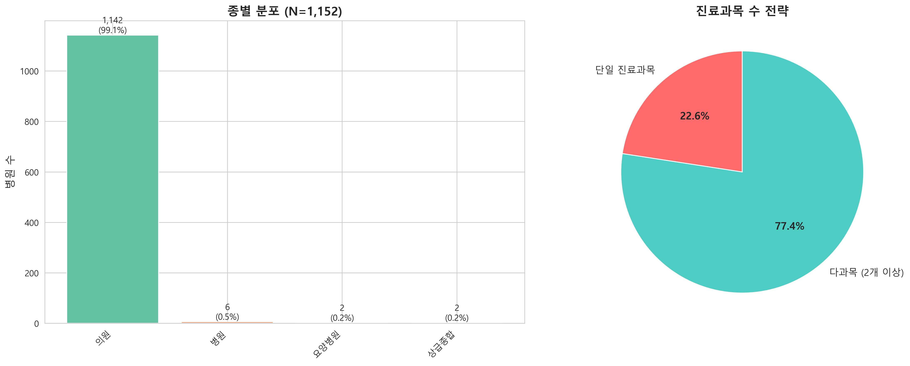
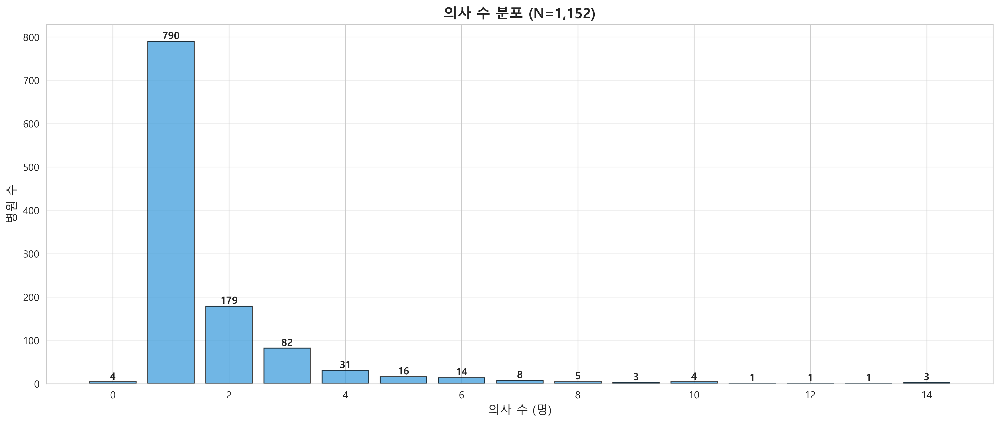
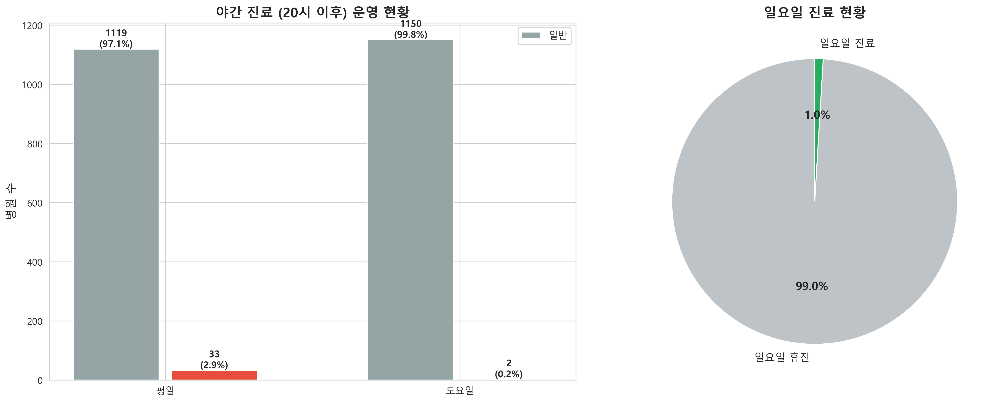
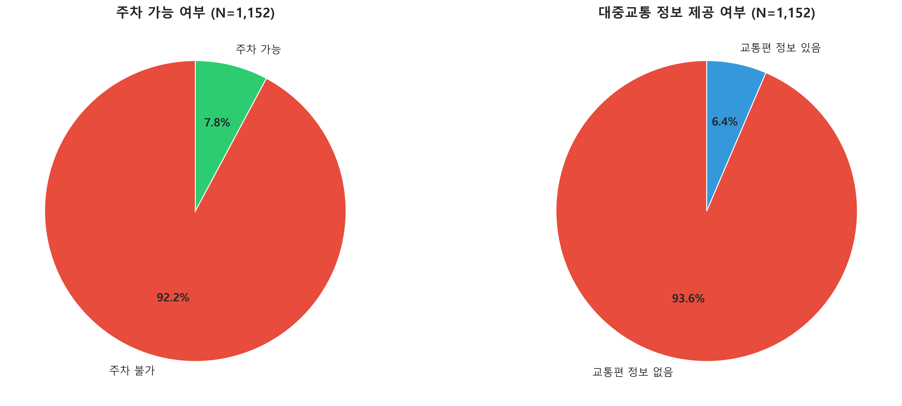
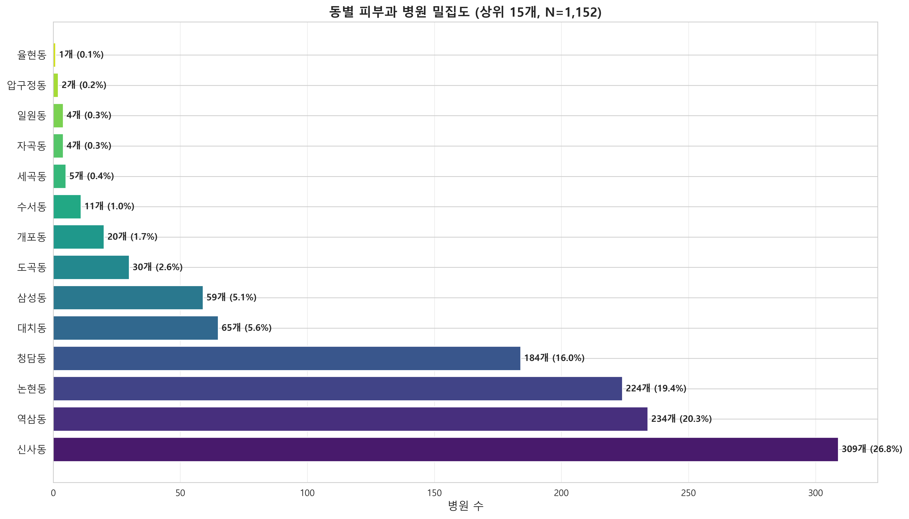

# 강남구 피부과 확장 EDA 분석 리포트

> **분석 기간**: 2026-01-31  
> **데이터 출처**: 건강보험심사평가원 공공데이터 (2025.12 기준)  
> **분석 대상**: 강남구 피부과 병원 1,152개

---

## 📊 Executive Summary

본 리포트는 강남구 피부과 시장의 **경쟁 구도**, **운영 전략**, **접근성**, **지리적 분포**를 분석하여 시장 진입 및 차별화 전략을 도출하기 위해 작성되었습니다.

### 핵심 발견사항

1. **시장 구조**: 의원(99.1%)이 압도적이며, 다과목 전략(77.4%)이 주류
2. **경쟁 기회**: 야간/주말 진료 공급 부족 (평일 야간 2.9%, 일요일 1.0%)
3. **접근성 약점**: 주차 가능 병원 7.8%로 매우 낮음
4. **지역 집중**: 대치동(26.8%), 역삼동(20.3%), 신사동(19.4%) 3개 동에 66.5% 집중

---

## 1. 시장 구조 분석

### 1.1 종별 분포

**분석 결과**:
- **의원**: 1,142개 (99.1%)
- **병원**: 6개 (0.5%)
- **종합병원**: 2개 (0.2%)
- **요양병원**: 2개 (0.2%)

**인사이트**:
> 강남구 피부과 시장은 **의원 중심 시장**입니다. 병원급 이상은 1% 미만으로, 대부분의 경쟁은 의원 간에 이루어집니다.

### 1.2 다과목 전략

**분석 결과**:
- **단일 진료과목**: 260개 (22.6%)
- **다과목 (2개 이상)**: 892개 (77.4%)
- **평균 진료과목 수**: 3.3개

**인사이트**:
> **77.4%의 병원이 다과목 전략**을 채택하고 있습니다. 이는 원스톱 의료 서비스 수요가 높고, 단일 진료과목만으로는 경쟁력 확보가 어려움을 시사합니다.

**전략적 시사점**:
- ✅ 신규 개원 시 다과목 운영 고려 필수
- ✅ 피부과 + 성형외과, 피부과 + 가정의학과 등 시너지 진료과목 조합 검토
- ⚠️ 단일 피부과 전문 의원은 고도의 전문성으로 차별화 필요

---

## 2. 인력 구조 분석

### 2.1 의사 수 분포

**분석 결과**:
- **1인 의원**: 790개 (68.6%)
- **2인 의원**: 179개 (15.5%)
- **3인 의원**: 82개 (7.1%)
- **4인 이상**: 97개 (8.4%)

**인사이트**:
> **68.6%가 1인 의원**으로, 소규모 개인 의원이 시장의 주류입니다. 2인 이상 의원은 31.4%로, 규모의 경제를 추구하는 병원은 소수입니다.

**전략적 시사점**:
- ✅ 1인 의원으로 시작하여 점진적 확장 전략 가능
- ✅ 2인 이상 의원은 전문성 분업 및 운영시간 확대 가능
- ⚠️ 대형 의원(4인 이상)은 8.4%로 희소하여 프리미엄 포지셔닝 기회

---

## 3. 운영 전략 분석

### 3.1 영업시간 전략

#### 야간 진료 (20시 이후)

**분석 결과**:
- **평일 야간 진료**: 33개 (2.9%)
- **토요일 야간 진료**: 2개 (0.2%)

**인사이트**:
> **야간 진료 공급이 극도로 부족**합니다. 평일 97.1%, 토요일 99.8%의 병원이 20시 이전에 진료를 종료합니다.

#### 주말 진료

**분석 결과**:
- **일요일 진료**: 11개 (1.0%)
- **일요일 휴진**: 1,141개 (99.0%)

**인사이트**:
> **일요일 진료 병원은 1%에 불과**합니다. 주말 진료 수요는 높으나 공급은 극히 제한적입니다.

#### 평균 영업시간

**분석 결과**:
- **평일 시작**: 09:37
- **평일 종료**: 18:56

**전략적 시사점**:
- 🔥 **야간 진료 (20시 이후)**: 가장 강력한 차별화 포인트
- 🔥 **주말 진료 (토요일 오후/일요일)**: 직장인 타겟 시 필수
- ✅ 점심시간 무휴진 운영도 차별화 가능
- ⚠️ 야간/주말 진료 시 인력 운영 및 비용 증가 고려 필요

---

## 4. 접근성 분석

### 4.1 주차 및 교통

#### 주차 접근성

**분석 결과**:
- **주차 가능**: 90개 (7.8%)
- **주차 불가**: 1,062개 (92.2%)
- **평균 주차 가능 대수**: 34.8대

**인사이트**:
> **92.2%의 병원이 주차 불가**입니다. 자차 이용 환자에게는 큰 불편 요소입니다.

#### 대중교통 접근성

**분석 결과**:
- **교통편 정보 있음**: 74개 (6.4%)
- **교통편 정보 없음**: 1,078개 (93.6%)
- **평균 교통편 개수**: 3.7개

**전략적 시사점**:
- 🔥 **주차 제공 시 강력한 경쟁 우위** (공급 부족)
- ✅ 역세권 입지 선정 시 대중교통 접근성 강조
- ✅ 발렛파킹, 주차 할인 등 주차 편의 서비스 차별화
- ⚠️ 주차 불가 시 대중교통 정보 적극 홍보 필요

---

## 5. 지리적 분석

### 5.1 동별 밀집도

**분석 결과 (상위 10개 동)**:

| 순위 | 동명 | 병원 수 | 비율 |
|------|------|---------|------|
| 1 | 대치동 | 309개 | 26.8% |
| 2 | 역삼동 | 234개 | 20.3% |
| 3 | 신사동 | 224개 | 19.4% |
| 4 | 청담동 | 184개 | 16.0% |
| 5 | 압구정동 | 65개 | 5.6% |
| 6 | 삼성동 | 59개 | 5.1% |
| 7 | 도곡동 | 30개 | 2.6% |
| 8 | 개포동 | 20개 | 1.7% |
| 9 | 일원동 | 11개 | 1.0% |
| 10 | 세곡동 | 5개 | 0.4% |

**인사이트**:
> **대치동, 역삼동, 신사동 3개 동에 66.5%가 집중**되어 있습니다. 반면, 도곡동, 개포동, 일원동, 세곡동은 상대적으로 공백 지역입니다.

**전략적 시사점**:
- 🔥 **도곡동, 개포동, 일원동, 세곡동**: 경쟁 회피 전략 (블루오션)
- ⚠️ **대치동, 역삼동, 신사동**: 고경쟁 지역 (차별화 필수)
- ✅ 청담동, 압구정동: 프리미엄 시장 (고소득층 타겟)
- ✅ 삼성동: 직장인 밀집 지역 (야간 진료 수요 높음)

---

## 6. 종합 인사이트 및 전략 제언

### 6.1 시장 기회 (Opportunities)

#### 🔥 최우선 차별화 포인트

1. **야간 진료 (20시 이후)**
   - 현황: 평일 2.9%, 토요일 0.2%
   - 기회: 직장인 타겟 시 강력한 경쟁 우위
   - 실행: 평일 21시까지, 토요일 18시까지 운영

2. **주말 진료 (일요일)**
   - 현황: 1.0%만 운영
   - 기회: 주말 수요 독점 가능
   - 실행: 일요일 오전 또는 격주 운영

3. **주차 편의**
   - 현황: 7.8%만 주차 가능
   - 기회: 자차 이용 환자 확보
   - 실행: 주차 제휴, 발렛파킹, 주차 할인

#### ✅ 입지 전략

1. **블루오션 지역**: 도곡동, 개포동, 일원동, 세곡동
   - 경쟁 낮음 (2.6% 이하)
   - 주거 밀집 지역으로 수요 존재
   - 임대료 상대적 저렴

2. **프리미엄 지역**: 청담동, 압구정동
   - 고소득층 밀집
   - 프리미엄 서비스 포지셔닝
   - 고가 시술 중심 전략

3. **직장인 지역**: 삼성동
   - 직장인 밀집
   - 야간 진료 필수
   - 점심시간 무휴진 운영

### 6.2 경쟁 전략

#### 다과목 전략 (77.4%가 채택)

**장점**:
- 원스톱 서비스로 환자 편의성 증대
- 교차 판매 기회 (피부과 → 성형외과)
- 매출 다변화

**단점**:
- 전문성 희석 우려
- 인력 및 장비 투자 증가

**권장 조합**:
- 피부과 + 성형외과 (시너지 최대)
- 피부과 + 가정의학과 (건강검진 연계)
- 피부과 + 내과 (종합 진료)

#### 단일 전문 전략 (22.6%가 채택)

**장점**:
- 고도의 전문성 어필
- 브랜딩 명확
- 운영 단순화

**단점**:
- 매출 한계
- 경쟁 심화 시 취약

**성공 조건**:
- 특화 시술 (레이저, 보톡스 등)
- 전문의 자격 강조
- 프리미엄 포지셔닝

### 6.3 실행 체크리스트

#### 신규 개원 시

- [ ] 입지 선정: 블루오션 지역 vs 프리미엄 지역 선택
- [ ] 다과목 여부: 다과목 vs 단일 전문 결정
- [ ] 야간 진료: 평일 20시 이후 운영 검토
- [ ] 주말 진료: 토요일 오후 또는 일요일 운영 검토
- [ ] 주차: 주차 제휴 또는 발렛파킹 서비스 검토
- [ ] 인력: 1인 vs 2인 이상 결정

#### 기존 병원 차별화 시

- [ ] 영업시간 확대: 야간/주말 진료 추가
- [ ] 주차 편의: 주차 제휴 또는 할인 서비스
- [ ] 다과목 확장: 시너지 진료과목 추가
- [ ] 온라인 마케팅: 야간/주말 진료 강조
- [ ] 예약 시스템: 직장인 편의 (온라인 예약, 카톡 상담)

---

## 7. 데이터 품질 보고

### 7.1 결측 현황

| 항목 | 결측 수 | 비율 |
|------|---------|------|
| 개설일자 | 1,152개 | 100% |
| 설립구분코드명 | 일부 | - |
| 주차_가능대수 | 1,062개 | 92.2% |
| 교통편_개수 | 1,078개 | 93.6% |

**참고사항**:
- 개설일자 정보가 통합 데이터에 포함되지 않아 병원 연령 분석 불가
- 주차 및 교통편 정보는 제공 병원만 집계됨 (실제 주차 가능 병원은 더 많을 수 있음)

### 7.2 분석 제외 항목

- **병원 연령 분포**: 개설일자 정보 부재로 분석 불가
- **설립 형태 분석**: 데이터 부족으로 제외

---

## 8. 결론

강남구 피부과 시장은 **의원 중심의 고경쟁 시장**이지만, **야간/주말 진료**, **주차 편의**, **지역 선택** 등에서 명확한 차별화 기회가 존재합니다.

**성공 전략**:
1. **시간 차별화**: 야간/주말 진료로 직장인 타겟
2. **입지 차별화**: 블루오션 지역 또는 프리미엄 지역 선택
3. **편의 차별화**: 주차, 예약, 온라인 상담 등 환자 편의성 극대화
4. **전문성 차별화**: 다과목 vs 단일 전문 명확한 포지셔닝

---

**분석 완료일**: 2026-01-31  
**분석 도구**: Python (pandas, matplotlib, seaborn)  
**데이터 출처**: 건강보험심사평가원 공공데이터 (2025.12)
