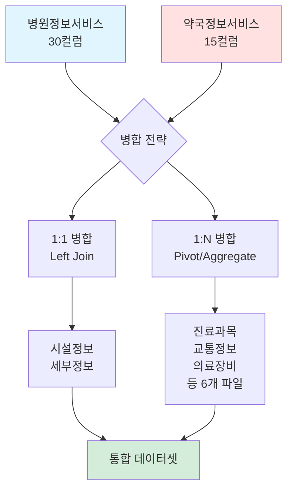

# 자료 취합 가이드라인: 전국 병의원 및 약국 현황 (2025.12)

> **작성일**: 2026-01-29  
> **데이터 기준**: 2025년 12월  
> **데이터 출처**: 건강보험심사평가원 공공데이터

---

## 📋 목차

1. [데이터 개요](#1-데이터-개요)
2. [파일 구조 분석](#2-파일-구조-분석)
3. [데이터 취합 전략](#3-데이터-취합-전략)
4. [병합 키 및 관계도](#4-병합-키-및-관계도)
5. [취합 프로세스](#5-취합-프로세스)
6. [주의사항 및 제약조건](#6-주의사항-및-제약조건)
7. [검증 체크리스트](#7-검증-체크리스트)
8. [活用 시나리오](#8-활용-시나리오)
9. [참고 자료](#9-참고-자료)
10. [파일 및 폴더 관리 규칙](#10-파일-및-폴더-관리-규칙)

---

## 1. 데이터 개요

### 1.1 데이터셋 구성

전국 병의원 및 약국 현황 데이터는 **12개의 CSV 파일**로 구성되어 있으며, 크게 **3개 카테고리**로 분류됩니다:

| 카테고리 | 파일 수 | 설명 |
|---------|--------|------|
| **기본 정보** | 2개 | 병원정보, 약국정보 |
| **상세 정보** | 10개 | 시설, 세부, 진료과목, 교통, 장비, 식대, 간호, 특수진료, 전문병원, 기타인력 |
| **총계** | **12개** | - |

### 1.2 데이터 규모

| 파일명 | 파일 크기 | 실제 레코드 수 |
|--------|----------|--------------|
| 1.병원정보서비스 | 24.1 MB | 79,432행 |
| 2.약국정보서비스 | 6.7 MB | 25,593행 |
| 3.시설정보 | 30.2 MB | 105,025행 |
| 4.세부정보 | 7.6 MB | 25,000행 |
| 5.진료과목정보 | 52.7 MB | 432,526행 |
| 6.교통정보 | 6.6 MB | 40,623행 |
| 7.의료장비정보 | 7.9 MB | 62,520행 |
| 8.식대가산정보 | 1.9 MB | 15,742행 |
| 9.간호등급정보 | 1.6 MB | 13,164행 |
| 10.특수진료정보 | 9.3 MB | 63,113행 |
| 11.전문병원지정분야 | 13.6 KB | 113행 |
| 12.기타인력정보 | 4.9 MB | 43,800행 |

---

## 2. 파일 구조 분석

### 2.1 기본 정보 파일

#### 📄 1. 병원정보서비스 (30 컬럼)

**핵심 식별자**: `암호화요양기호`

**컬럼 그룹**:
- **식별 정보** (5): 암호화요양기호, 요양기관명, 종별코드, 종별코드명, 개설일자
- **위치 정보** (7): 시도코드, 시도코드명, 시군구코드, 시군구코드명, 읍면동, 우편번호, 주소
- **연락 정보** (2): 전화번호, 병원홈페이지
- **의료 인력** (14): 총의사수, 의과/치과/한방 일반의/인턴/레지던트/전문의 인원수
- **기타** (1): 조산사 인원수
- **좌표 정보** (2): 좌표(X), 좌표(Y)

```
주요 컬럼:
- 암호화요양기호: 기관 고유 식별자 (병합 키)
- 요양기관명: 병원명
- 종별코드/명: 병원 종류 (상급종합병원, 종합병원, 병원, 의원 등)
- 시도/시군구코드: 행정구역 코드
- 좌표(X), 좌표(Y): WGS84 좌표계
```

#### 📄 2. 약국정보서비스 (15 컬럼)

**핵심 식별자**: `암호화요양기호`

**컬럼 그룹**:
- **식별 정보** (4): 암호화요양기호, 요양기관명, 종별코드, 종별코드명
- **위치 정보** (7): 시도코드, 시도코드명, 시군구코드, 시군구코드명, 읍면동, 우편번호, 주소
- **연락 정보** (1): 전화번호
- **기타** (1): 개설일자
- **좌표 정보** (2): 좌표(X), 좌표(Y)

---

### 2.2 상세 정보 파일 (의료기관별)

#### 📄 3. 시설정보 (30 컬럼)

**병합 키**: `암호화요양기호`

**컬럼 구성**:
- 기본 정보 (5): 암호화요양기호, 요양기관명, 설립구분코드/명, 개설일자
- 위치 정보 (7): 시도/시군구코드, 읍면동, 우편번호, 주소, 전화번호
- **병상 정보** (15): 일반입원실, 중환자실, 분만실, 수술실, 응급실, 물리치료실, 정신과, 격리병실, 무균치료실 등

```
핵심 컬럼:
- 일반입원실상급병상수, 일반입원실일반병상수
- 성인중환자병상수, 소아중환자병상수, 신생아중환자병상수
- 응급실병상수, 수술실병상수
```

#### 📄 4. 세부정보 (34 컬럼)

**병합 키**: `암호화요양기호`

**컬럼 구성**:
- **위치 안내** (3): 공공건물명, 방향, 거리
- **주차 정보** (3): 가능대수, 비용부담여부, 기타안내
- **휴진 정보** (2): 일요일, 공휴일
- **응급실 정보** (6): 주간/야간 운영여부, 전화번호
- **진료 시간** (20): 요일별 진료시작/종료시간, 점심시간, 접수시간

```
핵심 컬럼:
- 진료시작시간_월요일 ~ 진료종료시간_토요일 (12개)
- 점심시간_평일, 점심시간_토요일
- 응급실_주간/야간_운영여부
```

#### 📄 5. 진료과목정보 (6 컬럼) - **1:N 관계**

**병합 키**: `암호화요양기호`  
**관계 유형**: **One-to-Many** (한 병원이 여러 진료과목 보유)

**컬럼 구성**:
- 암호화요양기호, 요양기관명
- 진료과목코드, 진료과목코드명
- 과목별 전문의수, 선택진료 의사수

> ⚠️ **주의**: 이 파일은 병원당 여러 행이 존재할 수 있음 (진료과목별 1행)

#### 📄 6. 교통정보 (8 컬럼) - **1:N 관계**

**병합 키**: `암호화요양기호`  
**관계 유형**: **One-to-Many** (한 병원에 여러 교통편 정보)

**컬럼 구성**:
- 암호화요양기호, 요양기관명
- 교통편명, 노선번호, 하차지점, 방향, 거리, 비고

#### 📄 7. 의료장비정보 (5 컬럼) - **1:N 관계**

**병합 키**: `암호화요양기호`  
**관계 유형**: **One-to-Many** (한 병원이 여러 장비 보유)

**컬럼 구성**:
- 암호화요양기호, 요양기관명
- 장비코드, 장비코드명, 장비대수

#### 📄 8. 식대가산정보 (7 컬럼) - **1:N 관계**

**병합 키**: `암호화요양기호`

**컬럼 구성**:
- 암호화요양기호, 요양기관명
- 유형코드, 유형코드명
- 일반식 가산여부, 산정인원수, 치료식 등급

#### 📄 9. 간호등급정보 (5 컬럼) - **1:N 관계**

**병합 키**: `암호화요양기호`

**컬럼 구성**:
- 암호화요양기호, 요양기관명
- 유형코드, 유형코드명, 간호등급

#### 📄 10. 특수진료정보 (4 컬럼) - **1:N 관계**

**병합 키**: `암호화요양기호`

**컬럼 구성**:
- 암호화요양기호, 요양기관명
- 검색코드, 검색코드명

#### 📄 11. 전문병원지정분야 (4 컬럼) - **1:N 관계**

**병합 키**: `암호화요양기호`

**컬럼 구성**:
- 암호화요양기호, 요양기관명
- 검색코드, 검색코드명

#### 📄 12. 기타인력정보 (5 컬럼) - **1:N 관계**

**병합 키**: `암호화요양기호`

**컬럼 구성**:
- 암호화요양기호, 요양기관명
- 기타인력코드, 기타인력코드명, 기타인력수

---

## 3. 데이터 취합 전략

### 3.1 병합 전략 개요



### 3.2 병합 유형별 처리 방법

#### ✅ **유형 1: 1:1 관계 (Left Join)**

**대상 파일**:
- 시설정보 (파일 3)
- 세부정보 (파일 4)

**병합 방법**:
```python
# 예시 코드
df_hospital = pd.read_csv('1.병원정보서비스(2025.12.).csv', encoding='utf-8-sig')
df_facility = pd.read_csv('3.의료기관별상세정보서비스_01_시설정보 2025.12..csv', encoding='utf-8-sig')

df_merged = df_hospital.merge(
    df_facility,
    on='암호화요양기호',
    how='left',
    suffixes=('', '_시설')
)
```

**특징**:
- 병원정보를 기준으로 Left Join
- 누락된 기관은 NaN으로 처리
- 컬럼명 중복 시 suffix 추가

---

#### ⚠️ **유형 2: 1:N 관계 (Pivot/Aggregate)**

**대상 파일** (6개):
- 진료과목정보 (파일 5)
- 교통정보 (파일 6)
- 의료장비정보 (파일 7)
- 식대가산정보 (파일 8)
- 간호등급정보 (파일 9)
- 특수진료정보 (파일 10)
- 전문병원지정분야 (파일 11)
- 기타인력정보 (파일 12)

**처리 방법 A: 집계 (Aggregation)**

```python
# 예시: 진료과목정보 - 과목 수 집계
df_subject = pd.read_csv('5.의료기관별상세정보서비스_03_진료과목정보 2025.12..csv', encoding='utf-8-sig')

df_subject_agg = df_subject.groupby('암호화요양기호').agg({
    '진료과목코드': 'count',  # 진료과목 수
    '과목별 전문의수': 'sum',  # 전문의 총합
    '선택진료 의사수': 'sum'   # 선택진료 의사 총합
}).rename(columns={
    '진료과목코드': '진료과목_총개수',
    '과목별 전문의수': '전문의_총수',
    '선택진료 의사수': '선택진료의사_총수'
}).reset_index()

# 병원정보와 병합
df_merged = df_hospital.merge(df_subject_agg, on='암호화요양기호', how='left')
```

**처리 방법 B: 피벗 (Pivot)**

```python
# 예시: 의료장비정보 - 장비별 대수를 컬럼으로 변환
df_equipment = pd.read_csv('7.의료기관별상세정보서비스_05_의료장비정보 2025.12..csv', encoding='utf-8-sig')

df_equipment_pivot = df_equipment.pivot_table(
    index='암호화요양기호',
    columns='장비코드명',
    values='장비대수',
    aggfunc='sum',
    fill_value=0
).reset_index()

# 컬럼명 정리
df_equipment_pivot.columns = ['암호화요양기호'] + \
    [f'장비_{col}' for col in df_equipment_pivot.columns[1:]]
```

**처리 방법 C: 리스트 형태로 보존**

```python
# 예시: 교통정보 - JSON/리스트 형태로 저장
df_traffic = pd.read_csv('6.의료기관별상세정보서비스_04_교통정보 2025.12..csv', encoding='utf-8-sig')

df_traffic_list = df_traffic.groupby('암호화요양기호').apply(
    lambda x: x[['교통편명', '노선번호', '하차지점']].to_dict('records')
).reset_index(name='교통정보_리스트')
```

---

### 3.3 권장 병합 순서

```
1단계: 기본 정보 통합
  ├─ 병원정보서비스 (기준)
  └─ 약국정보서비스 (Union 또는 별도 처리)

2단계: 1:1 관계 파일 병합 (Left Join)
  ├─ 시설정보
  └─ 세부정보

3단계: 1:N 관계 파일 처리 (Aggregate/Pivot)
  ├─ 진료과목정보 (집계)
  ├─ 의료장비정보 (피벗)
  ├─ 교통정보 (리스트)
  ├─ 식대가산정보 (집계)
  ├─ 간호등급정보 (피벗)
  ├─ 특수진료정보 (리스트)
  ├─ 전문병원지정분야 (리스트)
  └─ 기타인력정보 (집계)

4단계: 최종 통합 및 검증
  ├─ 중복 컬럼 정리
  ├─ 결측치 처리
  └─ 데이터 타입 변환
```

---

## 4. 병합 키 및 관계도

### 4.1 핵심 병합 키

| 컬럼명 | 데이터 타입 | 고유성 | 설명 |
|--------|-----------|--------|------|
| **암호화요양기호** | String | 고유 | 모든 파일의 Primary Key |
| 요양기관명 | String | 비고유 | 병원/약국명 (중복 가능) |

### 4.2 데이터 관계도

```
[병원정보서비스] 1 ─────────── 1 [시설정보]
       │                          
       │ 1 ─────────── 1 [세부정보]
       │
       │ 1 ─────────── N [진료과목정보]
       │
       │ 1 ─────────── N [교통정보]
       │
       │ 1 ─────────── N [의료장비정보]
       │
       │ 1 ─────────── N [식대가산정보]
       │
       │ 1 ─────────── N [간호등급정보]
       │
       │ 1 ─────────── N [특수진료정보]
       │
       │ 1 ─────────── N [전문병원지정분야]
       │
       └ 1 ─────────── N [기타인력정보]

[약국정보서비스] (별도 처리 또는 Union)
```

---

## 5. 취합 프로세스

### 5.1 전체 프로세스 플로우


### 5.2 단계별 상세 작업

#### **STEP 1: 데이터 로드 및 기본 검증**

```python
import pandas as pd
import os

# 파일 경로 설정 (CSV 폴더)
data_dir = 'd:/git_gb4pro/data/전국 병의원 및 약국 현황 2025.12/CSV/'

# 파일 목록
files = {
    'hospital': '1.병원정보서비스(2025.12.).csv',
    'pharmacy': '2.약국정보서비스(2025.12.).csv',
    'facility': '3.의료기관별상세정보서비스_01_시설정보 2025.12..csv',
    'detail': '4.의료기관별상세정보서비스_02_세부정보 2025.12..csv',
    'subject': '5.의료기관별상세정보서비스_03_진료과목정보 2025.12..csv',
    'traffic': '6.의료기관별상세정보서비스_04_교통정보 2025.12..csv',
    'equipment': '7.의료기관별상세정보서비스_05_의료장비정보 2025.12..csv',
    'meal': '8.의료기관별상세정보서비스_06_식대가산정보 2025.12..csv',
    'nursing': '9.의료기관별상세정보서비스_07_간호등급정보 2025.12..csv',
    'special': '10.의료기관별상세정보서비스_08_특수진료정보서비스 2025.12..csv',
    'specialized': '11.의료기관별상세정보서비스_09_전문병원지정분야 2025.12..csv',
    'staff': '12.의료기관별상세정보서비스_10_기타인력정보 2025.12..csv'
}

# 데이터 로드 (CSV 파일, UTF-8 BOM 인코딩)
data = {}
for key, filename in files.items():
    filepath = os.path.join(data_dir, filename)
    data[key] = pd.read_csv(filepath, encoding='utf-8-sig')
    print(f"✓ {key}: {data[key].shape[0]:,} rows, {data[key].shape[1]} columns")
```

#### **STEP 2: 기본 정보 병합 (병원 + 시설 + 세부)**

```python
# 병원정보를 기준으로 시작
df_base = data['hospital'].copy()

# 시설정보 병합 (1:1)
df_base = df_base.merge(
    data['facility'],
    on='암호화요양기호',
    how='left',
    suffixes=('', '_시설')
)

# 세부정보 병합 (1:1)
df_base = df_base.merge(
    data['detail'],
    on='암호화요양기호',
    how='left',
    suffixes=('', '_세부')
)

print(f"기본 병합 완료: {df_base.shape}")
```

#### **STEP 3: 진료과목 정보 처리 (1:N → 집계)**

```python
# 진료과목 집계
df_subject_agg = data['subject'].groupby('암호화요양기호').agg({
    '진료과목코드': 'count',
    '과목별 전문의수': 'sum',
    '선택진료 의사수': 'sum'
}).rename(columns={
    '진료과목코드': '진료과목_개수',
    '과목별 전문의수': '과목별전문의_총수',
    '선택진료 의사수': '선택진료의사_총수'
}).reset_index()

# 병합
df_base = df_base.merge(df_subject_agg, on='암호화요양기호', how='left')
```

#### **STEP 4: 의료장비 정보 처리 (1:N → 피벗)**

```python
# 주요 장비만 피벗 (예: CT, MRI 등)
major_equipment = ['CT', 'MRI', '초음파영상진단기', 'X선촬영장치']

df_equipment_filtered = data['equipment'][
    data['equipment']['장비코드명'].isin(major_equipment)
]

df_equipment_pivot = df_equipment_filtered.pivot_table(
    index='암호화요양기호',
    columns='장비코드명',
    values='장비대수',
    aggfunc='sum',
    fill_value=0
).reset_index()

df_equipment_pivot.columns = ['암호화요양기호'] + \
    [f'장비_{col}_대수' for col in df_equipment_pivot.columns[1:]]

# 병합
df_base = df_base.merge(df_equipment_pivot, on='암호화요양기호', how='left')
```

#### **STEP 5: 기타 1:N 정보 처리**

```python
# 교통정보 - 개수만 집계
df_traffic_count = data['traffic'].groupby('암호화요양기호').size().reset_index(name='교통편_개수')
df_base = df_base.merge(df_traffic_count, on='암호화요양기호', how='left')

# 특수진료정보 - 개수 집계
df_special_count = data['special'].groupby('암호화요양기호').size().reset_index(name='특수진료_개수')
df_base = df_base.merge(df_special_count, on='암호화요양기호', how='left')

# 기타인력정보 - 총 인력수 집계
df_staff_sum = data['staff'].groupby('암호화요양기호')['기타인력수'].sum().reset_index(name='기타인력_총수')
df_base = df_base.merge(df_staff_sum, on='암호화요양기호', how='left')
```

#### **STEP 6: 후처리 및 정리**

```python
# 중복 컬럼 제거 (요양기관명_시설, 요양기관명_세부 등)
cols_to_drop = [col for col in df_base.columns if col.endswith('_시설') or col.endswith('_세부')]
df_base = df_base.drop(columns=cols_to_drop, errors='ignore')

# 결측치 처리
# - 수치형: 0으로 채우기
numeric_cols = df_base.select_dtypes(include=['int64', 'float64']).columns
df_base[numeric_cols] = df_base[numeric_cols].fillna(0)

# - 범주형: '정보없음'으로 채우기
categorical_cols = df_base.select_dtypes(include=['object']).columns
df_base[categorical_cols] = df_base[categorical_cols].fillna('정보없음')

# 데이터 타입 최적화
df_base = df_base.convert_dtypes()
```

#### **STEP 7: 최종 저장**

```python
# CSV 저장
output_path = 'd:/git_gb4pro/output/전국_병의원_통합_2025.12.csv'
df_base.to_csv(output_path, index=False, encoding='utf-8-sig')

# Excel 저장 (옵션)
output_excel = 'd:/git_gb4pro/output/전국_병의원_통합_2025.12.xlsx'
df_base.to_excel(output_excel, index=False, engine='openpyxl')

print(f"✓ 저장 완료: {df_base.shape}")
```

---

## 6. 주의사항 및 제약조건

### 6.1 데이터 품질 이슈

| 이슈 유형 | 설명 | 대응 방안 |
|---------|------|----------|
| **결측치** | 상세 정보 파일에 누락된 기관 존재 | Left Join 사용, NaN 처리 |
| **중복 컬럼** | 병합 시 `요양기관명` 등 중복 | suffix 사용 후 제거 |
| **1:N 관계** | 진료과목, 장비 등 다중 행 | 집계/피벗 전략 적용 |
| **인코딩** | Excel 파일 한글 깨짐 가능 | `encoding='utf-8-sig'` 사용 |
| **메모리** | 대용량 파일 처리 시 메모리 부족 | chunk 단위 처리 또는 dtype 최적화 |

### 6.2 병합 시 주의사항

> ⚠️ **CRITICAL**: 다음 사항을 반드시 확인하세요

1. **암호화요양기호 일치 여부**
   - 모든 파일의 병합 키가 동일한 형식인지 확인
   - 공백, 특수문자 제거 필요 시 전처리

2. **1:N 관계 처리**
   - 단순 병합 시 행 수 폭발 (Cartesian Product)
   - 반드시 집계/피벗 후 병합

3. **컬럼명 중복**
   - `요양기관명`, `종별코드` 등 여러 파일에 존재
   - suffix 사용 후 불필요한 컬럼 제거

4. **데이터 타입**
   - 날짜: `개설일자` → datetime 변환
   - 시간: `진료시작시간` → time 변환
   - 코드: `시도코드` → string 유지 (앞자리 0 보존)

### 6.3 성능 최적화

```python
# 메모리 최적화 예시
def optimize_dtypes(df):
    """데이터 타입 최적화로 메모리 절약"""
    for col in df.columns:
        col_type = df[col].dtype
        
        if col_type == 'object':
            # 범주형으로 변환 가능한 경우
            if df[col].nunique() / len(df) < 0.5:
                df[col] = df[col].astype('category')
        
        elif col_type == 'int64':
            # int 범위 축소
            if df[col].min() >= 0:
                if df[col].max() < 255:
                    df[col] = df[col].astype('uint8')
                elif df[col].max() < 65535:
                    df[col] = df[col].astype('uint16')
        
        elif col_type == 'float64':
            # float32로 축소
            df[col] = df[col].astype('float32')
    
    return df
```

---

## 7. 검증 체크리스트

### 7.1 병합 전 검증

- [ ] 모든 파일이 정상적으로 로드되었는가?
- [ ] `암호화요양기호`가 모든 파일에 존재하는가?
- [ ] 기본 정보 파일(병원/약국)의 `암호화요양기호`가 고유한가?
- [ ] 1:N 관계 파일에서 중복 키가 존재하는가?

### 7.2 병합 후 검증

- [ ] 병합 후 행 수가 예상과 일치하는가?
  ```python
  assert len(df_base) == len(data['hospital']), "행 수 불일치!"
  ```

- [ ] 중복 행이 생성되지 않았는가?
  ```python
  assert df_base['암호화요양기호'].duplicated().sum() == 0, "중복 발생!"
  ```

- [ ] 필수 컬럼이 모두 존재하는가?
  ```python
  required_cols = ['암호화요양기호', '요양기관명', '시도코드명', '좌표(X)', '좌표(Y)']
  assert all(col in df_base.columns for col in required_cols), "필수 컬럼 누락!"
  ```

- [ ] 결측치 비율이 허용 범위 내인가?
  ```python
  missing_rate = df_base.isnull().sum() / len(df_base) * 100
  print(missing_rate[missing_rate > 50])  # 50% 이상 누락 컬럼 확인
  ```

### 7.3 데이터 품질 검증

- [ ] 좌표 범위가 한국 영역 내인가?
  ```python
  assert df_base['좌표(X)'].between(124, 132).all(), "X 좌표 이상!"
  assert df_base['좌표(Y)'].between(33, 43).all(), "Y 좌표 이상!"
  ```

- [ ] 음수 값이 있어서는 안 되는 컬럼 확인
  ```python
  numeric_cols = ['총의사수', '일반입원실일반병상수', '장비_CT_대수']
  for col in numeric_cols:
      if col in df_base.columns:
          assert (df_base[col] >= 0).all(), f"{col}에 음수 존재!"
  ```

- [ ] 날짜 형식 검증
  ```python
  df_base['개설일자'] = pd.to_datetime(df_base['개설일자'], errors='coerce')
  assert df_base['개설일자'].isnull().sum() < len(df_base) * 0.1, "날짜 변환 실패 과다!"
  ```

---

## 8. 활용 시나리오

### 8.1 시나리오 1: 병원 기본 정보 + 시설 정보만 필요한 경우

```python
# 간단한 병합
df_simple = data['hospital'].merge(
    data['facility'][['암호화요양기호', '일반입원실일반병상수', '응급실병상수']],
    on='암호화요양기호',
    how='left'
)
```

### 8.2 시나리오 2: 특정 지역 병원의 상세 분석

```python
# 서울 강남구 병원만 추출
df_gangnam = df_base[
    (df_base['시도코드명'] == '서울') & 
    (df_base['시군구코드명'] == '강남구')
].copy()

# 진료과목 상세 정보 추가 (1:N 유지)
df_gangnam_detail = df_gangnam.merge(
    data['subject'],
    on='암호화요양기호',
    how='left'
)
```

### 8.3 시나리오 3: 약국 정보 별도 처리

```python
# 약국은 별도 데이터셋으로 관리
df_pharmacy = data['pharmacy'].copy()

# 약국에는 시설정보, 진료과목 등이 없으므로 기본 정보만 사용
df_pharmacy.to_csv('전국_약국_정보_2025.12.csv', index=False, encoding='utf-8-sig')
```

---

## 9. 참고 자료

### 9.1 관련 문서

- 건강보험심사평가원 공공데이터 포털
- HIRA Open API 가이드라인
- 의료기관 종별 코드표
- 진료과목 코드표

### 9.2 코드 템플릿

전체 병합 스크립트는 별도 Python 파일로 제공 예정:
- `병원정보_통합_스크립트_v1.0.py`

---

---

## 10. 파일 및 폴더 관리 규칙

자료 취합 과정에서 발생하는 스크립트와 리포트를 체계적으로 관리하기 위해 다음 규칙을 준수합니다.

### 10.1 하위 폴더 생성 규칙
취합 리포트 폴더 하위에 생성되는 모든 폴더는 용도와 생성 일시(`YYMMDD_HHMM`)를 결합하여 명명합니다.
- **scripts_YYMMDD_HHMM**: 데이터 파싱 및 취합용 스크립트 저장
- **reports_YYMMDD_HHMM**: 취합 결과 및 에러 리포트 저장
- **data_samples_YYMMDD_HHMM**: 샘플 데이터 저장

*   **YYMMDD**: 연월일 (연도 뒤 2자리, 6자리)
*   **HHMM**: 시분 (4자리, 초 제외)
*   예: `scripts_260131_0700`, `reports_260131_0700`

### 10.2 파일 명명 규칙
파일명은 용도와 생성 일시(`YYMMDD_HHMM`)를 포함하여 작성합니다.
- **스크립트**: `{용도}_{버전}_{YYMMDD}_{HHMM}.py`
    - 예: `hira_merge_v1.0_260131_0700.py`
- **리포트**: `{구분}_{내용}_{YYMMDD}_{HHMM}.md`
    - 예: `EDA_전국병원현황_260131_0700.md`

### 10.3 취합 및 리포트 작성 규칙
규칙 기반의 자동 취합 프로세스를 실행할 때는 반드시 다음 산출물을 생성해야 합니다.

1.  **취합 결과 리포트**: 전체 취합 현황, 성공/실패 통계, 주요 지표 포함
2.  **에러 리포트**: 취합 과정에서 발생한 모든 예외 사항 및 데이터 오류 상세 기록
3.  **에러 반영 사항**: 취합 도중 에러가 발생하여 수정하거나 데이터 보정이 이루어진 경우, 해당 내용을 **취합 결과 리포트**의 별도 섹션에 반드시 포함하여 기록합니다.

---

**작성자**: Antigravity AI Assistant  
**최종 수정일**: 2026-01-31  
**버전**: 1.1 (폴더 및 파일 관리 규칙 추가)
