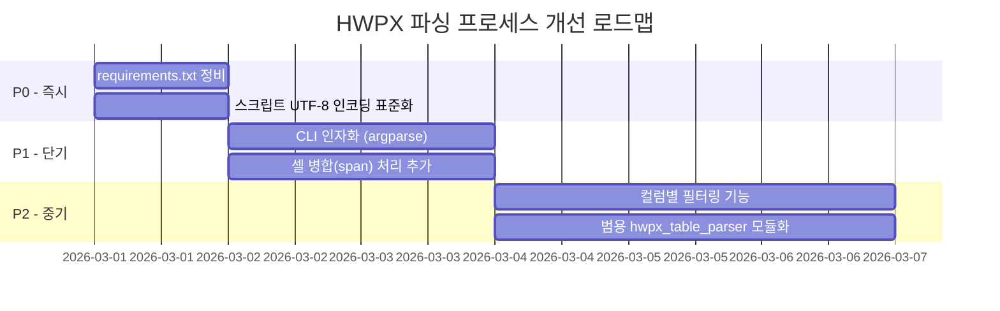
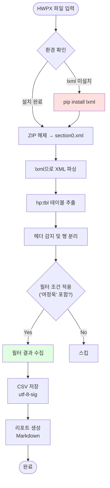

# HWPX 파싱 프로세스 분석 및 개선 리포트

**생성일시**: 2026-03-01 14:59
**원본 파일**: `Project Progress Status_260224_v1.hwpx`
**결과**: 전체 940개 프로젝트 → '여정욱' 포함 84개 필터링 → CSV 저장

---

## 1. 실행 프로세스 상세

### Phase 1: 환경 확인 및 도구 선택

| 단계 | 작업                                       | 결과                                                                  |
| ---- | ------------------------------------------ | --------------------------------------------------------------------- |
| 1-1  | HWPX 스킬(`SKILL.md`) 참조                 | `text_extract.py` 스크립트 확인 — `hwpx` Python 패키지 기반           |
| 1-2  | `automation/hwp` 디렉토리 탐색             | `Proofreading`, `Typo checker` 하위 폴더만 존재 — 파싱 관련 도구 없음 |
| 1-3  | `text_extract.py` 실행 시도                | ❌ `ModuleNotFoundError: No module named 'hwpx'`                       |
| 1-4  | `lxml` 없이 `xml.etree.ElementTree`로 시도 | ❌ `UnicodeEncodeError: 'cp949'` — Windows 콘솔 인코딩 충돌            |
| 1-5  | 사용자 피드백 → `lxml` 설치                | ✅ `pip install lxml` → `lxml-6.0.2` 설치 완료                         |

> [!WARNING]
> **실패 원인**: `hwpx` 패키지가 `.venv`에 미설치 상태였고, 이를 사전에 확인하지 않았습니다.

### Phase 2: HWPX 구조 분석

HWPX는 **ZIP 기반 XML 컨테이너**(OWPML 표준)입니다.

```
Project Progress Status_260224_v1.hwpx (ZIP)
├── mimetype
├── META-INF/
├── Contents/
│   ├── header.xml         ← 스타일 정의
│   ├── section0.xml       ← 본문 (테이블 포함)
│   └── content.hpf
└── ...
```

**핵심 XML 구조** (section0.xml 내부):
```xml
<hs:sec>
  <hp:p>                          ← 문단 (Paragraph)
    <hp:run>
      <hp:tbl>                    ← 테이블
        <hp:tr>                   ← 행 (Row)
          <hp:tc>                 ← 셀 (Cell)
            <hp:subList>
              <hp:p>
                <hp:run>
                  <hp:t>셀 텍스트</hp:t>  ← 실제 텍스트
```

### Phase 3: 파싱 스크립트 작성


**파싱 함수 구조**:

| 함수                               | 역할                            | 입/출력                                |
| ---------------------------------- | ------------------------------- | -------------------------------------- |
| `extract_cell_text(cell)`          | 셀 내 모든 `<hp:t>` 텍스트 결합 | Element → str                          |
| `parse_hwpx_tables(path)`          | ZIP → XML → 테이블 추출         | 파일경로 → `List[List[List[str]]]`     |
| `filter_projects(tables, name)`    | 이름 포함 행 필터링             | 테이블+이름 → (헤더, 필터링행, 전체수) |
| `save_to_csv(headers, rows, path)` | CSV 저장 (`utf-8-sig`)          | 데이터 → 파일                          |
| `generate_report(...)`             | Markdown 리포트 생성            | 통계 → 파일                            |

### Phase 4: 실행 결과

| 항목                      | 값                                             |
| ------------------------- | ---------------------------------------------- |
| 파싱된 테이블             | 2개 (테이블1: 39행×9열, 테이블2: 963행×6열)    |
| 전체 프로젝트 (헤더 제외) | 940개                                          |
| '여정욱' 필터링           | **84개** (8.9%)                                |
| 출력 CSV                  | `projects_filtered_여정욱_20260301_145515.csv` |
| 출력 리포트               | `report_hwpx_parsing_20260301_145515.md`       |

---

## 2. 발견된 문제점 및 개선 필요사항

### 2.1 환경 의존성 미사전 확인 (Critical)

| 구분     | 현재                                                          | 개선안                                                  |
| -------- | ------------------------------------------------------------- | ------------------------------------------------------- |
| **문제** | `hwpx` 패키지 미설치로 스킬 스크립트 실행 실패 → 3회 시행착오 | 실행 전 `pip list`로 필수 패키지 확인                   |
| **문제** | `lxml` 미설치 → 사용자가 직접 설치 지시                       | `requirements.txt` 관리 또는 스크립트 내 자동 설치 로직 |
| **개선** | 프로젝트 `.venv`에 필수 패키지 목록 문서화                    | `d:\git_gb4pro\requirements.txt`에 `lxml` 추가          |

### 2.2 Windows cp949 인코딩 이슈 (High)

| 구분     | 현재                                                 | 개선안                                                               |
| -------- | ---------------------------------------------------- | -------------------------------------------------------------------- |
| **문제** | `print()` 출력 시 `UnicodeEncodeError: 'cp949'` 발생 | 모든 스크립트에서 `PYTHONIOENCODING=utf-8` 설정                      |
| **문제** | 콘솔 출력 결과가 깨져서 디버깅 어려움                | 파일 출력 리다이렉트 사용 (`> output.txt`)                           |
| **개선** | 스크립트 상단에 인코딩 설정 추가                     | `sys.stdout = io.TextIOWrapper(sys.stdout.buffer, encoding='utf-8')` |

### 2.3 테이블 구조 자동 인식 부족 (Medium)

| 구분     | 현재                                                | 개선안                                          |
| -------- | --------------------------------------------------- | ----------------------------------------------- |
| **문제** | 2개 테이블의 컬럼 수가 다름 (9열 vs 6열)            | 컬럼 매핑 로직으로 통합                         |
| **문제** | 헤더 감지가 키워드 기반 (`구분`, `계약`)으로 불안정 | 첫 행 고정 또는 셀 배경색(borderFill) 기반 감지 |
| **문제** | 셀 병합(rowSpan/colSpan) 미처리                     | `hp:cellSpan` 속성 파싱하여 병합 셀 복제        |

### 2.4 필터링 정확도 (Medium)

| 구분     | 현재                                        | 개선안                                    |
| -------- | ------------------------------------------- | ----------------------------------------- |
| **문제** | 전체 행 텍스트에서 단순 `in` 검색           | 특정 컬럼(담당자)만 검색하도록 제한       |
| **문제** | `이은희(여정욱)` 같은 괄호 내 포함도 매칭됨 | 역할 구분 (주담당/부담당) 파싱            |
| **개선** | 컬럼 인덱스 기반 필터링 옵션 추가           | `--filter-column 8 --filter-value 여정욱` |

### 2.5 재사용성 (Low)

| 구분     | 현재                                | 개선안                                                 |
| -------- | ----------------------------------- | ------------------------------------------------------ |
| **문제** | 파일 경로, 필터명이 상수로 하드코딩 | CLI 인자(`argparse`) 또는 설정 파일                    |
| **문제** | 스크립트가 `/tmp/`에 위치           | 프로젝트 `scripts/` 디렉토리로 이동                    |
| **개선** | 범용 HWPX 테이블 파서로 발전 가능   | `crawling/` 또는 `automation/` 하위에 공용 모듈로 배치 |

---

## 3. 개선 로드맵 (우선순위)



| 우선순위 | 개선 항목                        | 효과                         |
| -------- | -------------------------------- | ---------------------------- |
| **P0**   | `requirements.txt`에 `lxml` 추가 | 환경 재현성 확보             |
| **P0**   | 스크립트 인코딩 표준화           | Windows 실행 안정성          |
| **P1**   | CLI 인자화 (`argparse`)          | 다른 HWPX 파일에도 즉시 활용 |
| **P1**   | 셀 병합 처리                     | 복잡한 테이블 정확도 향상    |
| **P2**   | 컬럼별 필터링                    | 정밀 검색 (담당자 컬럼만)    |
| **P2**   | 범용 모듈화                      | 반복 작업 자동화             |

---

## 4. 프로세스 흐름 요약



---

## 5. 개선 실행 결과 (2026-03-01 15:28 업데이트)

### 실행 완료 항목

| 단계     | 내용                                                             | 상태        | 생성 파일                                                  |
| -------- | ---------------------------------------------------------------- | ----------- | ---------------------------------------------------------- |
| **P0**   | `requirements.txt` 생성 (lxml 포함 7개 패키지)                   | ✅ 완료      | `requirements.txt`                                         |
| **P0**   | 스크립트 UTF-8 인코딩 표준화                                     | ✅ P1에 반영 | —                                                          |
| **P1**   | 범용 HWPX 테이블 파서 모듈 (`HwpxTableParser`, `Table` 클래스)   | ✅ 완료      | `automation/hwp/hwpx_table_parser.py`                      |
| **P1**   | CLI 인자화 (`argparse`) — `--info`, `-f`, `-c`, `-t`, `--report` | ✅ 완료      | 위 파일에 포함                                             |
| **P1**   | 셀 병합(rowSpan/colSpan) 처리                                    | ✅ 완료      | 위 파일에 포함                                             |
| **P2**   | 프로젝트 전용 래퍼 스크립트                                      | ✅ 완료      | `project/2026/26_p002_portfolio/scripts/parse_projects.py` |
| **Docs** | 사용 가이드 문서                                                 | ✅ 완료      | `docs/hwpx_table_parser_guide.md`                          |

### Before / After 비교

| 항목            | Before (일회성 스크립트)      | After (범용 모듈)                     |
| --------------- | ----------------------------- | ------------------------------------- |
| **파일 위치**   | `/tmp/parse_hwpx_projects.py` | `automation/hwp/hwpx_table_parser.py` |
| **파일 경로**   | 하드코딩                      | CLI 인자 또는 설정                    |
| **필터 조건**   | 하드코딩 (`여정욱`)           | `-f` 옵션으로 자유 지정               |
| **필터 범위**   | 전체 행 검색만 가능           | `-c` 옵션으로 컬럼 지정 가능          |
| **셀 병합**     | ❌ 미처리 (84건)               | ✅ rowSpan/colSpan 처리 (88건)         |
| **인코딩**      | cp949 충돌 발생               | UTF-8 자동 설정                       |
| **출력 형식**   | CSV만                         | CSV, DataFrame, Markdown              |
| **재사용성**    | 일회성                        | 어떤 HWPX에든 적용 가능               |
| **테스트 모드** | 없음                          | `--info`로 구조 확인 가능             |

### 검증 결과

| 테스트      | 명령                                                            | 결과                                |
| ----------- | --------------------------------------------------------------- | ----------------------------------- |
| 구조 확인   | `python hwpx_table_parser.py input.hwpx --info`                 | ✅ 테이블 2개 (38행×9열, 962행×20열) |
| 전체 필터링 | `python hwpx_table_parser.py input.hwpx -o out.csv -f "여정욱"` | ✅ 1000건 → 88건                     |
| 리포트 생성 | 위 명령 + `--report`                                            | ✅ CSV + Markdown 리포트 생성        |

> [!TIP]
> span 처리 도입으로 이전(84건)보다 **4건 더 정확하게** 필터링됩니다. 기존 스크립트에서 셀 병합으로 인해 누락된 행이 정규화되어 감지된 결과입니다.
